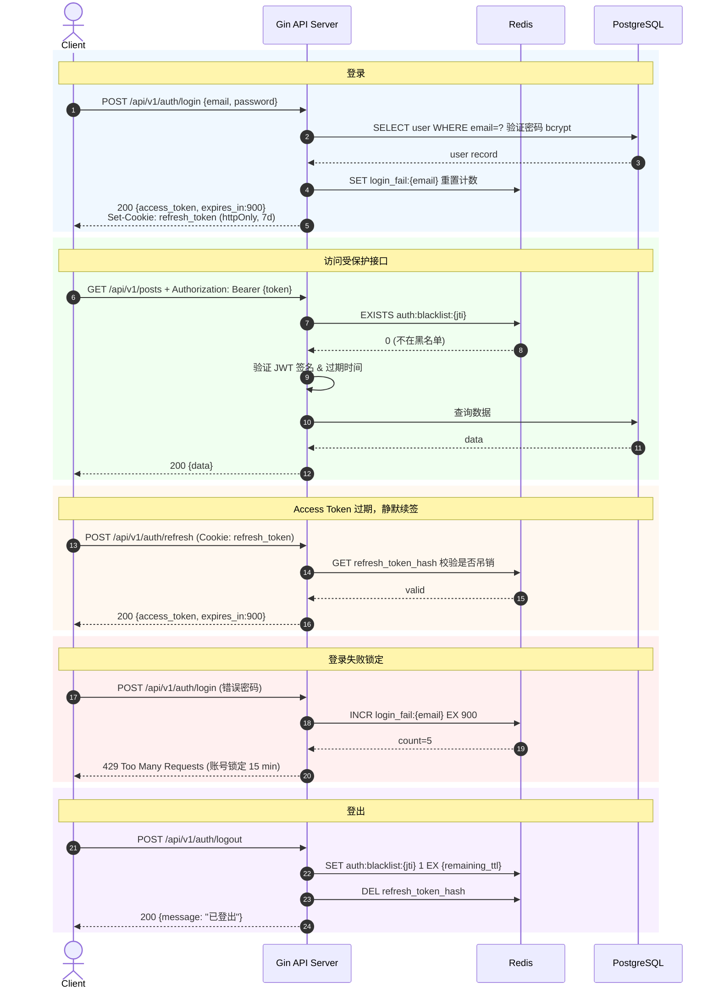
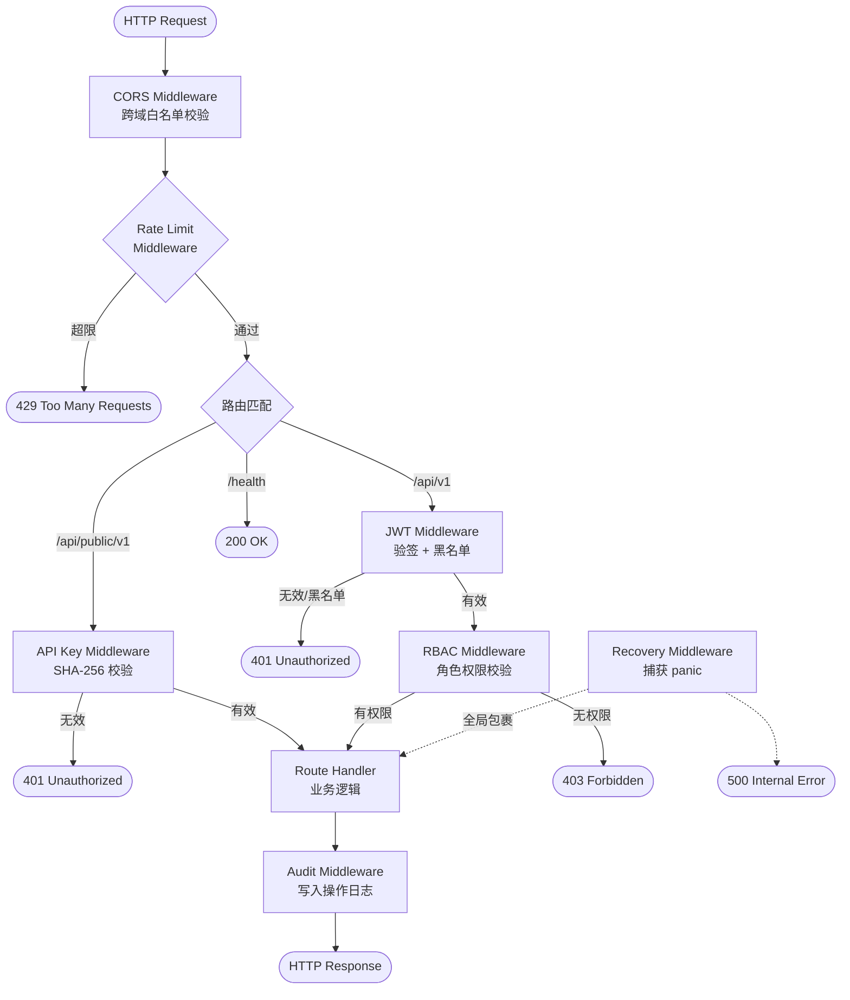

# CMS 内容管理系统 — API 设计文档

**规范**：OpenAPI 3.1 / RESTful
**Base URL**：`https://api.example.com`
**版本**：`/api/v1`（管理 API）、`/api/public/v1`（公开 Headless API）

---

## 0. API 概览

### 多站点架构 — Schema 隔离

Sky Flux CMS 采用 **PostgreSQL Schema Isolation** 实现多站点支持。每个站点拥有独立的 PostgreSQL Schema（`site_{slug}`），所有内容表位于各自 Schema 中，**无 `site_id` 列**。全局实体（用户、站点注册表、2FA、刷新令牌）位于 `public` Schema。

**站点上下文传递**：所有站点级管理 API 请求需要站点上下文，通过以下方式之一提供：
- **`X-Site-Slug` Header**：管理面板 / API 客户端
- **Host Header（域名映射）**：公开 API / Feed / Sitemap

**全局端点**（不需要站点上下文）：安装向导（`/api/v1/setup/*`）、2FA 认证（`/api/v1/auth/2fa/*`）、站点 CRUD（`/api/v1/sites/*`）。

### 中间件链

```
Request
  -> InstallationGuardMiddleware   (未安装? -> 重定向至 /setup 或 503)
  -> SiteResolverMiddleware        (从 Host / X-Site-Slug 解析站点)
  -> SchemaMiddleware              (SET search_path TO 'site_{slug}', 'public')
  -> AuthMiddleware                (验证 JWT)
  -> RBACMiddleware                 (从 sfc_user_roles 加载角色，两级 Redis 缓存，动态匹配 sfc_role_apis)
  -> Route Handler                 (所有查询自动限定在站点 Schema 内)
```

> **注意**：全局端点（setup、2FA、sites CRUD）跳过 SiteResolver 和 SchemaMiddleware。

### 路由总表

#### 全局端点（无需站点上下文）

| 方法 | 路径 | 权限 | 说明 |
|------|------|------|------|
| POST | /api/v1/setup/check | 无 | 检查安装状态 |
| POST | /api/v1/setup/initialize | 无 | 初始化系统 |
| POST | /api/v1/auth/login | 无 | 用户登录（含 2FA 流程） |
| POST | /api/v1/auth/refresh | 无 | 刷新 Access Token |
| POST | /api/v1/auth/forgot-password | 无 | 请求密码重置 |
| POST | /api/v1/auth/reset-password | 无 | 执行密码重置 |
| POST | /api/v1/auth/2fa/validate | 临时令牌 | 2FA TOTP 验证（登录第二步） |
| POST | /api/v1/auth/logout | JWT | 登出 |
| GET | /api/v1/auth/me | JWT | 获取当前用户信息（含站点列表） |
| PUT | /api/v1/auth/password | JWT | 修改密码 |
| POST | /api/v1/auth/2fa/setup | JWT | 开始 2FA 设置 |
| POST | /api/v1/auth/2fa/verify | JWT | 验证 TOTP 激活 2FA |
| POST | /api/v1/auth/2fa/disable | JWT | 禁用 2FA |
| POST | /api/v1/auth/2fa/backup-codes | JWT | 重新生成备用码 |
| GET | /api/v1/auth/2fa/status | JWT | 获取 2FA 状态 |
| DELETE | /api/v1/auth/2fa/users/:user_id | Super | 强制禁用用户 2FA |

#### 站点管理端点（Super，无需站点上下文）

| 方法 | 路径 | 权限 | 说明 |
|------|------|------|------|
| GET | /api/v1/sites | Super | 站点列表 |
| POST | /api/v1/sites | Super | 创建站点 |
| GET | /api/v1/sites/:slug | Super | 站点详情 |
| PUT | /api/v1/sites/:slug | Super | 更新站点 |
| DELETE | /api/v1/sites/:slug | Super | 删除站点 |
| GET | /api/v1/sites/:slug/users | Super | 站点用户列表 |
| PUT | /api/v1/sites/:slug/users/:user_id/role | Super | 分配用户站点角色 |
| DELETE | /api/v1/sites/:slug/users/:user_id/role | Super | 移除用户站点角色 |

#### RBAC 管理端点（Super，无需站点上下文）

| 方法 | 路径 | 权限 | 说明 |
|------|------|------|------|
| GET | /api/v1/rbac/roles | Super | 角色列表 |
| POST | /api/v1/rbac/roles | Super | 创建角色 |
| GET | /api/v1/rbac/roles/:id | Super | 角色详情 |
| PUT | /api/v1/rbac/roles/:id | Super | 更新角色 |
| DELETE | /api/v1/rbac/roles/:id | Super | 删除角色 |
| GET | /api/v1/rbac/roles/:id/apis | Super | 角色 API 权限列表 |
| PUT | /api/v1/rbac/roles/:id/apis | Super | 设置角色 API 权限 |
| GET | /api/v1/rbac/roles/:id/menus | Super | 角色菜单可见性 |
| PUT | /api/v1/rbac/roles/:id/menus | Super | 设置角色菜单 |
| GET | /api/v1/rbac/users/:id/roles | Super | 用户角色列表 |
| POST | /api/v1/rbac/users/:id/roles | Super | 设置用户角色 |
| GET | /api/v1/rbac/menus | Super | 菜单树 |
| POST | /api/v1/rbac/menus | Super | 创建菜单 |
| PUT | /api/v1/rbac/menus/:id | Super | 更新菜单 |
| DELETE | /api/v1/rbac/menus/:id | Super | 删除菜单 |
| GET | /api/v1/rbac/apis | Super | API 端点注册列表 |
| GET | /api/v1/rbac/templates | Super | 权限模板列表 |
| POST | /api/v1/rbac/templates | Super | 创建模板 |
| GET | /api/v1/rbac/templates/:id | Super | 模板详情 |
| PUT | /api/v1/rbac/templates/:id | Super | 更新模板 |
| DELETE | /api/v1/rbac/templates/:id | Super | 删除模板 |
| POST | /api/v1/rbac/roles/:id/apply-template | Super | 应用模板到角色 |
| GET | /api/v1/rbac/me/menus | JWT | 当前用户可见菜单树 |

#### 站点级管理 API（需要站点上下文）

| 方法 | 路径 | 权限 | 说明 |
|------|------|------|------|
| GET | /api/v1/posts | Viewer+ | 文章列表 |
| POST | /api/v1/posts | Editor+ | 创建文章 |
| GET | /api/v1/posts/:id | Viewer+ | 文章详情 |
| PUT | /api/v1/posts/:id | Editor+ | 更新文章 |
| DELETE | /api/v1/posts/:id | Editor+ | 软删除文章 |
| POST | /api/v1/posts/:id/publish | Editor+ | 发布文章 |
| POST | /api/v1/posts/:id/unpublish | Editor+ | 下架文章 |
| POST | /api/v1/posts/:id/revert-to-draft | Editor+ | 退回草稿 |
| POST | /api/v1/posts/:id/restore | Editor+ | 恢复文章 |
| GET | /api/v1/posts/:id/revisions | Viewer+ | 修订历史 |
| POST | /api/v1/posts/:id/revisions/:rev_id/rollback | Editor+ | 回滚版本 |
| GET | /api/v1/posts/:id/translations | Viewer+ | 翻译版本列表 |
| GET | /api/v1/posts/:id/translations/:locale | Viewer+ | 翻译版本详情 |
| PUT | /api/v1/posts/:id/translations/:locale | Editor+ | 创建/更新翻译 |
| DELETE | /api/v1/posts/:id/translations/:locale | Editor+ | 删除翻译 |
| POST | /api/v1/posts/:id/preview | Editor+ | 生成预览令牌 |
| GET | /api/v1/posts/:id/preview | Editor+ | 列出预览令牌 |
| DELETE | /api/v1/posts/:id/preview | Editor+ | 撤销所有预览令牌 |
| DELETE | /api/v1/posts/:id/preview/:token_id | Editor+ | 撤销单个预览令牌 |
| GET | /api/v1/categories | Viewer+ | 分类树 |
| GET | /api/v1/categories/:id | Viewer+ | 分类详情 |
| POST | /api/v1/categories | Admin+ | 创建分类 |
| PUT | /api/v1/categories/:id | Admin+ | 更新分类 |
| DELETE | /api/v1/categories/:id | Admin+ | 删除分类 |
| PUT | /api/v1/categories/reorder | Admin+ | 批量排序 |
| GET | /api/v1/tags | Viewer+ | 标签列表 |
| GET | /api/v1/tags/suggest | Viewer+ | 标签自动补全 |
| POST | /api/v1/tags | Editor+ | 创建标签 |
| PUT | /api/v1/tags/:id | Editor+ | 更新标签 |
| DELETE | /api/v1/tags/:id | Editor+ | 删除标签 |
| POST | /api/v1/media | Editor+ | 上传媒体 |
| GET | /api/v1/media | Viewer+ | 媒体列表 |
| DELETE | /api/v1/media/:id | Editor+ | 删除媒体 |
| GET | /api/v1/api-keys | Admin+ | API Key 列表 |
| POST | /api/v1/api-keys | Admin+ | 创建 API Key |
| DELETE | /api/v1/api-keys/:id | Admin+ | 吊销 API Key |
| GET | /api/v1/settings | Admin+ | 系统配置列表 |
| PUT | /api/v1/settings/:key | Super | 更新配置项 |
| GET | /api/v1/audit-logs | Super | 审计日志 |
| GET | /api/v1/users | Super | 用户列表 |
| POST | /api/v1/users | Super | 创建用户 |
| GET | /api/v1/users/:id | Super | 用户详情 |
| PUT | /api/v1/users/:id | Super | 更新用户 |
| DELETE | /api/v1/users/:id | Super | 删除用户 |
| GET | /api/v1/post-types | Viewer+ | 文章类型列表 |
| POST | /api/v1/post-types | Admin+ | 创建文章类型 |
| PUT | /api/v1/post-types/:id | Admin+ | 更新文章类型 |
| DELETE | /api/v1/post-types/:id | Admin+ | 删除文章类型 |
| GET | /api/v1/comments | Editor+ | 评论列表 |
| GET | /api/v1/comments/:id | Editor+ | 评论详情 |
| PUT | /api/v1/comments/:id/status | Editor+ | 更新评论状态 |
| PUT | /api/v1/comments/:id/pin | Editor+ | 切换置顶 |
| POST | /api/v1/comments/:id/reply | Editor+ | 管理员回复 |
| PUT | /api/v1/comments/batch-status | Editor+ | 批量更新状态 |
| DELETE | /api/v1/comments/:id | Admin+ | 永久删除评论 |
| GET | /api/v1/menus | Admin+ | 菜单列表 |
| POST | /api/v1/menus | Admin+ | 创建菜单 |
| GET | /api/v1/menus/:id | Admin+ | 菜单详情 |
| PUT | /api/v1/menus/:id | Admin+ | 更新菜单 |
| DELETE | /api/v1/menus/:id | Admin+ | 删除菜单 |
| POST | /api/v1/menus/:id/items | Admin+ | 添加菜单项 |
| PUT | /api/v1/menus/:id/items/:item_id | Admin+ | 更新菜单项 |
| DELETE | /api/v1/menus/:id/items/:item_id | Admin+ | 删除菜单项 |
| PUT | /api/v1/menus/:id/items/reorder | Admin+ | 批量排序菜单项 |
| GET | /api/v1/redirects | Admin+ | 重定向列表 |
| POST | /api/v1/redirects | Admin+ | 创建重定向 |
| PUT | /api/v1/redirects/:id | Admin+ | 更新重定向 |
| DELETE | /api/v1/redirects/:id | Admin+ | 删除重定向 |
| DELETE | /api/v1/redirects/batch | Admin+ | 批量删除重定向 |
| POST | /api/v1/redirects/import | Admin+ | CSV 导入重定向 |
| GET | /api/v1/redirects/export | Admin+ | CSV 导出重定向 |

#### 公开 API（站点级，API Key 认证）

| 方法 | 路径 | 权限 | 说明 |
|------|------|------|------|
| GET | /api/public/v1/posts | API Key | 已发布文章列表 |
| GET | /api/public/v1/posts/:slug | API Key | 文章详情（按 Slug） |
| GET | /api/public/v1/categories | API Key | 分类树 |
| GET | /api/public/v1/tags | API Key | 标签列表 |
| GET | /api/public/v1/search | API Key | 全文检索 |
| GET | /api/public/v1/posts/:slug/comments | API Key | 文章评论列表 |
| POST | /api/public/v1/posts/:slug/comments | API Key | 提交评论 |
| GET | /api/public/v1/menus | API Key | 获取菜单（按 location） |
| GET | /api/public/v1/preview/:token | 无 | 预览草稿文章 |

#### RSS Feed & Sitemap（公开，无需认证）

| 方法 | 路径 | 权限 | 说明 |
|------|------|------|------|
| GET | /feed/rss.xml | 无 | RSS 2.0 Feed |
| GET | /feed/atom.xml | 无 | Atom 1.0 Feed |
| GET | /sitemap.xml | 无 | Sitemap 索引 |
| GET | /sitemap-posts.xml | 无 | 文章 Sitemap |
| GET | /sitemap-categories.xml | 无 | 分类 Sitemap |
| GET | /sitemap-tags.xml | 无 | 标签 Sitemap |

---

## 1. 认证机制

### 管理 API（/api/v1/*）
- Bearer Token（JWT Access Token）
- Header：`Authorization: Bearer <access_token>`
- Access Token 有效期：15 分钟
- Refresh Token：httpOnly Cookie（有效期 7 天）

### 公开 API（/api/public/v1/*）
- API Key 认证
- Header：`X-API-Key: cms_live_xxxxxxxxxxxx`

### JWT 完整认证时序



---

## 1.1 RBAC 权限模型

> **动态 RBAC**（详见 story.md US-002）
>
> 权限现在通过 **`sfc_role_apis`** 表动态控制。每个角色在 `sfc_roles` 表中定义，角色可访问的 API 端点通过 `sfc_role_apis` 关联表配置，角色可见的菜单通过 `sfc_role_menus` 关联表配置。角色是**全局**的（非 per-site），通过 `public.sfc_user_roles` 表将角色分配给用户。
>
> 系统内置 4 个角色（`built_in = true`，不可删除）：**super** / **admin** / **editor** / **viewer**。管理员可创建自定义角色并通过 RBAC 管理 API 配置其权限。
>
> 下表为内置角色的**默认权限**参考（实际权限由 `sfc_role_apis` 动态决定）：
>
> | 操作 | Super | Admin | Editor | Viewer |
> |------|:---:|:---:|:---:|:---:|
> | 用户管理 | ✅ | ❌ | ❌ | ❌ |
> | 系统配置 | ✅ | ✅ | ❌ | ❌ |
> | 内容 CRUD | ✅ | ✅ | ✅ | ❌ |
> | 内容查看 | ✅ | ✅ | ✅ | ✅ |
> | 媒体上传 | ✅ | ✅ | ✅ | ❌ |
> | API Key 管理 | ✅ | ✅ | ❌ | ❌ |
> | 站点管理（sites CRUD） | ✅ | ❌ | ❌ | ❌ |
> | RBAC 管理 | ✅ | ❌ | ❌ | ❌ |
> | 评论审核（列表/审批/拒绝/标记垃圾） | ✅ | ✅ | ✅ | ❌ |
> | 评论删除（永久） | ✅ | ✅ | ❌ | ❌ |
> | 评论批量操作 | ✅ | ✅ | ❌ | ❌ |
> | 导航菜单 CRUD | ✅ | ✅ | ❌ | ❌ |
> | 菜单项 CRUD / 排序 | ✅ | ✅ | ❌ | ❌ |
> | URL 重定向 CRUD | ✅ | ✅ | ❌ | ❌ |
> | 重定向导入/导出 | ✅ | ✅ | ❌ | ❌ |
> | 草稿预览令牌 CRUD | ✅ | ✅ | ✅ | ❌ |
> | 2FA 设置/禁用（自身） | ✅ | ✅ | ✅ | ✅ |
> | 2FA 强制禁用（他人） | ✅ | ❌ | ❌ | ❌ |

RBAC 中间件在每次请求中从 `sfc_user_roles` 表获取用户角色（L1 缓存 5 分钟），再从 `sfc_role_apis` 获取角色可访问的 API 集合（L2 缓存 10 分钟），动态匹配当前请求的 `method:path`。`super` 角色拥有所有权限（短路放行）。角色**不存储在 JWT claims 中**。详见第 21 节 Gin 中间件设计。

---

## 2. 统一响应格式

```json
// 成功
{
  "success": true,
  "data": { ... },
  "message": "操作成功"
}

// 列表
{
  "success": true,
  "data": [ ... ],
  "pagination": {
    "page": 1,
    "per_page": 20,
    "total": 156,
    "total_pages": 8
  }
}

// 错误
{
  "success": false,
  "error": {
    "code": "VALIDATION_ERROR",
    "message": "请求参数错误",
    "details": [
      { "field": "title", "message": "标题不能为空" }
    ]
  }
}
```

### 错误码对照表

| HTTP Status | Error Code | 说明 |
|-------------|------------|------|
| 400 | VALIDATION_ERROR | 参数校验失败 |
| 401 | UNAUTHORIZED | 未认证 |
| 403 | FORBIDDEN | 无权限 |
| 404 | NOT_FOUND | 资源不存在 |
| 409 | CONFLICT | 资源冲突（如 slug 重复） |
| 410 | GONE | 资源已过期（如预览令牌过期） |
| 422 | UNPROCESSABLE | 业务逻辑错误 |
| 429 | RATE_LIMITED | 请求频率超限 |
| 500 | INTERNAL_ERROR | 服务器内部错误 |
| 503 | NOT_INSTALLED | CMS 尚未安装 |

### 业务错误码对照表

| HTTP Status | Error Code | 说明 |
|-------------|------------|------|
| 404 | SITE_NOT_FOUND | 站点不存在 |
| 409 | SITE_SLUG_EXISTS | 站点 slug 已存在 |
| 409 | DOMAIN_EXISTS | 站点域名已被占用 |
| 500 | SCHEMA_ERROR | Schema 操作失败 |
| 404 | COMMENT_NOT_FOUND | 评论不存在 |
| 422 | COMMENT_CLOSED | 文章评论已关闭 |
| 429 | COMMENT_RATE_LIMITED | 评论提交过于频繁 |
| 404 | MENU_NOT_FOUND | 菜单不存在 |
| 409 | MENU_SLUG_EXISTS | 菜单 slug 已存在 |
| 404 | REDIRECT_NOT_FOUND | 重定向规则不存在 |
| 409 | REDIRECT_PATH_EXISTS | 重定向源路径已存在 |
| 404 | PREVIEW_TOKEN_NOT_FOUND | 预览令牌不存在 |
| 422 | PREVIEW_LIMIT_REACHED | 预览令牌数量已达上限（每篇文章最多 5 个） |
| 401 | 2FA_REQUIRED | 需要双因素认证 |
| 400 | 2FA_INVALID_CODE | 双因素认证码无效 |
| 409 | 2FA_ALREADY_ENABLED | 双因素认证已启用 |
| 404 | 2FA_NOT_ENABLED | 双因素认证未启用 |
| 409 | SETUP_ALREADY_COMPLETE | 系统已完成安装 |
| 503 | NOT_INSTALLED | CMS 尚未安装 |

---

## 3. 健康检查

### GET /health
**描述**：系统健康检查（无需认证）

**Response 200**
```json
{
  "status": "healthy",
  "version": "1.0.0",
  "uptime": "72h15m",
  "checks": {
    "database": "ok",
    "redis": "ok",
    "rustfs": "ok"
  }
}
```

**Response 503**（服务不可用）
```json
{
  "status": "unhealthy",
  "version": "1.0.0",
  "uptime": "72h15m",
  "checks": {
    "database": "error",
    "redis": "ok",
    "rustfs": "ok"
  }
}
```

---

## 4. 认证模块 API

### POST /api/v1/auth/login
**描述**：用户登录（全局端点，无需站点上下文）

**Request Body**
```json
{
  "email": "admin@example.com",
  "password": "SecurePass123"
}
```

**Response 200（未启用 2FA — 正常登录）**
```json
{
  "success": true,
  "data": {
    "access_token": "eyJhbGc...",
    "token_type": "Bearer",
    "expires_in": 900,
    "user": {
      "id": "550e8400-...",
      "email": "admin@example.com",
      "display_name": "Admin",
      "avatar_url": "https://..."
    }
  }
}
```
*Refresh Token 通过 Set-Cookie httpOnly 返回*

**Response 200（已启用 2FA — 需要第二步验证）**

当用户启用了 2FA，密码验证通过后不直接颁发 Access Token，而是返回一个临时令牌，要求客户端提交 TOTP 验证码完成登录。

```json
{
  "success": true,
  "data": {
    "requires_2fa": true,
    "temp_token": "eyJhbGc...",
    "temp_token_expires_in": 300
  }
}
```

> **临时令牌说明**：`temp_token` 是一个短期 JWT（5 分钟），claims 包含 `{ "sub": "user_id", "purpose": "2fa_verification", "jti": "...", "exp": ... }`。该令牌仅可用于 `POST /api/v1/auth/2fa/validate` 端点，其他端点会拒绝此令牌。不包含 `role` 声明，无法用于授权。

> **JWT Claims（Access Token）**：`{ "sub": "user_id", "jti": "token_id", "iat": ..., "exp": ... }`。注意：`role` 字段不在 JWT claims 中。角色是全局的，在每次请求中由 RBAC 中间件从 `sfc_user_roles` + `sfc_role_apis` 解析（两级 Redis 缓存：L1 用户角色 5min，L2 角色 API 集合 10min）。

---

### POST /api/v1/auth/refresh
**描述**：刷新 Access Token（使用 Cookie 中的 Refresh Token）

**Response 200**
```json
{
  "success": true,
  "data": {
    "access_token": "eyJhbGc...",
    "expires_in": 900
  }
}
```

---

### POST /api/v1/auth/logout
**描述**：登出，Refresh Token 加入黑名单

**Response 200**
```json
{ "success": true, "message": "已登出" }
```

---

### GET /api/v1/auth/me
**描述**：获取当前用户信息（全局端点），包含用户在各站点的角色列表

**Response 200**
```json
{
  "success": true,
  "data": {
    "id": "550e8400-...",
    "email": "admin@example.com",
    "display_name": "Admin",
    "avatar_url": null,
    "last_login_at": "2026-02-21T10:00:00Z",
    "two_factor_enabled": true,
    "roles": ["super"],
    "sites": [
      {
        "id": "019...",
        "name": "My Blog",
        "slug": "blog",
        "domain": "blog.example.com"
      },
      {
        "id": "019...",
        "name": "Documentation",
        "slug": "docs",
        "domain": "docs.example.com"
      }
    ]
  }
}
```

> `roles` 数组来自 `public.sfc_user_roles`，包含用户的全局角色 slug 列表。`sites` 数组包含用户可访问的所有站点（角色是全局的，不再 per-site 分配）。

---

### PUT /api/v1/auth/password
**描述**：修改密码

**Request Body**
```json
{
  "current_password": "OldPass123",
  "new_password": "NewPass456",
  "new_password_confirmation": "NewPass456"
}
```

**Response 200**
```json
{
  "success": true,
  "message": "密码修改成功"
}
```

---

### POST /api/v1/auth/forgot-password
**描述**：请求密码重置链接

**Request Body**
```json
{
  "email": "user@example.com"
}
```

**Response 200**
```json
{
  "success": true,
  "code": "OK",
  "message": "如果该邮箱已注册，重置链接已发送"
}
```

> 无论邮箱是否存在均返回相同响应（防枚举）。令牌有效期 30 分钟，使用一次后失效。

---

### POST /api/v1/auth/reset-password
**描述**：使用重置令牌执行密码重置

**Request Body**
```json
{
  "token": "reset-token-here",
  "new_password": "NewSecure123!"
}
```

**Response 200**
```json
{
  "success": true,
  "code": "OK",
  "message": "密码已重置，请重新登录"
}
```

**Error**：400 TOKEN_EXPIRED / TOKEN_INVALID

---

## 4.1 安装向导 API（全局 — 无需认证、无需站点上下文）

> 安装向导用于初始化全新的 Sky Flux CMS 实例。安装完成后，向导端点永久禁用。

### POST /api/v1/setup/check
**描述**：检查 CMS 是否已安装
**认证**：无需认证
**限流**：30 req/min per IP

**Response 200（未安装）**
```json
{
  "success": true,
  "data": {
    "installed": false
  }
}
```

**Response 200（已安装）**
```json
{
  "success": true,
  "data": {
    "installed": true
  }
}
```

> 检查顺序：内存原子变量 → Redis `system:installed` → 数据库 `public.sfc_configs`。

---

### POST /api/v1/setup/initialize
**描述**：初始化系统（创建 public schema、第一个站点、管理员用户）
**认证**：无需认证（仅在未安装时有效）
**限流**：5 req/min per IP

**Request Body**
```json
{
  "site_name": "My Blog",
  "site_slug": "blog",
  "site_url": "https://blog.example.com",
  "admin_email": "admin@example.com",
  "admin_password": "SecureP@ssw0rd",
  "admin_display_name": "Admin",
  "locale": "zh-CN"
}
```

**字段校验**

| 字段 | 规则 |
|------|------|
| site_name | 必填，1-200 字符 |
| site_slug | 必填，`^[a-z0-9_]{3,50}$`，不能是保留词（`public`、`pg_catalog`、`information_schema` 等） |
| site_url | 必填，合法 URL |
| admin_email | 必填，合法邮箱格式 |
| admin_password | 必填，最少 8 字符，必须包含大小写字母 + 数字 + 特殊字符 |
| admin_display_name | 必填，1-100 字符 |
| locale | 可选，默认 `zh-CN` |

**Response 201**
```json
{
  "success": true,
  "data": {
    "user": {
      "id": "019...",
      "email": "admin@example.com",
      "display_name": "Admin"
    },
    "site": {
      "id": "019...",
      "name": "My Blog",
      "slug": "blog"
    },
    "access_token": "eyJhbGci...",
    "token_type": "Bearer",
    "expires_in": 900
  }
}
```

**错误响应**

| HTTP Status | Error Code | 说明 |
|-------------|------------|------|
| 409 | SETUP_ALREADY_COMPLETE | CMS 已完成安装 |
| 422 | VALIDATION_ERROR | 输入校验失败 |
| 500 | SETUP_FAILED | 安装过程内部错误（事务已回滚） |

> **执行流程**（单一事务内）：验证未安装 → 获取 PostgreSQL advisory lock → 创建 public schema 表 → 创建 sites 记录 → 创建站点 schema（`site_{slug}`）→ 执行所有站点级 DDL → 创建管理员用户 → 创建 `sfc_user_roles`（super）→ 设置 `system.installed = true` → COMMIT → 更新 Redis 和内存标志 → 生成 JWT。

---

## 4.2 站点管理 API（Super，全局端点）

> 站点管理是全局操作，不需要站点上下文。所有操作直接查询 `public.sfc_sites` 表。

### GET /api/v1/sites
**描述**：获取所有站点列表（仅 Super）

**Query Params**：`page`，`per_page`，`q`（名称/slug 搜索），`is_active`

**Response 200**
```json
{
  "success": true,
  "data": [
    {
      "id": "019...",
      "name": "My Blog",
      "slug": "blog",
      "domain": "blog.example.com",
      "description": "个人技术博客",
      "logo_url": "https://...",
      "default_locale": "zh-CN",
      "timezone": "Asia/Shanghai",
      "is_active": true,
      "settings": {},
      "created_at": "2026-02-20T08:00:00Z",
      "updated_at": "2026-02-24T10:00:00Z"
    }
  ],
  "pagination": { "page": 1, "per_page": 20, "total": 3, "total_pages": 1 }
}
```

---

### POST /api/v1/sites
**描述**：创建新站点（创建 PostgreSQL schema）（仅 Super）

**Request Body**
```json
{
  "name": "Documentation",
  "slug": "docs",
  "domain": "docs.example.com",
  "description": "Product documentation site",
  "default_locale": "en",
  "timezone": "UTC"
}
```

**字段校验**

| 字段 | 规则 |
|------|------|
| name | 必填，1-200 字符 |
| slug | 必填，`^[a-z0-9_]{3,50}$`，不能是保留词，不能重复 |
| domain | 可选，合法域名格式，不能重复 |
| default_locale | 可选，默认 `zh-CN` |
| timezone | 可选，默认 `Asia/Shanghai` |

**Response 201**
```json
{
  "success": true,
  "data": {
    "id": "019...",
    "name": "Documentation",
    "slug": "docs",
    "domain": "docs.example.com",
    "is_active": true,
    "created_at": "2026-02-24T10:00:00Z"
  }
}
```

**错误响应**

| HTTP Status | Error Code | 说明 |
|-------------|------------|------|
| 409 | SITE_SLUG_EXISTS | slug 已被占用 |
| 409 | DOMAIN_EXISTS | 域名已被占用 |
| 500 | SCHEMA_ERROR | Schema 创建失败 |

> **执行流程**（单一事务内）：校验 slug/domain 唯一 → INSERT sites → CREATE SCHEMA site_{slug} → 执行站点级 DDL → Seed built-in sfc_site_post_types → 插入默认 sfc_site_configs → COMMIT → 刷新 Redis 缓存。

---

### GET /api/v1/sites/:slug
**描述**：获取站点详情（仅 Super）

**Response 200**
```json
{
  "success": true,
  "data": {
    "id": "019...",
    "name": "Documentation",
    "slug": "docs",
    "domain": "docs.example.com",
    "description": "Product documentation site",
    "logo_url": null,
    "default_locale": "en",
    "timezone": "UTC",
    "is_active": true,
    "settings": {},
    "created_at": "2026-02-24T10:00:00Z",
    "updated_at": "2026-02-24T10:00:00Z"
  }
}
```

---

### PUT /api/v1/sites/:slug
**描述**：更新站点信息（仅 Super）。`slug` 创建后不可修改。

**Request Body**（所有字段可选）
```json
{
  "name": "Updated Documentation",
  "domain": "new-docs.example.com",
  "description": "Updated description",
  "logo_url": "https://...",
  "default_locale": "en",
  "timezone": "UTC",
  "is_active": true,
  "settings": {}
}
```

**Response 200**
```json
{
  "success": true,
  "data": {
    "id": "019...",
    "name": "Updated Documentation",
    "slug": "docs",
    "domain": "new-docs.example.com",
    "updated_at": "2026-02-24T12:00:00Z"
  }
}
```

> 域名变更时自动刷新 Redis 缓存：`DEL site:slug:{slug}`, `DEL site:domain:{old_domain}`, `DEL site:domain:{new_domain}`。

---

### DELETE /api/v1/sites/:slug
**描述**：删除站点（DROP SCHEMA CASCADE）（仅 Super）

**Request Body**（需要确认）
```json
{
  "confirm_slug": "docs"
}
```

> `confirm_slug` 必须与站点 slug 完全匹配，防止误删。不允许删除最后一个站点。

**Response 200**
```json
{
  "success": true,
  "message": "站点已删除"
}
```

**错误响应**

| HTTP Status | Error Code | 说明 |
|-------------|------------|------|
| 400 | VALIDATION_ERROR | confirm_slug 不匹配 |
| 422 | UNPROCESSABLE | 不能删除最后一个站点 |
| 404 | SITE_NOT_FOUND | 站点不存在 |

> **警告**：站点删除不可逆。所有内容（文章、媒体记录、评论等）将永久销毁。存储对象（RustFS）中的媒体文件由后台清理任务处理。

---

### GET /api/v1/sites/:slug/users
**描述**：获取站点的用户及角色列表（仅 Super）

**Query Params**：`page`，`per_page`，`role`，`q`（姓名/邮箱搜索）

**Response 200**
```json
{
  "success": true,
  "data": [
    {
      "user": {
        "id": "550e8400-...",
        "email": "editor@example.com",
        "display_name": "张编辑",
        "avatar_url": null,
        "is_active": true
      },
      "role": "editor",
      "created_at": "2026-02-20T08:00:00Z"
    }
  ],
  "pagination": { "page": 1, "per_page": 20, "total": 5, "total_pages": 1 }
}
```

---

### PUT /api/v1/sites/:slug/users/:user_id/role
**描述**：分配或更新用户在站点上的角色（仅 Super）

**Request Body**
```json
{
  "role": "editor"
}
```

**字段校验**：`role` 必须是 `sfc_roles` 表中已存在的角色 slug（内置角色：`super`、`admin`、`editor`、`viewer`，也支持自定义角色）。

**Response 200**
```json
{
  "success": true,
  "data": {
    "user_id": "550e8400-...",
    "site_slug": "blog",
    "role": "editor",
    "updated_at": "2026-02-24T10:00:00Z"
  }
}
```

> 变更后自动刷新 Redis RBAC 缓存：`DEL rbac:user:{user_id}:roles`。

---

### DELETE /api/v1/sites/:slug/users/:user_id/role
**描述**：从站点移除用户角色（仅 Super）

**Response 200**
```json
{
  "success": true,
  "message": "用户角色已移除"
}
```

> 移除后该用户将无法访问该站点的任何资源（请求返回 403）。

---

## 4.3 双因素认证（2FA）API（全局 — 需认证、无需站点上下文）

> 2FA 是用户级安全功能，不与站点绑定。`user_totp` 表位于 `public` Schema。启用 2FA 将保护用户在所有站点的登录。

### POST /api/v1/auth/2fa/setup
**描述**：开始 2FA 设置（生成 TOTP 密钥、QR 码 URI、备用码）。不会立即激活 2FA，用户需要用 `/2fa/verify` 端点验证第一个 TOTP 码。
**认证**：JWT（任何已认证用户）

**Request Body**：无

**Response 200**
```json
{
  "success": true,
  "data": {
    "secret": "JBSWY3DPEHPK3PXP",
    "qr_code_uri": "otpauth://totp/Sky%20Flux%20CMS:admin%40example.com?secret=JBSWY3DPEHPK3PXP&issuer=Sky%20Flux%20CMS&algorithm=SHA1&digits=6&period=30",
    "qr_code_svg": "<svg>...</svg>",
    "backup_codes": [
      "ABCD-EFGH",
      "JKLM-NPQR",
      "STUV-WXYZ",
      "2345-6789",
      "ABCD-2345",
      "EFGH-6789",
      "JKLM-STUV",
      "NPQR-WXYZ",
      "2345-ABCD",
      "6789-EFGH"
    ]
  }
}
```

**错误响应**

| HTTP Status | Error Code | 说明 |
|-------------|------------|------|
| 401 | UNAUTHORIZED | 未认证 |
| 409 | 2FA_ALREADY_ENABLED | 2FA 已启用 |

> 如果存在之前未验证的设置记录（`is_enabled = false`），将覆盖为新的密钥。备用码仅在此响应中返回一次。TOTP 参数：SHA-1 / 6 位数 / 30 秒 / 窗口 +/-1。

---

### POST /api/v1/auth/2fa/verify
**描述**：验证第一个 TOTP 码以激活 2FA
**认证**：JWT（任何已认证用户）

**Request Body**
```json
{
  "code": "123456"
}
```

**Response 200**
```json
{
  "success": true,
  "message": "双因素认证已启用"
}
```

**错误响应**

| HTTP Status | Error Code | 说明 |
|-------------|------------|------|
| 400 | VALIDATION_ERROR | 码格式无效（非 6 位数字） |
| 400 | 2FA_INVALID_CODE | TOTP 码不匹配 |
| 404 | 2FA_NOT_ENABLED | 无待验证的 2FA 设置记录 |
| 409 | 2FA_ALREADY_ENABLED | 2FA 已验证激活 |

---

### POST /api/v1/auth/2fa/validate
**描述**：登录时验证 TOTP 码（登录第二步）。使用临时令牌认证。
**认证**：临时 2FA 令牌（`Authorization: Bearer <temp_token>`）

**Request Body**
```json
{
  "code": "123456"
}
```

或使用备用码：
```json
{
  "code": "ABCD-EFGH",
  "is_backup_code": true
}
```

**Response 200（验证成功 — 完成登录）**
```json
{
  "success": true,
  "data": {
    "access_token": "eyJhbGc...",
    "token_type": "Bearer",
    "expires_in": 900,
    "user": {
      "id": "550e8400-...",
      "email": "admin@example.com",
      "display_name": "Admin",
      "avatar_url": "https://..."
    }
  }
}
```

*Refresh Token 通过 Set-Cookie httpOnly 返回。*

**错误响应**

| HTTP Status | Error Code | 说明 |
|-------------|------------|------|
| 400 | VALIDATION_ERROR | 码格式无效 |
| 400 | 2FA_INVALID_CODE | TOTP 码不匹配或备用码无效 |
| 401 | UNAUTHORIZED | 临时令牌缺失、过期、或 purpose 不正确 |
| 429 | RATE_LIMITED | 5 分钟内超过 5 次尝试 |

> 使用备用码时，匹配的备用码会从 `backup_codes_hash` 数组中移除（单次使用）。TOTP 重放检测：使用 Redis key `2fa:used:{user_id}:{code}` TTL=90s 防止同一码在有效窗口内被重复使用。

---

### POST /api/v1/auth/2fa/disable
**描述**：禁用当前用户的 2FA
**认证**：JWT（任何已认证用户）

**Request Body**
```json
{
  "password": "CurrentPassword123",
  "code": "123456"
}
```

**Response 200**
```json
{
  "success": true,
  "message": "双因素认证已禁用"
}
```

**错误响应**

| HTTP Status | Error Code | 说明 |
|-------------|------------|------|
| 400 | VALIDATION_ERROR | 缺少密码或验证码 |
| 401 | UNAUTHORIZED | 密码错误 |
| 400 | 2FA_INVALID_CODE | TOTP/备用码无效 |
| 404 | 2FA_NOT_ENABLED | 该用户未启用 2FA |

> 禁用后删除 `public.sfc_user_totp` 记录，并吊销所有刷新令牌（强制重新登录）。

---

### POST /api/v1/auth/2fa/backup-codes
**描述**：重新生成备用码（旧备用码全部失效）
**认证**：JWT（任何已认证用户）

**Request Body**
```json
{
  "password": "CurrentPassword123"
}
```

**Response 200**
```json
{
  "success": true,
  "data": {
    "backup_codes": [
      "ABCD-EFGH",
      "JKLM-NPQR",
      "STUV-WXYZ",
      "2345-6789",
      "ABCD-2345",
      "EFGH-6789",
      "JKLM-STUV",
      "NPQR-WXYZ",
      "2345-ABCD",
      "6789-EFGH"
    ],
    "message": "请妥善保存这些备用码，它们不会再次显示"
  }
}
```

**错误响应**

| HTTP Status | Error Code | 说明 |
|-------------|------------|------|
| 401 | UNAUTHORIZED | 密码错误 |
| 404 | 2FA_NOT_ENABLED | 该用户未启用 2FA |

---

### GET /api/v1/auth/2fa/status
**描述**：检查当前用户的 2FA 状态
**认证**：JWT（任何已认证用户）

**Response 200**
```json
{
  "success": true,
  "data": {
    "is_enabled": true,
    "verified_at": "2026-02-20T10:00:00Z",
    "backup_codes_remaining": 8
  }
}
```

---

### DELETE /api/v1/auth/2fa/users/:user_id
**描述**：Super 强制禁用指定用户的 2FA（账户恢复场景）
**认证**：JWT（仅 Super）

**Request Body**
```json
{
  "reason": "User lost access to authenticator device"
}
```

**Response 200**
```json
{
  "success": true,
  "message": "双因素认证已为该用户禁用"
}
```

**错误响应**

| HTTP Status | Error Code | 说明 |
|-------------|------------|------|
| 403 | FORBIDDEN | 非 Super |
| 404 | NOT_FOUND | 用户不存在或未启用 2FA |

> 副作用：删除 `public.sfc_user_totp` 记录、吊销所有刷新令牌、写入包含 reason 的审计日志。

---

## 5. 用户管理 API（Super）

### GET /api/v1/users
**描述**：获取用户列表（仅 Super）

**Query Params**：`page`, `per_page`, `role`, `q`（姓名/邮箱搜索）

**Response 200**
```json
{
  "success": true,
  "data": [
    {
      "id": "550e8400-...",
      "email": "editor@example.com",
      "display_name": "张编辑",
      "role": "editor",
      "is_active": true,
      "avatar_url": "https://...",
      "last_login_at": "2026-02-21T10:00:00Z",
      "created_at": "2026-01-15T08:00:00Z",
      "updated_at": "2026-02-20T12:00:00Z"
    }
  ],
  "pagination": { "page": 1, "per_page": 20, "total": 5, "total_pages": 1 }
}
```

---

### POST /api/v1/users
**描述**：创建用户（仅 Super）

**Request Body**
```json
{
  "email": "editor@example.com",
  "password": "TempPass123",
  "display_name": "张编辑",
  "role": "editor"
}
```

**Response 201**
```json
{
  "success": true,
  "data": {
    "id": "550e8400-...",
    "email": "editor@example.com",
    "display_name": "张编辑",
    "role": "editor",
    "is_active": true,
    "avatar_url": null,
    "created_at": "2026-02-21T10:00:00Z",
    "updated_at": "2026-02-21T10:00:00Z"
  }
}
```

> **邮件通知**：用户创建成功后，系统异步发送包含临时密码的欢迎邮件至用户邮箱。

---

### GET /api/v1/users/:id
**描述**：获取用户详情

**Response 200**
```json
{
  "success": true,
  "data": {
    "id": "550e8400-...",
    "email": "editor@example.com",
    "display_name": "张编辑",
    "role": "editor",
    "is_active": true,
    "avatar_url": "https://...",
    "last_login_at": "2026-02-21T10:00:00Z",
    "created_at": "2026-01-15T08:00:00Z",
    "updated_at": "2026-02-20T12:00:00Z"
  }
}
```

---

### PUT /api/v1/users/:id
**描述**：更新用户信息

**Request Body**（所有字段可选）
```json
{
  "display_name": "新名称",
  "role": "editor",
  "is_active": true
}
```

**Response 200**
```json
{
  "success": true,
  "data": {
    "id": "550e8400-...",
    "email": "editor@example.com",
    "display_name": "新名称",
    "role": "editor",
    "is_active": true,
    "updated_at": "2026-02-21T12:00:00Z"
  }
}
```

> **邮件通知**：当用户 `is_active` 从 true 变为 false 时，系统异步发送账号禁用通知邮件。

---

### DELETE /api/v1/users/:id（软删除）

**Response 200**
```json
{
  "success": true,
  "message": "用户已删除"
}
```

---

## 6. 文章管理 API

### GET /api/v1/posts
**描述**：获取文章列表（管理端，可见所有状态）

**Query Params**

| 参数 | 类型 | 说明 |
|------|------|------|
| page | int | 页码，默认 1 |
| per_page | int | 每页数量，默认 20，最大 100（见下方分页边界行为） |
| status | string | draft/scheduled/published/archived |
| q | string | 全文搜索关键字 |
| category_id | uuid | 按分类筛选 |
| tag_id | uuid | 按标签筛选 |
| author_id | uuid | 按作者筛选 |
| sort | string | created_at:desc / published_at:desc / title:asc |
| include_deleted | bool | 是否包含回收站（Admin+） |

**Response 200**
```json
{
  "success": true,
  "data": [
    {
      "id": "550e8400-...",
      "title": "Go 性能优化实践",
      "slug": "go-performance-optimization",
      "status": "published",
      "author": { "id": "...", "display_name": "张编辑" },
      "cover_image": { "id": "...", "url": "https://...", "webp_url": "https://..." },
      "categories": [{ "id": "...", "name": "技术", "slug": "tech" }],
      "tags": [{ "id": "...", "name": "Go" }],
      "view_count": 1024,
      "published_at": "2026-02-20T08:00:00Z",
      "created_at": "2026-02-19T14:00:00Z",
      "updated_at": "2026-02-20T07:55:00Z"
    }
  ],
  "pagination": { "page": 1, "per_page": 20, "total": 42, "total_pages": 3 }
}
```

#### 分页边界行为

| 场景 | 行为 |
|------|------|
| `page=0` 或负数 | 返回 400 VALIDATION_ERROR |
| `per_page > 100` | 自动截断为 100 |
| `page` 超过总页数 | 返回空数组 `data: []`，pagination 正常返回 |
| `per_page=0` | 返回 400 VALIDATION_ERROR |

---

### POST /api/v1/posts
**描述**：创建文章

**Request Body**
```json
{
  "title": "Go 性能优化实践",
  "slug": "go-performance-optimization",      // 可选，自动生成
  "content": "<p>正文 HTML</p>",
  "content_json": { ... },                   // BlockNote JSON
  "excerpt": "文章摘要",
  "status": "draft",                         // draft / published / scheduled
  "scheduled_at": "2026-03-01T09:00:00+08:00", // status=scheduled 时必填，见下方时区说明
  "cover_image_id": "uuid",
  "category_ids": ["uuid1", "uuid2"],
  "primary_category_id": "uuid1",
  "tag_ids": ["uuid3"],
  "meta_title": "Go 性能优化实践 | 博客",
  "meta_description": "深度解析 Go 性能优化的 10 个核心技巧",
  "og_image_url": "https://...",
  "extra_fields": { "reading_time": 8 }
}
```

**Response 201**
```json
{
  "success": true,
  "data": { "id": "550e8400-...", ... }
}
```

> **字段映射说明**：请求体使用扁平字段 `meta_title`、`meta_description`、`og_image_url`，响应体将它们包装为 `seo` 嵌套对象。Service 层负责转换。

#### Slug 生成规则

- 若请求未提供 slug，则由标题自动生成（中文 → pinyin，特殊字符 → 连字符，转小写）
- 最大长度 200 字符
- 碰撞处理：追加递增后缀 `-2`、`-3`...
- posts.slug 全局唯一
- categories.slug 同级唯一（同一 parent_id 下）

#### 计划发布时区处理

| 环节 | 规则 |
|------|------|
| 客户端请求 | 发送本地时间 **附带时区偏移**，例如 `2026-03-01T09:00:00+08:00` |
| 服务端存储 | 将接收到的时间转换为 **UTC** 后写入数据库 `scheduled_at` 字段（`2026-03-01T01:00:00Z`） |
| API 响应 | 所有时间戳统一使用 **UTC**（ISO 8601 / RFC 3339），由客户端根据用户时区转换显示 |
| 定时发布 Cron | 每分钟轮询 `WHERE status = 'scheduled' AND scheduled_at <= NOW() AT TIME ZONE 'UTC'`，命中后将文章状态更新为 `published` |

> 前端应使用浏览器 `Intl.DateTimeFormat` 或 `dayjs` / `date-fns` 将 UTC 时间转换为用户本地时区显示。

#### 定时发布错误处理

- `scheduled_at` 为过去时间：返回 400 VALIDATION_ERROR，提示"发布时间不能早于当前时间"
- 时区格式：ISO 8601 偏移量（如 `+08:00`、`-05:00`），无效偏移返回 400
- Cron 每分钟轮询 `status='scheduled' AND scheduled_at <= NOW()`
- 发布失败自动重试 3 次（指数退避），3 次失败后标记 `publish_failed`，记录 audit_log
- 防重复：使用 `UPDATE ... WHERE status='scheduled'` 行级锁确保幂等

---

### GET /api/v1/posts/:id
**描述**：获取文章详情（含完整正文）

**Response 200**
```json
{
  "success": true,
  "data": {
    "id": "550e8400-...",
    "title": "Go 性能优化实践",
    "slug": "go-performance-optimization",
    "content": "<p>正文 HTML</p>",
    "content_json": { "type": "doc", "content": [] },
    "excerpt": "文章摘要",
    "status": "published",
    "author": { "id": "...", "display_name": "张编辑", "avatar_url": null },
    "cover_image": {
      "id": "...",
      "url": "https://cdn.example.com/media/banner.webp",
      "webp_url": "https://cdn.example.com/media/banner.webp",
      "thumbnail_urls": {
        "sm": "https://cdn.example.com/media/thumbs/sm_banner.webp",
        "md": "https://cdn.example.com/media/thumbs/md_banner.webp"
      }
    },
    "categories": [{ "id": "...", "name": "技术", "slug": "tech" }],
    "tags": [{ "id": "...", "name": "Go", "slug": "go" }],
    "seo": {
      "meta_title": "Go 性能优化实践 | 博客",
      "meta_description": "深度解析 Go 性能优化的 10 个核心技巧",
      "og_image_url": "https://cdn.example.com/media/og-banner.webp"
    },
    "extra_fields": { "reading_time": 8 },
    "view_count": 1024,
    "scheduled_at": null,
    "published_at": "2026-02-20T08:00:00Z",
    "created_at": "2026-02-19T14:00:00Z",
    "updated_at": "2026-02-20T07:55:00Z"
  }
}
```

---

### PUT /api/v1/posts/:id
**描述**：更新文章（自动创建修订版本）

#### 状态转换校验

当请求 Body 包含 `status` 字段时，服务端必须校验转换是否合法。合法的状态转换路径如下（详见 story.md 附录 A 状态机）：

| 当前状态 | 允许转换到 |
|----------|-----------|
| draft | published, scheduled |
| scheduled | draft, published |
| published | draft, archived |
| archived | published, draft |

- 任意状态均可通过 `DELETE /api/v1/posts/:id` 执行软删除（设置 `deleted_at`），不属于 `status` 字段转换。
- 不在上表中的状态转换请求返回 **422 Unprocessable Entity**：

```json
{
  "success": false,
  "error": {
    "code": "UNPROCESSABLE",
    "message": "不允许的状态转换",
    "details": {
      "current_status": "archived",
      "requested_status": "scheduled",
      "allowed_transitions": ["published", "draft"]
    }
  }
}
```

**Request Body**（与 POST 类似，所有字段可选）
```json
{
  "title": "Go 性能优化实践（修订版）",
  "slug": "go-performance-optimization",
  "content": "<p>更新后的正文 HTML</p>",
  "content_json": { "type": "doc", "content": [] },
  "excerpt": "更新后的摘要",
  "status": "published",
  "scheduled_at": null,
  "cover_image_id": "uuid",
  "category_ids": ["uuid1"],
  "primary_category_id": "uuid1",
  "tag_ids": ["uuid3"],
  "meta_title": "Go 性能优化实践 | 博客",
  "meta_description": "深度解析 Go 性能优化的 10 个核心技巧",
  "og_image_url": "https://...",
  "extra_fields": { "reading_time": 10 },
  "version": 3
}
```

> **乐观锁**：客户端必须提交当前 `version` 值。若服务端 version 已更新（被其他用户修改），返回 `409 VERSION_CONFLICT`。客户端应提示用户刷新后重试。`version` 字段来源于 `sfc_site_posts` 表，非 `sfc_site_post_revisions` 表。每次成功更新后自增。

**Response 200**
```json
{
  "success": true,
  "data": { "id": "550e8400-...", "title": "Go 性能优化实践（修订版）", "version": 4, "updated_at": "2026-02-21T12:00:00Z" }
}
```

---

### DELETE /api/v1/posts/:id
**描述**：软删除（移入回收站）

**Response 200**
```json
{
  "success": true,
  "message": "文章已移入回收站"
}
```

---

### POST /api/v1/posts/:id/publish
**描述**：立即发布文章（状态改为 published，适用于 draft / scheduled / archived 状态）

**Response 200**
```json
{
  "success": true,
  "data": { "id": "550e8400-...", "status": "published", "published_at": "2026-02-21T12:00:00Z" }
}
```

---

### POST /api/v1/posts/:id/unpublish
**描述**：下架文章（状态改为 archived）

**Response 200**
```json
{
  "success": true,
  "data": { "id": "550e8400-...", "status": "archived", "updated_at": "2026-02-21T12:00:00Z" }
}
```

---

### POST /api/v1/posts/:id/revert-to-draft
**描述**：退回草稿（状态改为 draft，适用于 scheduled / published / archived 状态）

**Response 200**
```json
{
  "success": true,
  "data": { "id": "550e8400-...", "status": "draft", "updated_at": "2026-02-21T12:00:00Z" }
}
```

---

### POST /api/v1/posts/:id/restore
**描述**：从回收站恢复

**Response 200**
```json
{
  "success": true,
  "data": { "id": "550e8400-...", "status": "draft", "updated_at": "2026-02-21T12:00:00Z" }
}
```

---

### GET /api/v1/posts/:id/revisions
**描述**：获取文章修订历史

**Response 200**
```json
{
  "success": true,
  "data": [
    {
      "id": "uuid",
      "version": 3,
      "editor": { "id": "...", "display_name": "张编辑" },
      "diff_summary": "更新了第二段内容，新增了代码示例",
      "created_at": "2026-02-21T10:00:00Z"
    }
  ]
}
```

---

### POST /api/v1/posts/:id/revisions/:rev_id/rollback
**描述**：回滚到指定版本

**Response 200**
```json
{
  "success": true,
  "data": {
    "id": "550e8400-...",
    "version": 3,
    "status": "draft",
    "updated_at": "2026-02-21T12:00:00Z"
  }
}
```

#### 版本号规则

- 文章首次创建时自动生成 version=1 的初始修订记录
- 每次更新 version 递增（2, 3, 4...）
- Rollback 操作创建**新版本**（内容恢复为目标版本，version 继续递增）
- 版本号永不重用

---

### 多语言内容管理

#### GET /api/v1/posts/:id/translations
**描述**：获取文章的所有语言版本列表

**Response 200**
```json
{
  "success": true,
  "data": [
    {
      "locale": "en",
      "title": "Go Performance Optimization",
      "updated_at": "2026-02-21T10:00:00Z"
    },
    {
      "locale": "zh-CN",
      "title": "Go 性能优化实践",
      "updated_at": "2026-02-20T08:00:00Z"
    }
  ]
}
```

---

#### GET /api/v1/posts/:id/translations/:locale
**描述**：获取指定语言版本详情

**Response 200**
```json
{
  "success": true,
  "data": {
    "locale": "en",
    "title": "Go Performance Optimization",
    "excerpt": "10 core tips for Go performance",
    "content": "<p>Body HTML</p>",
    "content_json": { "type": "doc", "content": [] },
    "meta_title": "Go Performance | Blog",
    "meta_description": "Deep dive into Go performance optimization",
    "og_image_url": "https://cdn.example.com/og-en.jpg",
    "created_at": "2026-02-20T08:00:00Z",
    "updated_at": "2026-02-21T10:00:00Z"
  }
}
```

---

#### PUT /api/v1/posts/:id/translations/:locale
**描述**：创建或更新指定语言版本（Editor+）

**Request Body**
```json
{
  "title": "Go Performance Optimization",
  "excerpt": "10 core tips for Go performance",
  "content": "<p>Body HTML</p>",
  "content_json": { "type": "doc", "content": [] },
  "meta_title": "Go Performance | Blog",
  "meta_description": "Deep dive into Go performance optimization",
  "og_image_url": "https://cdn.example.com/og-en.jpg"
}
```

> 可选，`og_image_url` 为 NULL 时继承主文章的 og_image_url

**Response 200**
```json
{
  "success": true,
  "data": {
    "locale": "en",
    "title": "Go Performance Optimization",
    "excerpt": "10 core tips for Go performance",
    "content": "<p>Body HTML</p>",
    "content_json": { "type": "doc", "content": [] },
    "meta_title": "Go Performance | Blog",
    "meta_description": "Deep dive into Go performance optimization",
    "og_image_url": "https://cdn.example.com/og-en.jpg",
    "created_at": "2026-02-20T08:00:00Z",
    "updated_at": "2026-02-21T12:00:00Z"
  }
}
```

---

#### DELETE /api/v1/posts/:id/translations/:locale
**描述**：删除指定语言版本（Editor+）

**Response 200**
```json
{
  "success": true,
  "message": "翻译版本已删除"
}
```

#### Locale 验证规则

- 格式：BCP 47 语言标签（如 `zh-CN`、`en-US`、`ja-JP`）
- 系统支持的 locale 列表由 system_settings 中的 `supported_locales` 配置
- 请求不支持的 locale 返回 400 VALIDATION_ERROR
- 默认 locale（`default_locale` 设置项）的翻译不可删除

---

## 7. 分类管理 API

### GET /api/v1/categories
**描述**：获取分类树（嵌套结构）

**Response 200**
```json
{
  "success": true,
  "data": [
    {
      "id": "uuid",
      "name": "技术",
      "slug": "tech",
      "path": "/tech/",
      "post_count": 42,
      "sort_order": 1,
      "children": [
        {
          "id": "uuid2",
          "name": "后端",
          "slug": "tech-backend",
          "path": "/tech/backend/",
          "post_count": 28,
          "children": []
        }
      ]
    }
  ]
}
```

> 注意：`post_count` 为实时计算值（COUNT 查询 + Redis 缓存 60s），非数据库存储字段。

### GET /api/v1/categories/:id
**描述**：获取单个分类详情

**Response 200**
```json
{
  "success": true,
  "data": {
    "id": "uuid",
    "name": "技术",
    "slug": "tech",
    "path": "/tech/",
    "description": "技术相关文章",
    "parent_id": null,
    "post_count": 42,
    "sort_order": 1,
    "children": [
      {
        "id": "uuid2",
        "name": "后端",
        "slug": "tech-backend",
        "path": "/tech/backend/",
        "post_count": 28,
        "children": []
      }
    ],
    "created_at": "2026-01-05T08:00:00Z",
    "updated_at": "2026-02-20T10:00:00Z"
  }
}
```

---

### POST /api/v1/categories
**描述**：创建分类（Admin+）

**Request Body**
```json
{
  "name": "前端",
  "slug": "frontend",
  "parent_id": null,
  "description": "前端开发相关",
  "sort_order": 2
}
```

**Response 201**
```json
{
  "success": true,
  "data": {
    "id": "uuid",
    "name": "前端",
    "slug": "frontend",
    "path": "/frontend/",
    "parent_id": null,
    "description": "前端开发相关",
    "sort_order": 2,
    "post_count": 0,
    "created_at": "2026-02-21T10:00:00Z",
    "updated_at": "2026-02-21T10:00:00Z"
  }
}
```

---

### PUT /api/v1/categories/:id
**描述**：更新分类（Admin+）

**Request Body**（所有字段可选）
```json
{
  "name": "前端开发",
  "slug": "frontend-dev",
  "parent_id": "uuid",
  "description": "前端开发相关文章",
  "sort_order": 3
}
```

**Response 200**
```json
{
  "success": true,
  "data": {
    "id": "uuid",
    "name": "前端开发",
    "slug": "frontend-dev",
    "path": "/frontend-dev/",
    "description": "前端开发相关文章",
    "parent_id": "uuid",
    "sort_order": 3,
    "updated_at": "2026-02-21T12:00:00Z"
  }
}
```

---

### DELETE /api/v1/categories/:id
**描述**：删除分类（Admin+）。仅允许删除叶子分类（无子分类）。删除后该分类下的文章将取消关联。

> **注意**：与 story.md US-010 保持一致——如果目标分类存在子分类，服务端拒绝删除并返回 409 Conflict，要求先删除或移动子分类。

**删除影响**：
- 该分类下的文章取消关联（从 sfc_site_post_category_map 移除）
- 若文章的 `primary_category_id` 指向被删分类，自动设为 NULL
- 仅允许删除叶子分类（无子分类），否则返回 400

**Response 200**（删除成功——叶子分类）
```json
{
  "success": true,
  "message": "分类已删除"
}
```

**Response 409**（存在子分类，拒绝删除）
```json
{
  "success": false,
  "error": {
    "code": "CONFLICT",
    "message": "请先删除或移动子分类",
    "details": {
      "children_count": 3,
      "children": [
        { "id": "uuid1", "name": "后端" },
        { "id": "uuid2", "name": "前端" },
        { "id": "uuid3", "name": "DevOps" }
      ]
    }
  }
}
```

---

### PUT /api/v1/categories/reorder
**描述**：批量更新分类排序（Admin+）

**Request Body**
```json
{
  "orders": [
    { "id": "uuid1", "sort_order": 1 },
    { "id": "uuid2", "sort_order": 2 },
    { "id": "uuid3", "sort_order": 3 }
  ]
}
```

**Response 200**
```json
{
  "success": true,
  "message": "分类排序已更新"
}
```

---

## 8. 标签管理 API

### GET /api/v1/tags
**描述**：获取标签列表

**Query Params**：`q`（搜索），`sort`（post_count:desc），`page`，`per_page`

**Response 200**
```json
{
  "success": true,
  "data": [
    {
      "id": "uuid",
      "name": "Go",
      "slug": "go",
      "post_count": 15,
      "created_at": "2026-01-10T08:00:00Z"
    },
    {
      "id": "uuid2",
      "name": "PostgreSQL",
      "slug": "postgresql",
      "post_count": 8,
      "created_at": "2026-01-12T10:00:00Z"
    }
  ],
  "pagination": { "page": 1, "per_page": 20, "total": 45, "total_pages": 3 }
}
```

> 注意：`post_count` 为实时计算值（COUNT 查询 + Redis 缓存 60s），非数据库存储字段。

---

### POST /api/v1/tags
**描述**：创建标签（Editor+）

**Request Body**
```json
{
  "name": "Go",
  "slug": "go"
}
```

**Response 201**
```json
{
  "success": true,
  "data": {
    "id": "uuid",
    "name": "Go",
    "slug": "go",
    "post_count": 0,
    "created_at": "2026-02-21T10:00:00Z"
  }
}
```

---

### PUT /api/v1/tags/:id
**描述**：更新标签（Editor+）

**Request Body**（所有字段可选）
```json
{
  "name": "Golang",
  "slug": "golang"
}
```

**Response 200**
```json
{
  "success": true,
  "data": {
    "id": "uuid",
    "name": "Golang",
    "slug": "golang",
    "post_count": 15,
    "created_at": "2026-01-10T08:00:00Z"
  }
}
```

---

### DELETE /api/v1/tags/:id
**描述**：删除标签（Editor+）

**Response 200**
```json
{
  "success": true,
  "message": "标签已删除"
}
```

---

### GET /api/v1/tags/suggest?q=Go（自动补全）

---

## 9. 媒体资产 API

### POST /api/v1/media
**描述**：上传媒体文件（Multipart）

**Request**：`Content-Type: multipart/form-data`
```
file: <binary>
alt_text: 图片描述（可选）
```

**Response 201**
```json
{
  "success": true,
  "data": {
    "id": "uuid",
    "file_name": "banner-2026.webp",
    "original_name": "banner.png",
    "mime_type": "image/webp",
    "file_size": 45678,
    "width": 1920,
    "height": 1080,
    "public_url": "https://cdn.example.com/media/banner-2026.webp",
    "webp_url": "https://cdn.example.com/media/banner-2026.webp",
    "thumbnail_urls": {
      "sm": "https://cdn.example.com/media/thumbs/sm_banner-2026.webp",
      "md": "https://cdn.example.com/media/thumbs/md_banner-2026.webp"
    }
  }
}
```

### GET /api/v1/media
**描述**：获取媒体列表

**Query Params**：`page`, `per_page`, `q`, `media_type`

**Response 200**
```json
{
  "success": true,
  "data": [
    {
      "id": "uuid",
      "file_name": "banner-2026.webp",
      "original_name": "banner.png",
      "mime_type": "image/webp",
      "media_type": "image",
      "file_size": 45678,
      "public_url": "https://cdn.example.com/media/banner-2026.webp",
      "webp_url": "https://cdn.example.com/media/banner-2026.webp",
      "thumbnail_urls": {
        "sm": "https://cdn.example.com/media/thumbs/sm_banner-2026.webp",
        "md": "https://cdn.example.com/media/thumbs/md_banner-2026.webp"
      },
      "reference_count": 3,
      "created_at": "2026-02-15T08:00:00Z",
      "updated_at": "2026-02-20T12:00:00Z"
    }
  ],
  "pagination": { "page": 1, "per_page": 20, "total": 86, "total_pages": 5 }
}
```

---

### DELETE /api/v1/media/:id
**描述**：删除媒体文件

**Query Params**

| 参数 | 类型 | 说明 |
|------|------|------|
| force | bool | 强制删除（即使有引用），需 Admin+ 权限 |

**默认行为**：引用计数 > 0 时返回 409，附带引用文章列表。

**Response 200**（删除成功 / `?force=true` 强制删除成功）
```json
{
  "success": true,
  "message": "媒体文件已删除"
}
```

**Response 409**（引用计数 > 0，未使用 `force=true`）
```json
{
  "success": false,
  "error": {
    "code": "CONFLICT",
    "message": "该媒体文件正在被引用，无法删除",
    "details": {
      "reference_count": 3,
      "referencing_posts": [
        { "id": "550e8400-...", "title": "Go 性能优化实践" },
        { "id": "660f9500-...", "title": "Gin 框架入门" },
        { "id": "770a0600-...", "title": "PostgreSQL 调优指南" }
      ]
    }
  }
}
```

> `?force=true` 需要 Admin 或 Super 角色，即使媒体有引用也执行删除操作。

---

## 10. API Key 管理

### GET /api/v1/api-keys
**描述**：获取 API Key 列表（Admin+）

**Response 200**
```json
{
  "success": true,
  "data": [
    {
      "id": "uuid",
      "name": "博客前端",
      "key_prefix": "cms_live_a1b2",
      "is_active": true,
      "last_used_at": "2026-02-21T09:30:00Z",
      "expires_at": null,
      "rate_limit": 100,
      "created_at": "2026-02-01T10:00:00Z"
    }
  ]
}
```

> 默认值 100 req/min，可在创建时自定义。

---

### POST /api/v1/api-keys
**描述**：创建 API Key（Admin+）

**Request Body**
```json
{
  "name": "博客前端",
  "expires_at": null,
  "rate_limit": 100
}
```

**Response 201**（仅此一次返回明文 Key）
```json
{
  "success": true,
  "data": {
    "id": "uuid",
    "name": "博客前端",
    "key": "cms_live_a1b2c3d4e5f6...",    // 仅此次返回
    "key_prefix": "cms_live_a1b2",
    "expires_at": null,
    "rate_limit": 100,
    "created_at": "2026-02-21T10:00:00Z"
  }
}
```

### DELETE /api/v1/api-keys/:id
**描述**：吊销 API Key（Admin+）

**Response 200**
```json
{
  "success": true,
  "message": "API Key 已吊销"
}
```

---

## 11. 系统设置 API（Admin+）

### GET /api/v1/settings
**描述**：获取所有系统配置项（Admin+）

**Response 200**
```json
{
  "success": true,
  "data": [
    {
      "key": "site_name",
      "value": "Sky Flux CMS",
      "description": "站点名称"
    },
    {
      "key": "posts_per_page",
      "value": "20",
      "description": "前台每页文章数"
    }
  ]
}
```

---

### PUT /api/v1/settings/:key
**描述**：更新指定配置项（仅 Super）

**Request Body**
```json
{
  "value": "My New Site Name"
}
```

**Response 200**
```json
{
  "success": true,
  "data": {
    "key": "site_name",
    "value": "My New Site Name",
    "updated_at": "2026-02-21T12:00:00Z"
  }
}
```

---

## 12. 审计日志 API（Super）

### GET /api/v1/audit-logs
**描述**：查询审计日志（仅 Super）

**Query Params**

| 参数 | 类型 | 说明 |
|------|------|------|
| actor_id | uuid | 操作人 ID |
| action | string | 操作类型（如 create、update、delete、login） |
| resource_type | string | 资源类型（如 post、user、setting） |
| start_date | datetime | 起始时间（ISO 8601） |
| end_date | datetime | 结束时间（ISO 8601） |
| page | int | 页码，默认 1 |
| per_page | int | 每页数量，默认 20，最大 100 |

**Response 200**
```json
{
  "success": true,
  "data": [
    {
      "id": "uuid",
      "actor": { "id": "...", "display_name": "Admin" },
      "action": "update",
      "resource_type": "post",
      "resource_id": "550e8400-...",
      "resource_snapshot": { "status": "published", "title": "Go 性能优化实践" },
      "ip_address": "203.0.113.1",
      "created_at": "2026-02-21T10:30:00Z"
    }
  ],
  "pagination": { "page": 1, "per_page": 20, "total": 312, "total_pages": 16 }
}
```

---

## 13. 公开 Headless API（/api/public/v1）

### GET /api/public/v1/posts
**描述**：获取已发布文章列表（公开访问）

**Query Params**：与管理端类似，但只返回 published 状态
- `locale`：语言（zh-CN / en），默认 zh-CN
- `fields`：指定返回字段（e.g. `fields=id,title,excerpt,published_at`）

**缓存**：Redis 60 秒，Cache-Control: public, max-age=60

**Response 200**
```json
{
  "success": true,
  "data": [
    {
      "id": "550e8400-...",
      "title": "Go 性能优化实践",
      "slug": "go-performance-optimization",
      "excerpt": "深度解析 Go 性能优化的 10 个核心技巧",
      "author": { "id": "...", "display_name": "张编辑" },
      "cover_image": { "id": "...", "url": "https://...", "webp_url": "https://..." },
      "categories": [{ "id": "...", "name": "技术", "slug": "tech" }],
      "tags": [{ "id": "...", "name": "Go", "slug": "go" }],
      "view_count": 1024,
      "published_at": "2026-02-20T08:00:00Z"
    }
  ],
  "pagination": { "page": 1, "per_page": 20, "total": 42, "total_pages": 3 }
}
```

---

### GET /api/public/v1/posts/:slug
**描述**：按 Slug 获取文章详情

**缓存**：Redis 300 秒

**Response 200**
```json
{
  "success": true,
  "data": {
    "id": "550e8400-...",
    "title": "Go 性能优化实践",
    "slug": "go-performance-optimization",
    "content": "<p>正文 HTML</p>",
    "content_json": { "type": "doc", "content": [] },
    "excerpt": "深度解析 Go 性能优化的 10 个核心技巧",
    "author": { "id": "...", "display_name": "张编辑", "avatar_url": null },
    "cover_image": {
      "id": "...",
      "url": "https://cdn.example.com/media/banner.webp",
      "webp_url": "https://cdn.example.com/media/banner.webp",
      "thumbnail_urls": {
        "sm": "https://cdn.example.com/media/thumbs/sm_banner.webp",
        "md": "https://cdn.example.com/media/thumbs/md_banner.webp"
      }
    },
    "categories": [{ "id": "...", "name": "技术", "slug": "tech" }],
    "tags": [{ "id": "...", "name": "Go", "slug": "go" }],
    "seo": {
      "meta_title": "Go 性能优化实践 | 博客",
      "meta_description": "深度解析 Go 性能优化的 10 个核心技巧",
      "og_image_url": "https://cdn.example.com/media/og-banner.webp"
    },
    "extra_fields": { "reading_time": 8 },
    "view_count": 1024,
    "published_at": "2026-02-20T08:00:00Z"
  }
}
```

---

### GET /api/public/v1/categories
**描述**：获取分类树（公开）

**Response 200**
```json
{
  "success": true,
  "data": [
    {
      "id": "uuid",
      "name": "技术",
      "slug": "tech",
      "path": "/tech/",
      "post_count": 42,
      "children": [
        {
          "id": "uuid2",
          "name": "后端",
          "slug": "tech-backend",
          "path": "/tech/backend/",
          "post_count": 28,
          "children": []
        }
      ]
    }
  ]
}
```

---

### GET /api/public/v1/tags
**描述**：获取标签列表（公开）

**Response 200**
```json
{
  "success": true,
  "data": [
    {
      "id": "uuid",
      "name": "Go",
      "slug": "go",
      "post_count": 15
    },
    {
      "id": "uuid2",
      "name": "PostgreSQL",
      "slug": "postgresql",
      "post_count": 8
    }
  ]
}
```

---

### GET /api/public/v1/search?q=关键字
**描述**：全文检索（使用 Meilisearch）

**Response 200**
```json
{
  "success": true,
  "data": [
    {
      "id": "550e8400-...",
      "title": "Go 性能优化实践",
      "slug": "go-performance-optimization",
      "excerpt": "深度解析 Go 性能优化的 10 个核心技巧",
      "author": { "id": "...", "display_name": "张编辑" },
      "categories": [{ "id": "...", "name": "技术", "slug": "tech" }],
      "tags": [{ "id": "...", "name": "Go", "slug": "go" }],
      "published_at": "2026-02-20T08:00:00Z",
      "relevance": 0.95
    }
  ],
  "pagination": { "page": 1, "per_page": 20, "total": 5, "total_pages": 1 }
}
```

---

## 14. 文章类型与自定义字段 API（P2）

> **优先级**：P2（计划），详见 story.md US-009。此模块为自定义字段功能的后端基础，允许 Admin 定义文章类型及其附加字段 Schema。

### POST /api/v1/post-types
**描述**：创建文章类型及其自定义字段定义（Admin+）

**Request Body**
```json
{
  "name": "产品",
  "slug": "product",
  "description": "产品介绍类文章",
  "fields": [
    {
      "name": "price",
      "label": "价格",
      "type": "number",
      "required": true,
      "default_value": null
    },
    {
      "name": "sku",
      "label": "SKU 编号",
      "type": "string",
      "required": true,
      "default_value": null
    }
  ]
}
```

**Response 201**
```json
{
  "success": true,
  "data": {
    "id": "uuid",
    "name": "产品",
    "slug": "product",
    "description": "产品介绍类文章",
    "fields": [
      { "name": "price", "label": "价格", "type": "number", "required": true, "default_value": null },
      { "name": "sku", "label": "SKU 编号", "type": "string", "required": true, "default_value": null }
    ],
    "created_at": "2026-02-21T10:00:00Z",
    "updated_at": "2026-02-21T10:00:00Z"
  }
}
```

---

### GET /api/v1/post-types
**描述**：获取所有文章类型列表（认证用户均可）

**Response 200**
```json
{
  "success": true,
  "data": [
    {
      "id": "uuid",
      "name": "产品",
      "slug": "product",
      "description": "产品介绍类文章",
      "field_count": 2,
      "post_count": 15,
      "created_at": "2026-02-21T10:00:00Z"
    }
  ]
}
```

---

### PUT /api/v1/post-types/:id
**描述**：更新文章类型及字段定义（Admin+）

**Request Body**（所有字段可选）
```json
{
  "name": "产品页",
  "description": "产品介绍与详情页",
  "fields": [
    { "name": "price", "label": "价格", "type": "number", "required": true, "default_value": null },
    { "name": "sku", "label": "SKU 编号", "type": "string", "required": true, "default_value": null },
    { "name": "weight", "label": "重量 (kg)", "type": "number", "required": false, "default_value": 0 }
  ]
}
```

**Response 200**
```json
{
  "success": true,
  "data": {
    "id": "uuid",
    "name": "产品页",
    "slug": "product",
    "description": "产品介绍与详情页",
    "fields": [ ... ],
    "updated_at": "2026-02-21T12:00:00Z"
  }
}
```

> **注意**：修改字段定义时不会回填已有文章的 `extra_fields`，但前端表单应根据最新 Schema 渲染并标记缺失字段。

---

### DELETE /api/v1/post-types/:id
**描述**：删除文章类型（Admin+）

> 删除文章类型不会删除关联的文章，但文章的 `post_type_id` 将被置空，`extra_fields` 数据保留。

**Response 200**
```json
{
  "success": true,
  "message": "文章类型已删除"
}
```

---

## 15. 评论管理 API（站点级）

> 所有评论端点都是站点级的，SchemaMiddleware 已设置 `search_path`。管理端点需要 JWT 认证，公开端点使用 API Key 认证。

### 管理端点（/api/v1/comments）

#### GET /api/v1/comments
**描述**：评论列表，支持按文章、状态过滤（审核队列）
**认证**：JWT（Editor+）

**Query Params**

| 参数 | 类型 | 说明 |
|------|------|------|
| page | int | 页码，默认 1 |
| per_page | int | 每页数量，默认 20，最大 100 |
| post_id | uuid | 按文章筛选 |
| status | string | `pending` / `approved` / `spam` / `trash` |
| q | string | 搜索内容或作者名 |
| sort | string | `created_at:desc`（默认）/ `created_at:asc` |

**Response 200**
```json
{
  "success": true,
  "data": [
    {
      "id": "019503a1-...",
      "post": {
        "id": "018f1234-...",
        "title": "Go 性能优化实践",
        "slug": "go-performance-optimization"
      },
      "parent_id": null,
      "user_id": null,
      "author_name": "张三",
      "author_email": "zhangsan@example.com",
      "author_url": "https://zhangsan.dev",
      "author_ip": "203.0.113.45",
      "gravatar_url": "https://www.gravatar.com/avatar/abc123...?s=80&d=mp",
      "content": "非常棒的文章，学到了很多！",
      "status": "pending",
      "is_pinned": false,
      "created_at": "2026-02-24T08:30:00Z",
      "updated_at": "2026-02-24T08:30:00Z"
    }
  ],
  "pagination": { "page": 1, "per_page": 20, "total": 156, "total_pages": 8 }
}
```

---

#### GET /api/v1/comments/:id
**描述**：获取单条评论详情（含直接回复列表）
**认证**：JWT（Editor+）

**Response 200**
```json
{
  "success": true,
  "data": {
    "id": "019503a1-...",
    "post": {
      "id": "018f1234-...",
      "title": "Go 性能优化实践",
      "slug": "go-performance-optimization"
    },
    "parent_id": null,
    "user_id": null,
    "author_name": "张三",
    "author_email": "zhangsan@example.com",
    "author_url": "https://zhangsan.dev",
    "author_ip": "203.0.113.45",
    "user_agent": "Mozilla/5.0 ...",
    "gravatar_url": "https://www.gravatar.com/avatar/abc123...?s=80&d=mp",
    "content": "非常棒的文章，学到了很多！",
    "status": "pending",
    "is_pinned": false,
    "replies": [
      {
        "id": "019503b2-...",
        "author_name": "李四",
        "content": "同意！",
        "status": "approved",
        "created_at": "2026-02-24T09:00:00Z"
      }
    ],
    "created_at": "2026-02-24T08:30:00Z",
    "updated_at": "2026-02-24T08:30:00Z"
  }
}
```

**Error 404**：COMMENT_NOT_FOUND

---

#### PUT /api/v1/comments/:id/status
**描述**：更新评论状态（审批/拒绝/标记垃圾/移入回收站）
**认证**：JWT（Editor+）

**Request Body**
```json
{
  "status": "approved"
}
```

**校验**：`status` 必须是 `approved`、`pending`、`spam`、`trash` 之一。

**Response 200**
```json
{
  "success": true,
  "data": {
    "id": "019503a1-...",
    "status": "approved",
    "updated_at": "2026-02-24T10:00:00Z"
  }
}
```

**Error 404**：COMMENT_NOT_FOUND
**Error 422**：VALIDATION_ERROR（无效状态值）

---

#### PUT /api/v1/comments/:id/pin
**描述**：切换评论置顶状态
**认证**：JWT（Editor+）

**Request Body**
```json
{
  "is_pinned": true
}
```

> 仅顶级评论（`parent_id IS NULL`）可置顶。每篇文章最多 3 条置顶评论。

**Response 200**
```json
{
  "success": true,
  "data": {
    "id": "019503a1-...",
    "is_pinned": true,
    "updated_at": "2026-02-24T10:00:00Z"
  }
}
```

**Error 422**：UNPROCESSABLE（置顶数量超限 / 回复不能置顶）

---

#### POST /api/v1/comments/:id/reply
**描述**：管理员回复评论（自动审核通过，`user_id` 和作者信息从 JWT 填充）
**认证**：JWT（Editor+）

**Request Body**
```json
{
  "content": "感谢您的反馈！"
}
```

**Response 201**
```json
{
  "success": true,
  "data": {
    "id": "019503c3-...",
    "parent_id": "019503a1-...",
    "user_id": "018f0001-...",
    "author_name": "Admin",
    "author_email": "admin@example.com",
    "content": "感谢您的反馈！",
    "status": "approved",
    "created_at": "2026-02-24T10:05:00Z"
  }
}
```

**Error 404**：COMMENT_NOT_FOUND
**Error 422**：UNPROCESSABLE（嵌套层级超过 3 级）

---

#### PUT /api/v1/comments/batch-status
**描述**：批量更新评论状态（Admin+）

**Request Body**
```json
{
  "comment_ids": ["019503a1-...", "019503a2-...", "019503a3-..."],
  "status": "approved"
}
```

**校验**：`comment_ids` 最多 100 条。

**Response 200**
```json
{
  "success": true,
  "data": {
    "updated_count": 3
  }
}
```

---

#### DELETE /api/v1/comments/:id
**描述**：永久删除评论及其子回复（Admin+，CASCADE 删除）

**Response 200**
```json
{
  "success": true,
  "message": "评论已删除"
}
```

**Error 404**：COMMENT_NOT_FOUND

---

### 公开端点（/api/public/v1）

#### GET /api/public/v1/posts/:slug/comments
**描述**：获取已发布文章的已审核评论（嵌套树结构）
**认证**：API Key

**Query Params**

| 参数 | 类型 | 说明 |
|------|------|------|
| page | int | 页码，默认 1（仅对顶级评论分页） |
| per_page | int | 每页数量，默认 20，最大 50 |
| sort | string | `created_at:asc`（默认，时间顺序）/ `created_at:desc` |

**缓存**：Redis 60s

**Response 200**
```json
{
  "success": true,
  "data": {
    "comment_count": 42,
    "comments": [
      {
        "id": "019503a1-...",
        "parent_id": null,
        "author_name": "张三",
        "gravatar_url": "https://www.gravatar.com/avatar/abc123...?s=80&d=mp",
        "author_url": "https://zhangsan.dev",
        "content": "非常棒的文章，学到了很多！",
        "is_pinned": true,
        "created_at": "2026-02-24T08:30:00Z",
        "replies": [
          {
            "id": "019503b2-...",
            "parent_id": "019503a1-...",
            "author_name": "李四",
            "gravatar_url": "https://www.gravatar.com/avatar/def456...?s=80&d=mp",
            "author_url": null,
            "content": "同意！",
            "is_pinned": false,
            "created_at": "2026-02-24T09:00:00Z",
            "replies": []
          }
        ]
      }
    ]
  },
  "pagination": { "page": 1, "per_page": 20, "total": 35, "total_pages": 2 }
}
```

> 分页仅对顶级评论生效，所有子回复内联返回。置顶评论优先排列。公开 API **不返回** `author_email`、`author_ip`、`user_agent`。

---

#### POST /api/public/v1/posts/:slug/comments
**描述**：提交评论（公开访客，支持游客和认证用户）
**认证**：API Key
**限流**：每 IP 30 秒 1 条（Redis `site:{slug}:ratelimit:comment:{ip}` TTL=30s）

**Request Body（游客）**
```json
{
  "parent_id": null,
  "author_name": "张三",
  "author_email": "zhangsan@example.com",
  "author_url": "https://zhangsan.dev",
  "content": "非常棒的文章，学到了很多！",
  "honeypot": ""
}
```

**Request Body（认证用户）** — 有效 JWT 时 `user_id`、`author_name`、`author_email` 从令牌填充
```json
{
  "parent_id": null,
  "content": "非常棒的文章，学到了很多！",
  "honeypot": ""
}
```

**字段校验**

| 字段 | 规则 |
|------|------|
| author_name | 游客必填，1-100 字符 |
| author_email | 游客必填，合法邮箱格式 |
| author_url | 可选，合法 URL |
| content | 必填，1-10000 字符，HTML 标签被剥离 |
| parent_id | 可选 UUID，必须引用同一文章的已审核评论 |
| honeypot | 必须为空或省略（非空自动标记为垃圾评论） |

**Response 201**
```json
{
  "success": true,
  "data": {
    "id": "019503d4-...",
    "status": "pending",
    "message": "评论已提交，待审核后显示"
  }
}
```

**Error 429**：COMMENT_RATE_LIMITED（评论提交过于频繁）
**Error 422**：UNPROCESSABLE（嵌套层级超过 3 级）

---

## 16. 导航菜单 API（站点级）

> 菜单管理端点需要 Admin+ 角色。公开端点使用 API Key 认证。

### 管理端点（/api/v1/menus）

#### GET /api/v1/menus
**描述**：获取当前站点的所有菜单列表（Admin+）

**Query Params**

| 参数 | 类型 | 说明 |
|------|------|------|
| location | string | 按位置筛选（`header`、`footer`、`sidebar`） |

**Response 200**
```json
{
  "success": true,
  "data": [
    {
      "id": "019504a1-...",
      "name": "主导航",
      "slug": "main-nav",
      "location": "header",
      "description": "网站顶部导航菜单",
      "item_count": 8,
      "created_at": "2026-02-20T08:00:00Z",
      "updated_at": "2026-02-24T10:00:00Z"
    }
  ]
}
```

---

#### POST /api/v1/menus
**描述**：创建菜单（Admin+）

**Request Body**
```json
{
  "name": "主导航",
  "slug": "main-nav",
  "location": "header",
  "description": "网站顶部导航菜单"
}
```

**字段校验**

| 字段 | 规则 |
|------|------|
| name | 必填，1-200 字符 |
| slug | 必填，1-200 字符，`^[a-z0-9]([a-z0-9-]*[a-z0-9])?$`，Schema 内唯一 |
| location | 可选，最大 50 字符 |
| description | 可选 |

**Response 201**
```json
{
  "success": true,
  "data": {
    "id": "019504a1-...",
    "name": "主导航",
    "slug": "main-nav",
    "location": "header",
    "description": "网站顶部导航菜单",
    "item_count": 0,
    "created_at": "2026-02-24T10:00:00Z",
    "updated_at": "2026-02-24T10:00:00Z"
  }
}
```

**Error 409**：MENU_SLUG_EXISTS（slug 冲突）

---

#### GET /api/v1/menus/:id
**描述**：获取菜单详情（含嵌套菜单项树）（Admin+）

**Response 200**
```json
{
  "success": true,
  "data": {
    "id": "019504a1-...",
    "name": "主导航",
    "slug": "main-nav",
    "location": "header",
    "description": "网站顶部导航菜单",
    "items": [
      {
        "id": "019504b1-...",
        "parent_id": null,
        "label": "首页",
        "url": "/",
        "target": "_self",
        "icon": null,
        "css_class": null,
        "type": "custom",
        "reference_id": null,
        "sort_order": 0,
        "is_active": true,
        "is_broken": false,
        "children": [
          {
            "id": "019504b2-...",
            "parent_id": "019504b1-...",
            "label": "关于我们",
            "url": "/about",
            "target": "_self",
            "type": "page",
            "reference_id": "018fabcd-...",
            "sort_order": 0,
            "is_active": true,
            "is_broken": false,
            "children": []
          }
        ]
      }
    ],
    "created_at": "2026-02-20T08:00:00Z",
    "updated_at": "2026-02-24T10:00:00Z"
  }
}
```

**Error 404**：MENU_NOT_FOUND

---

#### PUT /api/v1/menus/:id
**描述**：更新菜单元数据（Admin+）

**Request Body**（所有字段可选）
```json
{
  "name": "顶部导航",
  "slug": "top-nav",
  "location": "header",
  "description": "更新后的描述"
}
```

**Response 200**
```json
{
  "success": true,
  "data": {
    "id": "019504a1-...",
    "name": "顶部导航",
    "slug": "top-nav",
    "location": "header",
    "description": "更新后的描述",
    "updated_at": "2026-02-24T11:00:00Z"
  }
}
```

**Error 404**：MENU_NOT_FOUND
**Error 409**：MENU_SLUG_EXISTS

---

#### DELETE /api/v1/menus/:id
**描述**：删除菜单及所有菜单项（Admin+，CASCADE 删除）

**Response 200**
```json
{
  "success": true,
  "message": "菜单已删除"
}
```

**Error 404**：MENU_NOT_FOUND

---

#### POST /api/v1/menus/:id/items
**描述**：添加菜单项（Admin+）

**Request Body**
```json
{
  "parent_id": null,
  "label": "技术博客",
  "url": null,
  "target": "_self",
  "icon": "code",
  "css_class": "nav-tech",
  "type": "category",
  "reference_id": "018f5678-...",
  "sort_order": 2,
  "is_active": true
}
```

**字段校验**

| 字段 | 规则 |
|------|------|
| label | 必填，1-200 字符 |
| url | `type = 'custom'` 时必填，其他类型忽略 |
| target | 可选，`_self`（默认）或 `_blank` |
| type | 必填，`custom` / `post` / `category` / `tag` / `page` |
| reference_id | `type != 'custom'` 时必填，必须引用存在的实体 |
| sort_order | 必填，整数 >= 0 |
| parent_id | 可选，必须在同一菜单内，最大 3 级嵌套 |
| is_active | 可选，默认 `true` |

**Response 201**
```json
{
  "success": true,
  "data": {
    "id": "019504c1-...",
    "menu_id": "019504a1-...",
    "parent_id": null,
    "label": "技术博客",
    "url": "/categories/tech/",
    "target": "_self",
    "icon": "code",
    "css_class": "nav-tech",
    "type": "category",
    "reference_id": "018f5678-...",
    "sort_order": 2,
    "is_active": true,
    "is_broken": false,
    "created_at": "2026-02-24T10:00:00Z",
    "updated_at": "2026-02-24T10:00:00Z"
  }
}
```

---

#### PUT /api/v1/menus/:id/items/:item_id
**描述**：更新菜单项（Admin+）

**Request Body**（所有字段可选）
```json
{
  "label": "技术文章",
  "url": null,
  "target": "_blank",
  "icon": "terminal",
  "css_class": null,
  "type": "category",
  "reference_id": "018f5678-...",
  "parent_id": null,
  "is_active": true
}
```

**Response 200**
```json
{
  "success": true,
  "data": {
    "id": "019504c1-...",
    "label": "技术文章",
    "url": "/categories/tech/",
    "target": "_blank",
    "updated_at": "2026-02-24T11:00:00Z"
  }
}
```

---

#### DELETE /api/v1/menus/:id/items/:item_id
**描述**：删除菜单项及其子项（Admin+，CASCADE 删除）

**Response 200**
```json
{
  "success": true,
  "message": "菜单项已删除"
}
```

---

#### PUT /api/v1/menus/:id/items/reorder
**描述**：批量重排菜单项（Admin+），支持同时修改父级关系

**Request Body**
```json
{
  "items": [
    { "id": "019504b1-...", "parent_id": null, "sort_order": 0 },
    { "id": "019504b3-...", "parent_id": null, "sort_order": 1 },
    { "id": "019504b2-...", "parent_id": "019504b1-...", "sort_order": 0 },
    { "id": "019504c1-...", "parent_id": "019504b3-...", "sort_order": 0 }
  ]
}
```

**校验**：所有 `id` 必须属于同一菜单。最大嵌套 3 级。必须包含菜单的所有项（防止孤立项）。

**Response 200**
```json
{
  "success": true,
  "message": "菜单排序已更新"
}
```

**Error 422**：UNPROCESSABLE（嵌套层级超过 3 级）

---

### 公开端点

#### GET /api/public/v1/menus
**描述**：按位置或 slug 获取菜单（仅返回 `is_active = true` 的项）
**认证**：API Key

**Query Params**

| 参数 | 类型 | 说明 |
|------|------|------|
| location | string | 必填（与 slug 二选一），菜单位置 |
| slug | string | 可选，按 slug 获取菜单 |

**缓存**：Redis 300s

**Response 200**
```json
{
  "success": true,
  "data": {
    "id": "019504a1-...",
    "name": "主导航",
    "slug": "main-nav",
    "location": "header",
    "items": [
      {
        "id": "019504b1-...",
        "label": "首页",
        "url": "/",
        "target": "_self",
        "icon": null,
        "css_class": null,
        "children": [
          {
            "id": "019504b2-...",
            "label": "关于我们",
            "url": "/about",
            "target": "_self",
            "icon": null,
            "css_class": null,
            "children": []
          }
        ]
      }
    ]
  }
}
```

> 引用已删除或未发布实体的菜单项（`is_broken = true`）在公开 API 中被过滤。

---

## 17. URL 重定向 API（站点级）

> 所有重定向端点需要 Admin+ 角色。SchemaMiddleware 已设置 search_path。

### GET /api/v1/redirects
**描述**：重定向列表（支持搜索、排序、分页）
**认证**：JWT（Admin+）

**Query Params**

| 参数 | 类型 | 说明 |
|------|------|------|
| page | int | 页码，默认 1 |
| per_page | int | 每页数量，默认 20，最大 100 |
| q | string | 搜索 source_path 或 target_url |
| status_code | int | 按 301 或 302 筛选 |
| is_active | bool | 按启用状态筛选 |
| sort | string | `created_at:desc`（默认）/ `hit_count:desc` / `last_hit_at:desc` / `source_path:asc` |

**Response 200**
```json
{
  "success": true,
  "data": [
    {
      "id": "019504a1-...",
      "source_path": "/blog/old-post-slug",
      "target_url": "/blog/new-post-slug",
      "status_code": 301,
      "is_active": true,
      "hit_count": 1523,
      "last_hit_at": "2026-02-24T09:15:00Z",
      "created_by": {
        "id": "550e8400-...",
        "display_name": "Admin"
      },
      "created_at": "2026-02-01T10:00:00Z",
      "updated_at": "2026-02-01T10:00:00Z"
    }
  ],
  "pagination": { "page": 1, "per_page": 20, "total": 45, "total_pages": 3 }
}
```

---

### POST /api/v1/redirects
**描述**：创建重定向
**认证**：JWT（Admin+）

**Request Body**
```json
{
  "source_path": "/blog/old-post-slug",
  "target_url": "/blog/new-post-slug",
  "status_code": 301,
  "is_active": true
}
```

**字段校验**

| 字段 | 规则 |
|------|------|
| source_path | 必填，必须以 `/` 开头，最大 500 字符，不含 `?`，尾部斜杠自动去除 |
| target_url | 必填，最大 2048 字符 |
| status_code | 可选，默认 301，必须是 301 或 302 |
| is_active | 可选，默认 true |

**Response 201**
```json
{
  "success": true,
  "data": {
    "id": "019504a1-...",
    "source_path": "/blog/old-post-slug",
    "target_url": "/blog/new-post-slug",
    "status_code": 301,
    "is_active": true,
    "hit_count": 0,
    "last_hit_at": null,
    "created_by": {
      "id": "550e8400-...",
      "display_name": "Admin"
    },
    "created_at": "2026-02-24T10:00:00Z",
    "updated_at": "2026-02-24T10:00:00Z"
  }
}
```

**Error 409**：REDIRECT_PATH_EXISTS（source_path 重复）

> 副作用：刷新 Redis 重定向缓存 `site:{slug}:redirects:map`。

---

### PUT /api/v1/redirects/:id
**描述**：更新重定向
**认证**：JWT（Admin+）

**Request Body**（所有字段可选）
```json
{
  "source_path": "/blog/updated-old-slug",
  "target_url": "/blog/updated-new-slug",
  "status_code": 302,
  "is_active": false
}
```

**Response 200**
```json
{
  "success": true,
  "data": {
    "id": "019504a1-...",
    "source_path": "/blog/updated-old-slug",
    "target_url": "/blog/updated-new-slug",
    "status_code": 302,
    "is_active": false,
    "hit_count": 1523,
    "last_hit_at": "2026-02-24T09:15:00Z",
    "updated_at": "2026-02-24T12:00:00Z"
  }
}
```

**Error 404**：REDIRECT_NOT_FOUND
**Error 409**：REDIRECT_PATH_EXISTS

---

### DELETE /api/v1/redirects/:id
**描述**：删除单条重定向
**认证**：JWT（Admin+）

**Response 200**
```json
{
  "success": true,
  "message": "重定向已删除"
}
```

**Error 404**：REDIRECT_NOT_FOUND

---

### DELETE /api/v1/redirects/batch
**描述**：批量删除重定向
**认证**：JWT（Admin+）

**Request Body**
```json
{
  "ids": ["019504a1-...", "019504a2-...", "019504a3-..."]
}
```

**校验**：`ids` 非空数组，最多 100 条。不存在的 ID 静默跳过。

**Response 200**
```json
{
  "success": true,
  "data": {
    "deleted_count": 3
  }
}
```

---

### POST /api/v1/redirects/import
**描述**：从 CSV 文件导入重定向
**认证**：JWT（Admin+）

**Request**：`Content-Type: multipart/form-data`
```
file: <CSV binary>
```

**CSV 格式**（需要表头行）：
```csv
source_path,target_url,status_code
/old-page,/new-page,301
/another-old,https://external.com/page,302
```

**校验**：最大文件 1 MB，最多 1000 行（不含表头）。`status_code` 列可选（省略默认 301）。重复的 `source_path` 跳过并在响应中报告。

**Response 200**
```json
{
  "success": true,
  "data": {
    "imported": 48,
    "skipped": 2,
    "errors": [
      { "row": 15, "source_path": "/old-page", "error": "重复的源路径，已存在相同重定向" },
      { "row": 32, "source_path": "", "error": "源路径不能为空" }
    ]
  }
}
```

---

### GET /api/v1/redirects/export
**描述**：导出当前站点所有重定向为 CSV
**认证**：JWT（Admin+）

**Response 200**：`Content-Type: text/csv`
```
source_path,target_url,status_code,is_active,hit_count,created_at
/old-page,/new-page,301,true,1523,2026-02-01T10:00:00Z
```

> 文章 slug 变更时自动创建 301 重定向。重定向链自动合并（A→B + B→C → A→C + B→C）。

---

## 18. 草稿预览 API（站点级）

> 允许编辑生成可分享的预览链接，接收者无需认证即可查看草稿内容。

### 管理端点

#### POST /api/v1/posts/:id/preview
**描述**：生成草稿预览链接
**认证**：JWT（Editor+）

**业务规则**：
- 文章必须存在且未被软删除
- 任何状态的文章均可生成预览（主要用于 draft）
- 每篇文章最多 5 个有效（未过期）预览令牌
- 令牌有效期 24 小时
- 限流：每用户每小时 10 次

**Request Body**：无

**Response 201**
```json
{
  "success": true,
  "data": {
    "preview_url": "https://cms.example.com/api/public/v1/preview/sky_preview_dGhpcyBpcyBhIHRlc3QgdG9rZW4gZm9yIHByZXZpZXc",
    "token": "sky_preview_dGhpcyBpcyBhIHRlc3QgdG9rZW4gZm9yIHByZXZpZXc",
    "expires_at": "2026-02-25T10:00:00Z",
    "active_count": 3
  }
}
```

**错误响应**

| HTTP Status | Error Code | 说明 |
|-------------|------------|------|
| 404 | NOT_FOUND | 文章不存在或已软删除 |
| 422 | PREVIEW_LIMIT_REACHED | 已达到 5 个有效令牌上限 |
| 429 | RATE_LIMITED | 超过每小时 10 次限制 |

> 令牌格式：`sky_preview_{base64url_random_32bytes}`。数据库仅存储 SHA-256 哈希值，原始令牌仅在创建时返回一次。

---

#### GET /api/v1/posts/:id/preview
**描述**：列出文章的所有有效（未过期）预览令牌
**认证**：JWT（Editor+）

**Response 200**
```json
{
  "success": true,
  "data": [
    {
      "id": "019504a1-...",
      "expires_at": "2026-02-25T10:00:00Z",
      "created_by": {
        "id": "550e8400-...",
        "display_name": "张编辑"
      },
      "created_at": "2026-02-24T10:00:00Z"
    }
  ]
}
```

> 列表响应不返回原始令牌值（数据库仅存哈希）。

---

#### DELETE /api/v1/posts/:id/preview
**描述**：撤销文章的所有预览令牌
**认证**：JWT（Editor+）

**Response 200**
```json
{
  "success": true,
  "message": "所有预览令牌已撤销",
  "data": {
    "revoked_count": 3
  }
}
```

---

#### DELETE /api/v1/posts/:id/preview/:token_id
**描述**：撤销单个预览令牌
**认证**：JWT（Editor+）

**Response 200**
```json
{
  "success": true,
  "message": "预览令牌已撤销"
}
```

**Error 404**：PREVIEW_TOKEN_NOT_FOUND

---

### 公开端点

#### GET /api/public/v1/preview/:token
**描述**：使用预览令牌查看草稿文章（无需认证）
**认证**：无

**流程**：从 Host 头解析站点 → SchemaMiddleware 设置 search_path → SHA-256 哈希令牌 → 查询 sfc_site_preview_tokens → 校验 expires_at → 返回文章内容

**Response 200**
```json
{
  "success": true,
  "data": {
    "id": "550e8400-...",
    "title": "Go 性能优化实践 (Draft)",
    "slug": "go-performance-optimization",
    "content": "<p>正文 HTML</p>",
    "content_json": { "type": "doc", "content": [] },
    "excerpt": "文章摘要",
    "status": "draft",
    "author": { "id": "...", "display_name": "张编辑", "avatar_url": null },
    "cover_image": {
      "id": "...",
      "url": "https://cdn.example.com/media/banner.webp",
      "webp_url": "https://cdn.example.com/media/banner.webp",
      "thumbnail_urls": {
        "sm": "https://cdn.example.com/media/thumbs/sm_banner.webp",
        "md": "https://cdn.example.com/media/thumbs/md_banner.webp"
      }
    },
    "categories": [{ "id": "...", "name": "技术", "slug": "tech" }],
    "tags": [{ "id": "...", "name": "Go", "slug": "go" }],
    "seo": {
      "meta_title": "Go 性能优化实践 | 博客",
      "meta_description": "深度解析 Go 性能优化的 10 个核心技巧",
      "og_image_url": "https://cdn.example.com/media/og-banner.webp"
    },
    "extra_fields": { "reading_time": 8 },
    "is_preview": true,
    "preview_expires_at": "2026-02-25T10:00:00Z"
  }
}
```

**错误响应**

| HTTP Status | Error Code | 说明 |
|-------------|------------|------|
| 404 | NOT_FOUND | 站点无法解析 / 令牌不存在 / 文章已删除 |
| 410 | GONE | 令牌已过期 |

> 预览不使用缓存，始终返回最新草稿数据。

---

## 19. RSS Feed & Sitemap（站点级，公开，无需认证）

> Feed 和 Sitemap 端点无需认证。站点通过 Host 头 + SchemaMiddleware 解析。所有内容来自当前站点 Schema 内的 `sfc_site_posts`、`sfc_site_categories`、`sfc_site_tags` 表，无需新数据库表。

### GET /feed/rss.xml
**描述**：RSS 2.0 Feed，返回最新 20 篇已发布文章
**Content-Type**：`application/rss+xml; charset=utf-8`
**缓存**：Redis 3600s（1 小时）

**Query Params**（可选）

| 参数 | 类型 | 说明 |
|------|------|------|
| category | string | 按分类 slug 过滤 |
| tag | string | 按标签 slug 过滤 |
| limit | int | 文章数量，默认 20，最大 50 |

**Response 200**（XML）
```xml
<?xml version="1.0" encoding="UTF-8"?>
<rss version="2.0" xmlns:atom="http://www.w3.org/2005/Atom"
     xmlns:dc="http://purl.org/dc/elements/1.1/"
     xmlns:content="http://purl.org/rss/1.0/modules/content/">
  <channel>
    <title>My Blog</title>
    <link>https://blog.example.com</link>
    <description>A blog about technology</description>
    <language>zh-CN</language>
    <lastBuildDate>Mon, 24 Feb 2026 08:00:00 +0000</lastBuildDate>
    <atom:link href="https://blog.example.com/feed/rss.xml"
               rel="self" type="application/rss+xml"/>
    <generator>Sky Flux CMS</generator>
    <item>
      <title>Go 性能优化实践</title>
      <link>https://blog.example.com/go-performance-optimization</link>
      <guid isPermaLink="true">https://blog.example.com/go-performance-optimization</guid>
      <description>深度解析 Go 性能优化的 10 个核心技巧</description>
      <content:encoded><![CDATA[<p>Full HTML content...</p>]]></content:encoded>
      <dc:creator>张编辑</dc:creator>
      <pubDate>Fri, 20 Feb 2026 08:00:00 +0000</pubDate>
      <category>技术</category>
    </item>
  </channel>
</rss>
```

---

### GET /feed/atom.xml
**描述**：Atom 1.0 Feed，返回最新 20 篇已发布文章
**Content-Type**：`application/atom+xml; charset=utf-8`
**缓存**：Redis 3600s

**Query Params**：同 RSS Feed。

---

### GET /sitemap.xml
**描述**：Sitemap 索引文件，引用所有子 Sitemap
**Content-Type**：`application/xml; charset=utf-8`
**缓存**：Redis 3600s

**Response 200**（XML）
```xml
<?xml version="1.0" encoding="UTF-8"?>
<sitemapindex xmlns="http://www.sitemaps.org/schemas/sitemap/0.9">
  <sitemap>
    <loc>https://blog.example.com/sitemap-posts.xml</loc>
    <lastmod>2026-02-24T08:00:00Z</lastmod>
  </sitemap>
  <sitemap>
    <loc>https://blog.example.com/sitemap-categories.xml</loc>
    <lastmod>2026-02-20T10:00:00Z</lastmod>
  </sitemap>
  <sitemap>
    <loc>https://blog.example.com/sitemap-tags.xml</loc>
    <lastmod>2026-02-18T15:00:00Z</lastmod>
  </sitemap>
</sitemapindex>
```

---

### GET /sitemap-posts.xml
**描述**：所有已发布文章的 Sitemap
**Content-Type**：`application/xml; charset=utf-8`
**缓存**：Redis 3600s

**Priority 规则**：

| 条件 | Priority | Changefreq |
|------|----------|------------|
| 7 天内发布 | 0.9 | daily |
| 30 天内发布 | 0.8 | weekly |
| 90 天内发布 | 0.7 | weekly |
| 90 天以上 | 0.5 | monthly |
| `post_type = 'page'` | 0.6 | monthly |

> 超过 50,000 URL 时自动分页为 `sitemap-posts-1.xml`、`sitemap-posts-2.xml` 等。

---

### GET /sitemap-categories.xml
**描述**：所有分类的 Sitemap
**Content-Type**：`application/xml; charset=utf-8`
**缓存**：Redis 3600s

> 根分类 Priority=0.6，子分类 Priority=0.5。`lastmod` 取自该分类下最近发布的文章。

---

### GET /sitemap-tags.xml
**描述**：所有有已发布文章的标签 Sitemap
**Content-Type**：`application/xml; charset=utf-8`
**缓存**：Redis 3600s

> 仅包含至少有一篇已发布文章的标签。Priority 固定 0.4。`lastmod` 取自该标签下最近发布的文章。

---

### HTTP 响应头（所有 Feed & Sitemap 端点）

| Header | Value |
|--------|-------|
| Cache-Control | `public, max-age=3600` |
| ETag | 基于内容哈希 |
| Last-Modified | 基于最近内容变更时间 |

---

## 20. Gin 路由结构

```go
func SetupRouter(r *gin.Engine) {
    // 健康检查
    r.GET("/health", HealthHandler)

    // =============================================
    // 安装向导（全局，无需认证、无需站点上下文）
    // =============================================
    r.POST("/api/v1/setup/check",       handler.SetupCheck)
    r.POST("/api/v1/setup/initialize",  handler.SetupInitialize)

    // =============================================
    // Feed & Sitemap（无需认证，站点级 via Host header）
    // =============================================
    feeds := r.Group("")
    feeds.Use(InstallationGuardMiddleware(), SiteResolverMiddleware(), SchemaMiddleware())
    {
        feeds.GET("/feed/rss.xml",           handler.RSSFeed)
        feeds.GET("/feed/atom.xml",          handler.AtomFeed)
        feeds.GET("/sitemap.xml",            handler.SitemapIndex)
        feeds.GET("/sitemap-posts.xml",      handler.SitemapPosts)
        feeds.GET("/sitemap-categories.xml", handler.SitemapCategories)
        feeds.GET("/sitemap-tags.xml",       handler.SitemapTags)
    }

    // =============================================
    // 公开 API（API Key 认证，站点级 via Host header）
    // =============================================
    public := r.Group("/api/public/v1")
    public.Use(InstallationGuardMiddleware(), APIKeyMiddleware(), RateLimitMiddleware(),
               SiteResolverMiddleware(), SchemaMiddleware())
    {
        public.GET("/posts",          handler.PublicListPosts)
        public.GET("/posts/:slug",    handler.PublicGetPost)
        public.GET("/categories",     handler.PublicListCategories)
        public.GET("/tags",           handler.PublicListTags)
        public.GET("/search",         handler.PublicSearch)

        // 评论（公开）
        public.GET("/posts/:slug/comments",  handler.PublicListComments)
        public.POST("/posts/:slug/comments", handler.PublicCreateComment)

        // 菜单（公开）
        public.GET("/menus",                 handler.PublicGetMenu)

        // 草稿预览（公开，无需 API Key — 使用令牌认证）
        public.GET("/preview/:token",        handler.PublicPreview)
    }

    // =============================================
    // 认证（全局，无需 JWT、无需站点上下文）
    // =============================================
    r.POST("/api/v1/auth/login",            handler.Login)
    r.POST("/api/v1/auth/refresh",          handler.Refresh)
    r.POST("/api/v1/auth/forgot-password",  handler.ForgotPassword)
    r.POST("/api/v1/auth/reset-password",   handler.ResetPassword)
    r.POST("/api/v1/auth/2fa/validate",     handler.Validate2FA) // 临时令牌认证

    // =============================================
    // 管理 API（需要 JWT）
    // =============================================
    api := r.Group("/api/v1")
    api.Use(InstallationGuardMiddleware(), JWTMiddleware())
    {
        // ---- 全局端点（无需站点上下文） ----

        // 认证
        auth := api.Group("/auth")
        {
            auth.POST("/logout",           handler.Logout)
            auth.GET("/me",                handler.Me)
            auth.PUT("/password",          handler.ChangePassword)

            // 2FA 管理（全局，用户级）
            auth.GET("/2fa/status",        handler.Get2FAStatus)
            auth.POST("/2fa/setup",        handler.Setup2FA)
            auth.POST("/2fa/verify",       handler.Verify2FASetup)
            auth.POST("/2fa/disable",      handler.Disable2FA)
            auth.POST("/2fa/backup-codes", handler.RegenerateBackupCodes)
        }

        // 用户管理（全局，RBAC 中间件动态鉴权）
        users := api.Group("/users")
        {
            users.GET("",         handler.ListUsers)
            users.POST("",        handler.CreateUser)
            users.GET("/:id",     handler.GetUser)
            users.PUT("/:id",     handler.UpdateUser)
            users.DELETE("/:id",  handler.DeleteUser)
            users.DELETE("/:id/2fa", handler.ForceDisable2FA)
        }

        // 站点管理（全局，RBAC 中间件动态鉴权）
        sites := api.Group("/sites")
        {
            sites.GET("",                                handler.ListSites)
            sites.POST("",                               handler.CreateSite)
            sites.GET("/:slug",                          handler.GetSite)
            sites.PUT("/:slug",                          handler.UpdateSite)
            sites.DELETE("/:slug",                       handler.DeleteSite)
            sites.GET("/:slug/users",                    handler.ListSiteUsers)
            sites.PUT("/:slug/users/:user_id/role",      handler.AssignSiteRole)
            sites.DELETE("/:slug/users/:user_id/role",   handler.RemoveSiteRole)
        }

        // RBAC 管理（全局，RBAC 中间件动态鉴权）
        rbac := api.Group("/rbac")
        {
            rbac.GET("/roles",                     rbacHandler.ListRoles)
            rbac.POST("/roles",                    rbacHandler.CreateRole)
            rbac.GET("/roles/:id",                 rbacHandler.GetRole)
            rbac.PUT("/roles/:id",                 rbacHandler.UpdateRole)
            rbac.DELETE("/roles/:id",              rbacHandler.DeleteRole)
            rbac.GET("/roles/:id/apis",            rbacHandler.GetRoleAPIs)
            rbac.PUT("/roles/:id/apis",            rbacHandler.SetRoleAPIs)
            rbac.GET("/roles/:id/menus",           rbacHandler.GetRoleMenus)
            rbac.PUT("/roles/:id/menus",           rbacHandler.SetRoleMenus)
            rbac.POST("/roles/:id/apply-template", rbacHandler.ApplyTemplate)
            rbac.GET("/users/:id/roles",           rbacHandler.GetUserRoles)
            rbac.POST("/users/:id/roles",          rbacHandler.SetUserRoles)
            rbac.GET("/menus",                     rbacHandler.ListMenus)
            rbac.POST("/menus",                    rbacHandler.CreateMenu)
            rbac.PUT("/menus/:id",                 rbacHandler.UpdateMenu)
            rbac.DELETE("/menus/:id",              rbacHandler.DeleteMenu)
            rbac.GET("/apis",                      rbacHandler.ListAPIs)
            rbac.GET("/templates",                 rbacHandler.ListTemplates)
            rbac.POST("/templates",                rbacHandler.CreateTemplate)
            rbac.GET("/templates/:id",             rbacHandler.GetTemplate)
            rbac.PUT("/templates/:id",             rbacHandler.UpdateTemplate)
            rbac.DELETE("/templates/:id",          rbacHandler.DeleteTemplate)
            rbac.GET("/me/menus",                  rbacHandler.GetMyMenus)
        }

        // ---- 站点级端点（需要站点上下文） ----
        // 以下路由组增加 SiteResolver + SchemaMiddleware
        siteScoped := api.Group("")
        siteScoped.Use(SiteResolverMiddleware(), SchemaMiddleware())
        {
            // 以下所有站点级路由均由 RBAC 中间件动态鉴权
            // 每个 API 端点在 sfc_apis 表中注册，角色权限通过 sfc_role_apis 配置
            // 无需硬编码 RequireRole()，RBAC 中间件自动匹配 method:path

            // 文章
            posts := siteScoped.Group("/posts")
            {
                posts.GET("",           handler.ListPosts)
                posts.GET("/:id",       handler.GetPost)
                posts.GET("/:id/revisions",  handler.ListRevisions)
                posts.GET("/:id/translations",         handler.ListTranslations)
                posts.GET("/:id/translations/:locale", handler.GetTranslation)
                posts.POST("",          handler.CreatePost)
                posts.PUT("/:id",       handler.UpdatePost)
                posts.DELETE("/:id",    handler.DeletePost)
                posts.POST("/:id/publish",   handler.PublishPost)
                posts.POST("/:id/unpublish", handler.UnpublishPost)
                posts.POST("/:id/revert-to-draft", handler.RevertToDraft)
                posts.POST("/:id/restore",   handler.RestorePost)
                posts.POST("/:id/revisions/:rev_id/rollback", handler.RollbackRevision)
                posts.PUT("/:id/translations/:locale", handler.UpsertTranslation)
                posts.DELETE("/:id/translations/:locale", handler.DeleteTranslation)
                posts.POST("/:id/preview",             handler.CreatePreviewToken)
                posts.GET("/:id/preview",              handler.ListPreviewTokens)
                posts.DELETE("/:id/preview",           handler.RevokeAllPreviewTokens)
                posts.DELETE("/:id/preview/:token_id", handler.RevokeSinglePreviewToken)
            }

            // 分类
            categories := siteScoped.Group("/categories")
            {
                categories.GET("",         handler.ListCategories)
                categories.GET("/:id",     handler.GetCategory)
                categories.POST("",        handler.CreateCategory)
                categories.PUT("/:id",     handler.UpdateCategory)
                categories.DELETE("/:id",  handler.DeleteCategory)
                categories.PUT("/reorder", handler.ReorderCategories)
            }

            // 标签
            tags := siteScoped.Group("/tags")
            {
                tags.GET("",           handler.ListTags)
                tags.GET("/suggest",   handler.SuggestTags)
                tags.POST("",       handler.CreateTag)
                tags.PUT("/:id",    handler.UpdateTag)
                tags.DELETE("/:id", handler.DeleteTag)
            }

            // 媒体
            media := siteScoped.Group("/media")
            {
                media.GET("",      handler.ListMedia)
                media.POST("",       handler.UploadMedia)
                media.DELETE("/:id", handler.DeleteMedia)
            }

            // API Key 管理
            apiKeys := siteScoped.Group("/api-keys")
            {
                apiKeys.GET("",         handler.ListAPIKeys)
                apiKeys.POST("",        handler.CreateAPIKey)
                apiKeys.DELETE("/:id",  handler.RevokeAPIKey)
            }

            // 系统设置
            settings := siteScoped.Group("/settings")
            {
                settings.GET("",      handler.ListSettings)
                settings.PUT("/:key", handler.UpdateSetting)
            }

            // 审计日志
            siteScoped.GET("/audit-logs", handler.ListAuditLogs)

            // 文章类型与自定义字段
            postTypes := siteScoped.Group("/post-types")
            {
                postTypes.GET("",        handler.ListPostTypes)
                postTypes.POST("",       handler.CreatePostType)
                postTypes.PUT("/:id",    handler.UpdatePostType)
                postTypes.DELETE("/:id", handler.DeletePostType)
            }

            // 评论管理
            comments := siteScoped.Group("/comments")
            {
                comments.GET("",                handler.ListComments)
                comments.GET("/:id",            handler.GetComment)
                comments.PUT("/:id/status",     handler.UpdateCommentStatus)
                comments.PUT("/:id/pin",        handler.ToggleCommentPin)
                comments.POST("/:id/reply",     handler.AdminReplyComment)
                comments.PUT("/batch-status",    handler.BatchUpdateCommentStatus)
                comments.DELETE("/:id",         handler.DeleteComment)
            }

            // 导航菜单
            menus := siteScoped.Group("/menus")
            {
                menus.GET("",                       handler.ListMenus)
                menus.POST("",                      handler.CreateMenu)
                menus.GET("/:id",                   handler.GetMenu)
                menus.PUT("/:id",                   handler.UpdateMenu)
                menus.DELETE("/:id",                handler.DeleteMenu)
                menus.POST("/:id/items",            handler.CreateMenuItem)
                menus.PUT("/:id/items/:item_id",    handler.UpdateMenuItem)
                menus.DELETE("/:id/items/:item_id", handler.DeleteMenuItem)
                menus.PUT("/:id/items/reorder",     handler.ReorderMenuItems)
            }

            // URL 重定向
            redirects := siteScoped.Group("/redirects")
            {
                redirects.GET("",              handler.ListRedirects)
                redirects.POST("",             handler.CreateRedirect)
                redirects.PUT("/:id",          handler.UpdateRedirect)
                redirects.DELETE("/:id",       handler.DeleteRedirect)
                redirects.DELETE("/batch",     handler.BulkDeleteRedirects)
                redirects.POST("/import",      handler.ImportRedirects)
                redirects.GET("/export",       handler.ExportRedirects)
            }
        }
    }
}
```

---

## 21. Gin 中间件设计

### 请求处理流程



```go
// 安装守卫中间件
// 检查顺序：内存原子 bool → Redis → DB
// 未安装时：API 路由返回 503，页面路由重定向到 /setup
// 例外：/api/v1/setup/* 和 /setup 始终放行
func InstallationGuardMiddleware() gin.HandlerFunc { ... }

// 站点解析中间件
// 解析顺序：X-Site-Slug header → Host header → 单站点回退
// 注入 c.Set("site", siteRecord), c.Set("site_slug", slug), c.Set("site_id", id)
func SiteResolverMiddleware() gin.HandlerFunc { ... }

// Schema 中间件
// 执行 SET search_path TO 'site_{slug}', 'public'
// slug 来自 SiteResolverMiddleware 注入的 site_slug
func SchemaMiddleware() gin.HandlerFunc { ... }

// JWT 认证中间件
func JWTMiddleware() gin.HandlerFunc {
    return func(c *gin.Context) {
        token := extractBearerToken(c)
        claims, err := jwt.ParseToken(token)
        if err != nil {
            c.AbortWithStatusJSON(401, ErrorResponse("UNAUTHORIZED", "Token 无效或已过期"))
            return
        }
        // 检查黑名单
        if redis.Exists("auth:blacklist:" + claims.TokenID) {
            c.AbortWithStatusJSON(401, ErrorResponse("UNAUTHORIZED", "Token 已失效"))
            return
        }
        c.Set("user_id", claims.UserID)
        // 注意：role 不在 JWT claims 中，由 RBAC 中间件解析
        c.Next()
    }
}

// RBAC 中间件（动态权限校验）
// 1. 从 sfc_user_roles 获取用户全局角色（L1 Redis 缓存 5min，key: rbac:user:{user_id}:roles）
// 2. super 角色短路放行
// 3. 从 sfc_role_apis 获取角色可访问的 API 集合（L2 Redis 缓存 10min，key: rbac:role:{role_id}:apis）
// 4. 匹配当前请求 method:path，命中则放行，否则 403
func RBACMiddleware(svc *rbac.Service) gin.HandlerFunc { ... }

// API Key 中间件（站点级，key 存储在站点 Schema 内）
func APIKeyMiddleware() gin.HandlerFunc { ... }

// 限流中间件（Redis 滑动窗口）
func RateLimitMiddleware() gin.HandlerFunc { ... }

// 重定向中间件（在 SchemaMiddleware 之后运行）
// 查询当前站点 Schema 内的 sfc_site_redirects 表
func RedirectMiddleware() gin.HandlerFunc { ... }

// 审计日志中间件
func AuditMiddleware() gin.HandlerFunc { ... }
```

### 中间件链 — 请求类型对照

```
# 站点级路由（文章、分类、标签、媒体、评论、菜单、重定向）
Recovery → CORS → RateLimit → InstallationGuard
  → SiteResolver → Schema → RedirectMiddleware
  → JWT Auth → RBAC → Handler

# 全局路由（认证、2FA、用户管理、站点管理）
Recovery → CORS → RateLimit → InstallationGuard
  → JWT Auth → RBAC → Handler

# 公开路由（公开 API、预览、Feed、Sitemap）
Recovery → CORS → RateLimit(public tier) → InstallationGuard
  → SiteResolver → Schema → RedirectMiddleware → Handler
```
