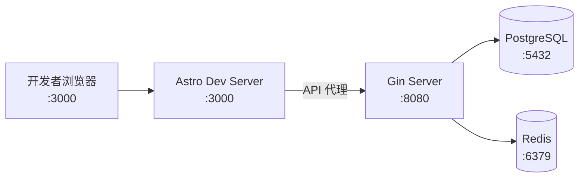
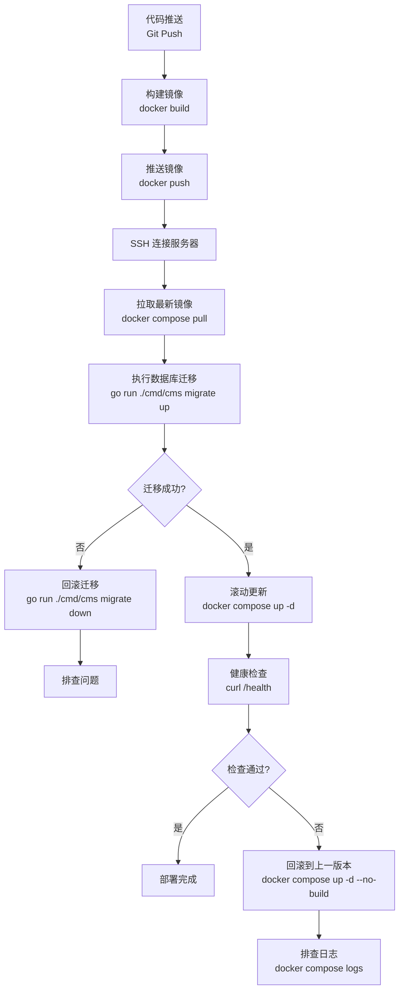
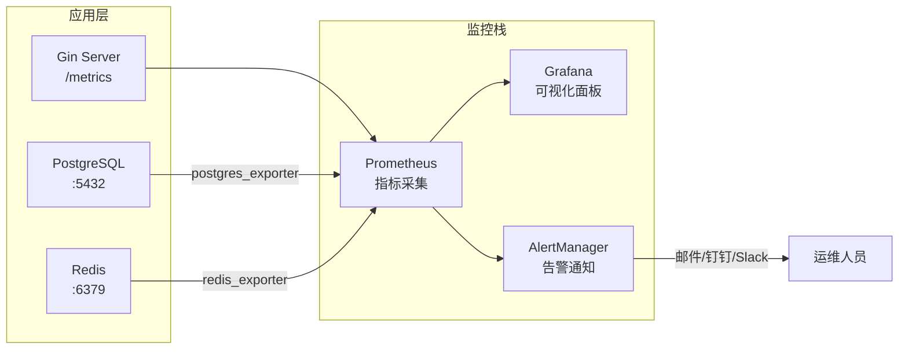
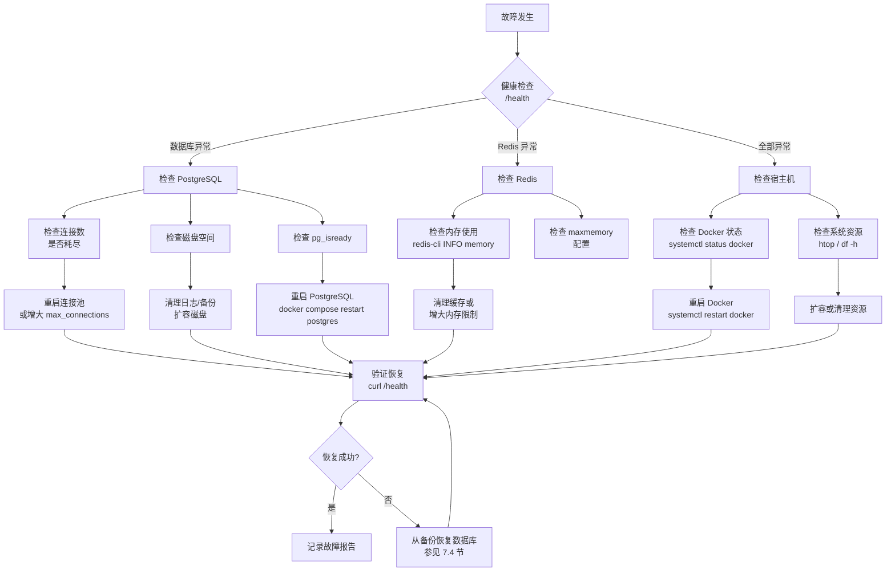

# CMS 内容管理系统 — 部署指南

**版本**：v2.0
**日期**：2026-02-24
**状态**：草稿

---

## 1. 环境要求

### 1.1 开发环境

| 软件 | 最低版本 | 说明 |
|------|----------|------|
| Go | 1.25+ | 后端编译与运行 |
| Node.js | 20+ (LTS) | 前端构建与 SSR 运行 |
| bun | 1.2+ | 前端包管理器与运行时 |
| Docker | 27+ | 容器化部署 |
| Docker Compose | 2.24+ | 多容器编排 |
| PostgreSQL | 18 | 主数据库（通过 Docker 运行） |
| Redis | 8 | 缓存与会话管理（通过 Docker 运行） |
| Make | 3.81+ | 构建任务管理 |

### 1.2 生产环境

| 软件 | 最低版本 | 说明 |
|------|----------|------|
| Docker | 27+ | 容器运行时 |
| Docker Compose | 2.24+ | 生产编排 |
| Nginx | 1.25+ | 反向代理 / HTTPS 终结 |
| Certbot | 2.0+ | Let's Encrypt 证书管理 |

### 1.3 硬件建议（单节点生产）

| 资源 | 最低配置 | 推荐配置 |
|------|----------|----------|
| CPU | 2 vCPU | 4 vCPU |
| 内存 | 4 GB | 8 GB |
| 磁盘 | 40 GB SSD | 100 GB SSD |
| 带宽 | 10 Mbps | 50 Mbps |

---

## 2. 本地开发环境搭建

### 2.1 克隆项目

```bash
git clone https://github.com/sky-flux/cms.git
cd cms
```

### 2.2 启动基础设施（PostgreSQL + Redis）

```bash
# 复制环境变量模板
cp .env.example .env

# 启动数据库与缓存
docker compose up -d postgres redis
```

等待健康检查通过：

```bash
docker compose ps
# 确认 postgres 和 redis 状态为 healthy
```

### 2.3 配置环境变量

编辑 `.env` 文件，填写必要配置（详见第 3 节环境变量清单）：

```bash
# .env.example — 完整环境变量模板
# 使用方式：cp .env.example .env 后根据实际环境修改

# ===== 数据库配置 =====
DB_HOST=localhost             # PostgreSQL 主机（默认 localhost）
DB_PORT=5432                  # PostgreSQL 端口（默认 5432）
DB_NAME=cms                   # [必填] 数据库名称
DB_USER=cms_user              # [必填] 数据库用户名
DB_PASSWORD=changeme          # [必填] PostgreSQL 密码
DB_SSLMODE=disable            # SSL 模式（默认 disable）
DB_MAX_OPEN_CONNS=25          # 最大打开连接数（默认 25）
DB_MAX_IDLE_CONNS=5           # 最大空闲连接数（默认 5）
DB_CONN_MAX_LIFETIME=1h       # 连接最大存活时间（默认 1h）
DB_CONN_MAX_IDLE_TIME=30m     # 空闲连接最大存活时间（默认 30m）

# ===== Redis 配置 =====
REDIS_HOST=localhost          # Redis 主机（默认 localhost）
REDIS_PORT=6379               # Redis 端口（默认 6379）
REDIS_PASSWORD=changeme       # Redis 密码
REDIS_DB=0                    # Redis 数据库编号（默认 0）

# ===== JWT 认证配置 =====
JWT_SECRET=your-secret-here-at-least-32-characters-long  # [必填] JWT 签名密钥（至少 32 字符，禁止硬编码）
JWT_ACCESS_EXPIRY=15m         # Access Token 有效期（默认 15m）
JWT_REFRESH_EXPIRY=168h       # Refresh Token 有效期（默认 168h，即 7 天）

# ===== 2FA 配置 =====
TOTP_ENCRYPTION_KEY=          # [必填] AES-256 加密密钥，用于加密 TOTP 秘钥（64 位十六进制字符 = 32 字节）
                              # 生成方式：openssl rand -hex 32

# ===== 服务器配置 =====
SERVER_PORT=8080              # 后端监听端口（默认 8080）
SERVER_MODE=debug             # 运行模式：debug / release（默认 debug）
FRONTEND_URL=http://localhost:3000  # 前端 URL（默认 http://localhost:3000）
LOG_LEVEL=debug               # 日志级别：debug / info / warn / error（默认 debug）
LOG_FORMAT=json               # 日志格式：json / text（默认 json）

# ===== RustFS 对象存储配置 =====
RUSTFS_ENDPOINT=http://rustfs:9000  # RustFS 服务地址（Docker 内部网络）
RUSTFS_ACCESS_KEY=                  # RustFS 访问密钥（必填）
RUSTFS_SECRET_KEY=                  # RustFS 密钥（必填）
RUSTFS_BUCKET=cms-media             # 存储桶名称（默认 cms-media）
RUSTFS_REGION=us-east-1             # 区域（默认 us-east-1）

# ===== Resend 邮件配置 =====
RESEND_API_KEY=re_xxxxxxxxxxxx       # [必填] Resend API Key
RESEND_FROM_NAME=Sky Flux CMS        # 发件人显示名称（默认 Sky Flux CMS）
RESEND_FROM_EMAIL=noreply@example.com  # [必填] 发件人邮箱地址

# ===== Meilisearch 全文搜索配置 =====
MEILI_URL=http://localhost:7700      # Meilisearch 服务地址（默认 http://localhost:7700）
MEILI_MASTER_KEY=your-master-key     # [必填] Meilisearch Master Key

# ===== 前端配置 =====
PUBLIC_API_URL=/api  # 后端 API 地址（通过 Caddy 代理）
```

### 2.4 执行数据库迁移

本项目使用 **uptrace/bun** 内置的 Go 代码迁移（非 golang-migrate 原始 SQL 文件）。迁移通过 `cms migrate` 子命令管理。

```bash
# 执行所有待迁移（自动处理 public 和所有 site_{slug} 模式）
go run ./cmd/cms migrate up
```

验证迁移状态：

```bash
go run ./cmd/cms migrate status
```

### 2.5 启动后端开发服务器

```bash
# 安装 Go 依赖
go mod download

# 启动（支持热重载，推荐安装 air）
# 方式一：直接运行
go run ./cmd/cms serve

# 方式二：使用 air 热重载
go install github.com/air-verse/air@latest
air
```

后端默认监听 `http://localhost:8080`。

### 2.6 启动前端开发服务器

```bash
cd web

# 安装依赖
bun install

# 启动开发服务器
bun dev
```

前端默认监听 `http://localhost:3000`。

### 2.7 首次运行 — Web 安装向导

首次启动后，系统尚未初始化。通过浏览器访问安装向导完成初始配置：

1. 打开浏览器访问 `http://localhost:3000/setup`
2. 填写以下信息：
   - **站点名称**（Site Name）
   - **站点 Slug**（自动从名称生成，可编辑，格式 `^[a-z0-9_]{3,50}$`）
   - **站点 URL**
   - **管理员邮箱**
   - **管理员密码**（至少 8 字符，需包含大写 + 小写 + 数字 + 特殊字符）
   - **管理员显示名**
   - **语言区域**（默认 `zh-CN`）
3. 点击提交，向导会在单个事务中完成：
   - 创建 `public` 模式表（sfc_users、sfc_sites、sfc_roles、sfc_user_roles 等 RBAC 表）
   - 创建首个站点记录和对应的 `site_{slug}` 模式
   - 创建管理员账号并赋予 `super` 角色（通过 sfc_user_roles 分配）
   - 设置 `system.installed = true` 标记
4. 初始化完成后自动跳转到 `/admin` 管理后台

> **注意**：安装向导使用 PostgreSQL 咨询锁（`pg_advisory_xact_lock`）防止并发安装竞争。安装完成后，`/api/v1/setup/*` 端点永久返回 409。

> **注意**：旧版 `make seed-admin` / `go run ./cmd/cms seed` 命令已移除，所有初始化通过 Web 安装向导完成。

### 2.8 开发环境架构总览



---

## 3. 环境变量清单

### 3.1 数据库配置

| 变量名 | 必填 | 默认值 | 说明 |
|--------|------|--------|------|
| `DB_HOST` | 否 | `localhost` | PostgreSQL 主机地址 |
| `DB_PORT` | 否 | `5432` | PostgreSQL 端口 |
| `DB_NAME` | 是 | — | 数据库名称 |
| `DB_USER` | 是 | — | 数据库用户名 |
| `DB_PASSWORD` | 是 | — | PostgreSQL 密码 |
| `DB_SSLMODE` | 否 | `disable` | SSL 模式（`disable` / `require` / `verify-full`） |
| `DB_MAX_OPEN_CONNS` | 否 | `25` | 最大打开连接数 |
| `DB_MAX_IDLE_CONNS` | 否 | `5` | 最大空闲连接数 |
| `DB_CONN_MAX_LIFETIME` | 否 | `1h` | 连接最大存活时间 |
| `DB_CONN_MAX_IDLE_TIME` | 否 | `30m` | 空闲连接最大存活时间 |

### 3.2 Redis 配置

| 变量名 | 必填 | 默认值 | 说明 |
|--------|------|--------|------|
| `REDIS_HOST` | 否 | `localhost` | Redis 主机地址 |
| `REDIS_PORT` | 否 | `6379` | Redis 端口 |
| `REDIS_PASSWORD` | 否 | — | Redis 密码 |
| `REDIS_DB` | 否 | `0` | Redis 数据库编号 |

### 3.3 JWT 认证配置

| 变量名 | 必填 | 默认值 | 说明 |
|--------|------|--------|------|
| `JWT_SECRET` | 是 | — | JWT 签名密钥（至少 32 字符） |
| `JWT_ACCESS_EXPIRY` | 否 | `15m` | Access Token 有效期 |
| `JWT_REFRESH_EXPIRY` | 否 | `168h` | Refresh Token 有效期（168h = 7 天） |

### 3.4 2FA 双因素认证配置

| 变量名 | 必填 | 默认值 | 说明 |
|--------|------|--------|------|
| `TOTP_ENCRYPTION_KEY` | 是 | — | AES-256 加密密钥，用于加密 TOTP 秘钥。必须为 64 位十六进制字符（32 字节）。生成方式：`openssl rand -hex 32` |

### 3.5 服务器配置

| 变量名 | 必填 | 默认值 | 说明 |
|--------|------|--------|------|
| `SERVER_PORT` | 否 | `8080` | 后端监听端口 |
| `SERVER_MODE` | 否 | `debug` | 运行模式：`debug` / `release` |
| `FRONTEND_URL` | 否 | `http://localhost:3000` | 前端 URL |
| `LOG_LEVEL` | 否 | `debug` | 日志级别：`debug` / `info` / `warn` / `error` |
| `LOG_FORMAT` | 否 | `json` | 日志格式：`json` / `text` |

### 3.6 RustFS 对象存储配置

| 变量名 | 必填 | 默认值 | 说明 |
|--------|------|--------|------|
| `RUSTFS_ENDPOINT` | 否 | `http://localhost:9000` | RustFS 服务地址 |
| `RUSTFS_ACCESS_KEY` | 是 | `rustfsadmin`（开发） | RustFS 访问密钥 |
| `RUSTFS_SECRET_KEY` | 是 | `rustfsadmin`（开发） | RustFS 密钥 |
| `RUSTFS_BUCKET` | 否 | `cms-media` | 存储桶名称 |
| `RUSTFS_REGION` | 否 | `us-east-1` | 区域设置 |

### 3.7 Resend 邮件配置

| 变量名 | 必填 | 默认值 | 说明 |
|--------|------|--------|------|
| `RESEND_API_KEY` | 是 | — | Resend API Key（`re_` 开头） |
| `RESEND_FROM_NAME` | 否 | `Sky Flux CMS` | 发件人显示名称 |
| `RESEND_FROM_EMAIL` | 是 | — | 发件人邮箱地址（如 `noreply@example.com`） |

### 3.8 Meilisearch 全文搜索配置

| 变量名 | 必填 | 默认值 | 说明 |
|--------|------|--------|------|
| `MEILI_URL` | 否 | `http://localhost:7700` | Meilisearch 服务地址 |
| `MEILI_MASTER_KEY` | 是 | — | Meilisearch Master Key |

### 3.9 前端配置

| 变量名 | 必填 | 默认值 | 说明 |
|--------|------|--------|------|
| `PUBLIC_API_URL` | 是 | — | 后端 API 地址（前端访问） |

---

## 4. Docker 构建

### 4.1 Go 后端 Dockerfile

```dockerfile
# Dockerfile
# =========================================
# 阶段一：构建
# =========================================
FROM golang:1.24-alpine AS builder

RUN apk add --no-cache git ca-certificates tzdata

WORKDIR /build

# 利用 Docker 缓存层：先复制依赖文件
COPY go.mod go.sum ./
RUN go mod download

# 复制源码并编译
COPY . .
RUN CGO_ENABLED=0 GOOS=linux GOARCH=amd64 \
    go build -ldflags="-w -s" -o /build/cms ./cmd/cms

# =========================================
# 阶段二：运行（最小镜像）
# =========================================
FROM alpine:3.20

RUN apk add --no-cache ca-certificates tzdata curl

# 非 root 用户运行
RUN addgroup -S appgroup && adduser -S appuser -G appgroup

WORKDIR /app

COPY --from=builder /build/cms .
COPY entrypoint.sh .
RUN chmod +x entrypoint.sh

RUN chown -R appuser:appgroup /app
USER appuser

EXPOSE 8080

HEALTHCHECK --interval=30s --timeout=5s --retries=3 \
    CMD curl -f http://localhost:8080/health || exit 1

ENTRYPOINT ["./entrypoint.sh"]
CMD ["./cms", "serve"]
```

### 4.1.1 Docker Secrets 入口脚本

后端容器通过 `entrypoint.sh` 在启动时读取 Docker Secrets 文件并注入环境变量，供应用程序使用：

```bash
#!/bin/sh
# entrypoint.sh — 读取 Docker Secrets 并注入环境变量
set -e

# 从 Docker Secret 读取数据库密码
if [ -f "${DB_PASSWORD_FILE:-}" ]; then
    export DB_PASSWORD=$(cat "$DB_PASSWORD_FILE")
fi

# 从 Docker Secret 读取 Redis 密码
if [ -f "${REDIS_PASSWORD_FILE:-}" ]; then
    export REDIS_PASSWORD=$(cat "${REDIS_PASSWORD_FILE}")
fi

if [ -f "${JWT_SECRET_FILE:-}" ]; then
    export JWT_SECRET=$(cat "${JWT_SECRET_FILE}")
fi

if [ -f "${TOTP_ENCRYPTION_KEY_FILE:-}" ]; then
    export TOTP_ENCRYPTION_KEY=$(cat "${TOTP_ENCRYPTION_KEY_FILE}")
fi

exec "$@"
```

> `exec "$@"` 将 `CMD` 指定的命令（`./cms serve`）作为 PID 1 执行，确保信号能正确传递到应用进程。

### 4.2 Astro 前端 Dockerfile

```dockerfile
# web/Dockerfile
# =========================================
# 阶段一：安装依赖
# =========================================
FROM oven/bun:1-alpine AS deps

WORKDIR /app
COPY package.json bun.lock ./
RUN bun install --frozen-lockfile

# =========================================
# 阶段二：构建
# =========================================
FROM oven/bun:1-alpine AS builder

WORKDIR /app
COPY --from=deps /app/node_modules ./node_modules
COPY . .

ARG PUBLIC_API_URL
ENV PUBLIC_API_URL=${PUBLIC_API_URL}

RUN bun run build

# =========================================
# 阶段三：运行（SSR）
# =========================================
FROM oven/bun:1-alpine AS runner

RUN addgroup -S appgroup && adduser -S appuser -G appgroup

WORKDIR /app

COPY --from=builder /app/dist ./dist
COPY --from=builder /app/node_modules ./node_modules
COPY --from=builder /app/package.json ./

RUN chown -R appuser:appgroup /app
USER appuser

EXPOSE 3000

HEALTHCHECK --interval=30s --timeout=5s --retries=3 \
    CMD wget --no-verbose --tries=1 --spider http://localhost:3000/ || exit 1

CMD ["bun", "./dist/server/entry.mjs"]
```

### 4.3 .dockerignore

```
# 后端 .dockerignore
.git
.env
*.md
tmp/
vendor/

# 前端 web/.dockerignore
.git
node_modules
.env
dist
.astro
*.md
bun.lockb.bak
```

### 4.4 镜像优化技巧

| 优化手段 | 效果 |
|----------|------|
| 多阶段构建 | 后端最终镜像约 20-30 MB（仅包含单一 CLI 二进制） |
| Alpine 基础镜像 | 比 Debian 镜像小 5-10 倍 |
| `CGO_ENABLED=0` | 静态链接，无 C 依赖 |
| `-ldflags="-w -s"` | 去除调试信息和符号表，减小二进制体积 |
| 分层缓存 | `go.mod` / `package.json` 单独 COPY，依赖变更才重建 |
| 非 root 用户 | 安全最佳实践，降低容器逃逸风险 |
| `--frozen-lockfile` | 确保生产构建与开发一致 |

---

## 5. 生产部署

### 5.1 docker-compose.prod.yml

与开发环境的主要差异：

| 差异项 | 开发环境 | 生产环境 |
|--------|----------|----------|
| 端口暴露 | 所有服务暴露端口到宿主机 | 仅 Nginx 暴露 80/443 |
| 日志级别 | `debug` | `warn` |
| 资源限制 | 无 | 设置 CPU/内存限制 |
| 重启策略 | 无 | `unless-stopped` |
| 敏感凭据 | 明文 `.env` | Docker Secrets（DB / Redis / JWT / TOTP） |
| 构建模式 | 实时编译 | 预构建镜像 |

```yaml
# docker-compose.prod.yml
# Docker Compose V2 不再需要 version 字段，已移除

services:
  postgres:
    image: postgres:18-alpine
    environment:
      POSTGRES_DB: cms
      POSTGRES_USER: cms_user
      POSTGRES_PASSWORD_FILE: /run/secrets/db_password
    secrets:
      - db_password
    volumes:
      - postgres_data:/var/lib/postgresql/data
    healthcheck:
      test: ["CMD-SHELL", "pg_isready -U cms_user -d cms"]
      interval: 10s
      timeout: 5s
      retries: 5
    restart: unless-stopped
    deploy:
      resources:
        limits:
          cpus: '1.5'
          memory: 1536M

  redis:
    image: redis:8-alpine
    # Redis 官方镜像不支持 _FILE 变量，通过挂载 secret 并在 command 中引用
    command: >
      sh -c 'redis-server
      --requirepass "$$(cat /run/secrets/redis_password)"
      --maxmemory 256mb
      --maxmemory-policy allkeys-lru
      --appendonly yes'
    secrets:
      - redis_password
    volumes:
      - redis_data:/data
    healthcheck:
      test: ["CMD-SHELL", "redis-cli -a \"$$(cat /run/secrets/redis_password)\" ping"]
      interval: 10s
      timeout: 3s
      retries: 5
    restart: unless-stopped
    deploy:
      resources:
        limits:
          cpus: '0.5'
          memory: 512M

  backend:
    image: ${REGISTRY}/cms-backend:${TAG:-latest}
    environment:
      DB_HOST: postgres
      DB_PORT: 5432
      DB_NAME: cms
      DB_USER: cms_user
      DB_PASSWORD_FILE: /run/secrets/db_password          # entrypoint.sh 读取后注入 DB_PASSWORD
      REDIS_HOST: redis
      REDIS_PASSWORD_FILE: /run/secrets/redis_password    # entrypoint.sh 读取后注入 REDIS_PASSWORD
      JWT_SECRET_FILE: /run/secrets/jwt_secret            # entrypoint.sh 读取后注入 JWT_SECRET
      TOTP_ENCRYPTION_KEY_FILE: /run/secrets/totp_key     # entrypoint.sh 读取后注入 TOTP_ENCRYPTION_KEY
      SERVER_PORT: 8080
      SERVER_MODE: release
      LOG_LEVEL: warn
      RUSTFS_ENDPOINT: http://rustfs:9000
      RUSTFS_BUCKET: ${RUSTFS_BUCKET:-cms-media}
    secrets:
      - db_password
      - redis_password
      - jwt_secret
      - totp_key
    depends_on:
      postgres:
        condition: service_healthy
      redis:
        condition: service_healthy
    # 媒体文件存储在 RustFS 中，无需本地 volume
    restart: unless-stopped
    deploy:
      resources:
        limits:
          cpus: '1.0'
          memory: 768M

  frontend:
    image: ${REGISTRY}/cms-frontend:${TAG:-latest}
    environment:
      PUBLIC_API_URL: /api
    depends_on:
      - backend
    restart: unless-stopped
    deploy:
      resources:
        limits:
          cpus: '0.5'
          memory: 256M

  nginx:
    image: nginx:alpine
    ports:
      - "80:80"
      - "443:443"
    volumes:
      - ./nginx/nginx.conf:/etc/nginx/nginx.conf:ro
      - ./nginx/conf.d:/etc/nginx/conf.d:ro
      - ./certs:/etc/nginx/certs:ro
      - media_files:/var/www/media:ro
    depends_on:
      - backend
      - frontend
    restart: unless-stopped
    deploy:
      resources:
        limits:
          cpus: '0.25'
          memory: 128M

# 资源分配说明（4GB 最低配置）：
# PostgreSQL: 1.5 CPU, 1.5GB
# Redis: 0.5 CPU, 512MB
# Backend: 1.0 CPU, 768MB
# Frontend: 0.5 CPU, 256MB
# Nginx: 0.25 CPU, 128MB
# 预留 ~850MB 给 OS 和 Docker daemon
# **注意**：以上为 4GB 最低配置的分配方案。生产建议 8GB+ 以获得充足余量。

secrets:
  db_password:
    file: ./secrets/db_password.txt
  redis_password:
    file: ./secrets/redis_password.txt
  jwt_secret:
    file: ./secrets/jwt_secret.txt
  totp_key:
    file: ./secrets/totp_key.txt

volumes:
  postgres_data:
  redis_data:
  media_files:
```

### 5.2 Caddy 反向代理

Caddy 作为统一入口，自动处理 HTTPS 和安全头配置。

#### 开发环境

`Caddyfile`:

```caddyfile
:8000 {
    reverse_proxy /api/* backend:8080
    reverse_proxy /feed/* backend:8080
    reverse_proxy /sitemap* backend:8080
    reverse_proxy /_astro/* frontend:3000
    reverse_proxy /* frontend:3000
}
```

#### 生产环境

`Caddyfile.production`:

```caddyfile
{
    email admin@{$DOMAIN}
    admin off
}

{$DOMAIN} {
    # Security headers
    header {
        X-Frame-Options "DENY"
        X-Content-Type-Options "nosniff"
        X-XSS-Protection "1; mode=block"
        Referrer-Policy "strict-origin-when-cross-origin"
        Permissions-Policy "camera=(), microphone=(), geolocation=()"
        -Server
    }

    # Enable Gzip compression
    encode {
        gzip 6
        minimum_length 512
    }

    # Static assets - 1 year immutable cache
    @staticAssets {
        path /_astro/*
    }
    handle @staticAssets {
        header Cache-Control "public, max-age=31536000, immutable"
        reverse_proxy frontend:3000
    }

    # RSS/Sitemap - 1 hour cache
    @feedCache {
        path /feed/*
    }
    handle @feedCache {
        header Cache-Control "public, max-age=3600"
        reverse_proxy backend:8080
    }

    @sitemapCache {
        path /sitemap*
    }
    handle @sitemapCache {
        header Cache-Control "public, max-age=3600"
        reverse_proxy backend:8080
    }

    # API - no caching, proxy to backend
    @api {
        path /api/*
    }
    handle @api {
        reverse_proxy backend:8080
    }

    # Default - proxy to frontend SSR
    handle {
        reverse_proxy frontend:3000
    }
}
```

**优势:**

- **自动 HTTPS**: Caddy 自动获取和续期 Let's Encrypt 证书，无需手动配置
- **安全头**: 内置所有安全头配置，无需额外设置
- **零停机**: 配置更改自动重载，不影响服务
- **简洁配置**: 相比 Nginx，配置文件更简洁易懂

### 5.3 GitHub Actions CI/CD

#### 工作流触发

- **PR to main**: 仅运行测试
- **Push to main**: 测试 + 构建 + 推送 GHCR
- **Tag push**: 测试 + 构建 + 推送 GHCR

#### 镜像标签

- `latest`: 最新 main 分支
- `<branch>`: 分支名 (如 `main-backend`)
- `<sha>`: Git commit SHA

#### 镜像仓库

- 后端: `ghcr.io/sky-flux/cms-backend:latest`
- 前端: `ghcr.io/sky-flux/cms-frontend:latest`

详见 `.github/workflows/ci.yml`。

### 5.4 部署流程



### 镜像标签策略

- 开发环境：`dev-<commit-sha-7>`
- 预发布：`rc-<version>`（如 `rc-1.0.0`）
- 生产环境：语义化版本 `<version>`（如 `1.0.0`）
- **禁止**在生产环境使用 `latest` 标签
- 所有部署记录完整的镜像 digest（SHA256）

#### 部署脚本参考

```bash
#!/bin/bash
# deploy.sh — 生产部署脚本
set -euo pipefail

REGISTRY="registry.example.com"
TAG="${1:-latest}"

echo "==> 构建镜像..."
docker build -t ${REGISTRY}/cms-backend:${TAG} .
docker build -t ${REGISTRY}/cms-frontend:${TAG} \
    --build-arg PUBLIC_API_URL=https://cms.example.com ./web

echo "==> 推送镜像..."
docker push ${REGISTRY}/cms-backend:${TAG}
docker push ${REGISTRY}/cms-frontend:${TAG}

echo "==> 执行数据库迁移（自动处理 public + 所有 site 模式）..."
docker compose -f docker-compose.prod.yml run --rm backend \
    ./cms migrate up

echo "==> 更新服务..."
TAG=${TAG} docker compose -f docker-compose.prod.yml up -d --pull always

echo "==> 等待健康检查..."
sleep 10
if curl -sf http://localhost/health > /dev/null; then
    echo "==> 部署成功!"
else
    echo "==> 健康检查失败，请检查日志"
    docker compose -f docker-compose.prod.yml logs --tail 50
    exit 1
fi
```

---

## 6. 数据库迁移管理

### 6.1 迁移架构

本项目使用 **uptrace/bun** 内置迁移功能（Go 代码迁移），迁移通过 `cms migrate` 子命令管理。支持多站点模式隔离架构，迁移分为三种类型：

| 迁移类型 | 作用域 | 说明 |
|----------|--------|------|
| Global-only | `public` 模式 | 用户表加列、创建新全局表等 |
| Per-site-only | 所有 `site_{slug}` 模式 | 文章表加列、创建新站点表等 |
| Mixed | 两者 | 新建全局表 + 从站点表引用 |

### 6.2 迁移命令

```bash
# 执行所有待迁移（自动处理 public 和所有 site_{slug} 模式）
go run ./cmd/cms migrate up

# 回滚一步
go run ./cmd/cms migrate down

# 查看迁移状态
go run ./cmd/cms migrate status

# 创建迁移元数据表（首次部署时执行）
go run ./cmd/cms migrate init
```

> **注意**：站点 Schema 通过 API 创建站点时自动调用 `internal/schema/CreateSiteSchema()` 生成，不需要手动 CLI 命令。

### 6.3 迁移文件组织

```
migrations/
├── main.go                                       -- 迁移注册表 (migrate.NewMigrations())
├── 20260224000001_create_enums_and_functions.go   -- 枚举类型 + update_updated_at() 函数
├── 20260224000002_create_public_schema.go         -- sfc_users, sfc_sites, 9 张 RBAC 表, sfc_refresh_tokens 等
├── 20260224000003_create_site_template.go         -- 占位符（站点 schema 由 internal/schema/ 动态创建）
├── 20260224000004_seed_rbac_builtins.go           -- Seed 4 内置角色 + 4 内置权限模板
└── ...
```

### 6.4 Per-Site 迁移辅助函数

当迁移需要应用到每个已存在的站点模式时，使用 `ForEachSiteSchema` 辅助函数：

```go
// ForEachSiteSchema 在事务中对每个站点模式执行函数
func ForEachSiteSchema(ctx context.Context, db *bun.DB, fn func(tx bun.Tx, schema string) error) error {
    var slugs []string
    err := db.NewSelect().
        TableExpr("public.sfc_sites").
        Column("slug").
        Scan(ctx, &slugs)
    if err != nil {
        return err
    }

    for _, slug := range slugs {
        schema := "site_" + slug
        err := db.RunInTx(ctx, nil, func(ctx context.Context, tx bun.Tx) error {
            _, err := tx.ExecContext(ctx,
                fmt.Sprintf("SET LOCAL search_path TO '%s', 'public'", schema))
            if err != nil {
                return err
            }
            return fn(tx, schema)
        })
        if err != nil {
            return fmt.Errorf("migration failed for schema %s: %w", schema, err)
        }
    }
    return nil
}
```

### 6.5 迁移编写最佳实践

| 注意事项 | 说明 |
|----------|------|
| 始终备份 | 迁移前执行 `pg_dump` 备份数据库（含所有模式） |
| 事务包裹 | 每个迁移函数在 `bun.RunInTx` 内执行 |
| 避免锁表 | 大表加列使用 `ALTER TABLE ... ADD COLUMN ... DEFAULT` 而非回填 |
| 索引创建 | 使用 `CREATE INDEX CONCURRENTLY` 避免阻塞写入 |
| 分步执行 | 破坏性变更分为多步：(1) 添加新列 → (2) 迁移数据 → (3) 删除旧列 |
| 回滚计划 | 确保每个迁移的 `Down` 方法可正确回滚 |
| 低峰执行 | 选择业务低峰期执行迁移 |
| 模式感知 | per-site 迁移必须迭代所有 `site_{slug}` 模式，不能只操作单个模式 |

---

## 7. 运维检查清单

### 7.1 上线前检查项

| 检查项 | 状态 | 说明 |
|--------|------|------|
| 环境变量完整性 | [ ] | 所有必填变量已配置且值正确 |
| JWT_SECRET 安全性 | [ ] | 至少 32 字符，使用随机生成的强密码 |
| TOTP_ENCRYPTION_KEY | [ ] | 64 位十六进制字符（32 字节），使用 `openssl rand -hex 32` 生成 |
| 数据库连接 | [ ] | `psql` 或应用可正常连接 |
| Redis 连接 | [ ] | `redis-cli ping` 返回 PONG |
| 数据库迁移 | [ ] | 所有迁移已执行且无脏状态 |
| 安装向导 | [ ] | 首次部署通过 `/setup` 完成初始化 |
| SSL 证书 | [ ] | 证书有效且配置正确 |
| DNS 解析 | [ ] | 所有站点域名已正确指向服务器 IP |
| 防火墙 | [ ] | 仅开放 80/443 端口 |
| 备份策略 | [ ] | pg_dump 定时任务已配置（含所有模式） |
| 日志目录 | [ ] | 日志目录权限正确，磁盘空间充足 |
| 默认密码修改 | [ ] | 安装向导创建的管理员密码足够强 |
| CORS 配置 | [ ] | 仅允许生产域名 |
| 资源限制 | [ ] | Docker 容器 CPU/内存限制已设置 |

### 7.2 健康检查端点

后端提供 `/health` 端点，返回各服务状态：

```json
{
  "status": "healthy",
  "version": "2.0.0",
  "uptime": "72h15m",
  "checks": {
    "database": "ok",
    "redis": "ok",
    "rustfs": "ok"
  }
}
```

监控建议：每 30 秒轮询一次，连续 3 次失败触发告警。

### 7.3 日志管理

| 配置项 | 开发环境 | 生产环境 |
|--------|----------|----------|
| 日志级别 | `debug` | `warn` |
| 输出格式 | 文本（彩色） | JSON（结构化） |
| 输出目标 | `stdout` | `stdout`（Docker 收集） |

Docker 日志配置：

```yaml
# docker-compose.prod.yml 日志配置
services:
  backend:
    logging:
      driver: "json-file"
      options:
        max-size: "50m"
        max-file: "5"
```

查看日志：

```bash
# 实时查看后端日志
docker compose -f docker-compose.prod.yml logs -f backend

# 查看最近 100 行
docker compose -f docker-compose.prod.yml logs --tail 100 backend

# 按时间过滤
docker compose -f docker-compose.prod.yml logs --since "2026-02-24T10:00:00" backend
```

### 7.4 备份策略

#### PostgreSQL 定时备份

备份必须包含所有模式（`public` + 所有 `site_{slug}` 模式）。`pg_dump` 默认导出所有模式，无需额外参数。

```bash
#!/bin/bash
# backup.sh — PostgreSQL 备份脚本（含所有模式）
BACKUP_DIR="/backups/postgres"
TIMESTAMP=$(date +%Y%m%d_%H%M%S)
RETENTION_DAYS=30

mkdir -p ${BACKUP_DIR}

# 执行备份（--format=custom 自动包含所有模式）
docker compose -f docker-compose.prod.yml exec -T postgres \
    pg_dump -U cms_user -d cms --format=custom --compress=9 \
    > "${BACKUP_DIR}/cms_${TIMESTAMP}.dump"

# 清理过期备份
find ${BACKUP_DIR} -name "*.dump" -mtime +${RETENTION_DAYS} -delete

echo "[$(date)] 备份完成: cms_${TIMESTAMP}.dump"
```

配置 crontab 定时执行：

```bash
# 每天凌晨 3 点备份
0 3 * * * /opt/cms/backup.sh >> /var/log/cms-backup.log 2>&1
```

| 备份策略 | 频率 | 保留时间 |
|----------|------|----------|
| 全量备份 | 每日 03:00 | 30 天 |
| WAL 日志 | 持续归档（可选） | 7 天 |
| 备份验证 | 每周一次 | — |

#### 备份验证流程

```bash
# 每周自动验证（cron 定时任务）
#!/bin/bash
BACKUP_FILE=$(ls -t /backups/postgres/*.dump | head -1)
# 1. 恢复到临时数据库
createdb -h localhost backup_test
pg_restore -h localhost -d backup_test --no-owner "${BACKUP_FILE}"
# 2. 执行完整性检查（验证 public 模式和站点模式均存在）
psql -h localhost backup_test -c "SELECT count(*) FROM public.sfc_sites;"
psql -h localhost backup_test -c "SELECT schema_name FROM information_schema.schemata WHERE schema_name LIKE 'site_%';"
# 3. 清理
dropdb -h localhost backup_test
```

> **警告**：恢复备份时，`pg_restore --clean` 会执行 `DROP SCHEMA ... CASCADE`，将**永久删除**所有站点模式及其数据。请在恢复前确认操作对象正确，建议先恢复到临时数据库验证。

#### 数据恢复

```bash
# 从备份恢复（恢复所有模式：public + 所有 site_{slug}）
docker compose -f docker-compose.prod.yml exec -T postgres \
    pg_restore -U cms_user -d cms --clean --if-exists \
    < /backups/postgres/cms_20260224_030000.dump
```

### 7.5 监控建议



关键监控指标：

| 指标 | 告警阈值 | 说明 |
|------|----------|------|
| API P99 延迟 | > 500 ms | 接口响应过慢 |
| 错误率（5xx） | > 1% | 服务端异常 |
| CPU 使用率 | > 80% | 资源不足 |
| 内存使用率 | > 85% | 内存泄漏风险 |
| 磁盘使用率 | > 90% | 需扩容或清理 |
| PostgreSQL 连接数 | > 80% max | 连接池耗尽风险 |
| Redis 内存使用 | > 80% maxmemory | 缓存淘汰频繁 |
| SSL 证书到期 | < 14 天 | 证书续期 |

### 7.6 故障恢复流程



---

## 8. 定时任务

系统中多项功能依赖后台定时任务执行，包括定时发布、数据清理、缓存刷新等。所有定时任务在后端服务进程内运行，使用 [`robfig/cron/v3`](https://github.com/robfig/cron) 库调度（支持秒级精度的 6 位 cron 表达式）。

**快速概览**：

```go
// 核心调度逻辑概要
c := cron.New(cron.WithSeconds())
c.AddFunc("0 * * * * *",    publishScheduledPosts)          // every minute
c.AddFunc("0 0 2 * * *",    cleanupTrash)                   // daily at 2 AM UTC
c.AddFunc("0 0 3 * * *",    dropExpiredAuditPartitions)     // daily at 3 AM UTC
c.AddFunc("0 5 3 * * *",    createFutureAuditPartitions)    // daily at 3:05 AM UTC
c.AddFunc("0 0 4 * * *",    cleanupExpiredRefreshTokens)    // daily at 4 AM UTC
c.AddFunc("0 0 * * * *",    cleanExpiredPreviewTokens)      // every hour
c.AddFunc("0 */5 * * * *",  flushRedirectHitCounts)         // every 5 min
c.AddFunc("0 0 5 * * *",    cleanExpiredComments)           // daily at 5 AM UTC
c.Start()
```

### 8.1 调度器初始化

```go
// internal/cron/scheduler.go
package cron

import (
    "log/slog"

    "github.com/robfig/cron/v3"
)

func NewScheduler(db *bun.DB, rdb *redis.Client) *cron.Cron {
    c := cron.New(cron.WithSeconds())

    // 定时发布：每分钟检查一次（遍历所有站点模式）
    c.AddFunc("0 */1 * * * *", func() {
        n, err := PublishScheduledPosts(db)
        if err != nil {
            slog.Error("scheduled publish failed", slog.String("error", err.Error()))
            return
        }
        if n > 0 {
            slog.Info("scheduled publish completed", slog.Int("count", n))
        }
    })

    // 回收站清理：每天凌晨 2:00（遍历所有站点模式）
    c.AddFunc("0 0 2 * * *", func() { CleanupTrash(db) })

    // 审计日志分区清理：每天凌晨 3:00（遍历所有站点模式）
    c.AddFunc("0 0 3 * * *", func() { DropExpiredAuditPartitions(db) })

    // 审计日志分区自动创建：每天凌晨 3:05（遍历所有站点模式）
    c.AddFunc("0 5 3 * * *", func() { CreateFutureAuditPartitions(db) })

    // 过期 Refresh Token 清理：每天凌晨 4:00（public 模式）
    c.AddFunc("0 0 4 * * *", func() { CleanupExpiredRefreshTokens(db) })

    // 过期预览令牌清理：每小时（遍历所有站点模式）
    c.AddFunc("0 0 * * * *", func() { CleanExpiredPreviewTokens(db) })

    // 重定向命中计数刷新：每 5 分钟（遍历所有站点，从 Redis 刷新到 PostgreSQL）
    c.AddFunc("0 */5 * * * *", func() { FlushRedirectHitCounts(db, rdb) })

    // 过期已删除评论清理：每天凌晨 5:00（遍历所有站点模式）
    c.AddFunc("0 0 5 * * *", func() { CleanExpiredComments(db) })

    return c
}
```

### 8.2 任务说明

| 任务 | 调度周期 | 逻辑说明 |
|------|----------|----------|
| 定时发布 | 每分钟 | 遍历所有站点模式，查询 `sfc_site_posts WHERE status='scheduled' AND scheduled_at <= NOW()`，批量更新为 `published` |
| 回收站清理 | 每天 02:00 | 遍历所有站点模式，物理删除 `sfc_site_posts`/`users` 中 `deleted_at < NOW() - INTERVAL '30 days'` 的记录 |
| 审计日志清理 | 每天 03:00 | 遍历所有站点模式，删除超过 90 天的 `sfc_site_audits` 分区 |
| 分区自动创建 | 每天 03:05 | 遍历所有站点模式，检查并创建未来 2 个月的 `sfc_site_audits` 分区 |
| Refresh Token 清理 | 每天 04:00 | 删除 `public.sfc_refresh_tokens WHERE expires_at < NOW()` 的过期令牌 |
| 预览令牌清理 | 每小时 | 遍历所有站点模式，删除 `sfc_site_preview_tokens WHERE expires_at < NOW() - INTERVAL '1 hour'` |
| 重定向命中计数刷新 | 每 5 分钟 | 遍历所有站点，扫描 Redis `site:{slug}:redirect:hits:*` 键，使用 `GETDEL` 原子读取后写入 PostgreSQL `sfc_site_redirects.hit_count` |
| 过期评论清理 | 每天 05:00 | 遍历所有站点模式，物理删除 `sfc_site_comments WHERE status='trash' AND deleted_at < NOW() - INTERVAL '30 days'` |

### 8.3 启动与停止

在 `cmd/cms/serve.go` 中集成调度器：

```go
scheduler := cron.NewScheduler(db, rdb)
scheduler.Start()
defer scheduler.Stop()
```

### 8.4 注意事项

- 所有清理任务安排在凌晨低峰时段，避免影响正常业务
- 每个任务内部使用 `LIMIT` 分批处理，防止长事务锁表
- 任务执行失败仅记录日志告警，不影响主服务运行
- 所有 per-site 任务通过 `ForEachSiteSchema` 遍历执行，确保覆盖所有站点模式
- 生产环境如需水平扩展后端实例，需引入分布式锁（如 Redis `SETNX`）确保任务不重复执行
- 重定向命中计数使用 Redis `GETDEL` 原子操作，避免计数丢失或重复

---

## 附录 A：常用命令速查

```bash
# ===== 开发环境 =====
docker compose up -d                         # 启动所有服务（自动合并 override.yml）
docker compose -f docker-compose.yml -f docker-compose.local.yml up -d  # 本地 Docker 测试环境
docker compose down                          # 停止所有服务
docker compose logs -f api                   # 查看后端日志

# ===== 生产环境 =====
docker compose -f docker-compose.yml -f docker-compose.prod.yml up -d          # 启动生产环境
docker compose -f docker-compose.yml -f docker-compose.prod.yml pull            # 拉取最新镜像
docker compose -f docker-compose.yml -f docker-compose.prod.yml restart api    # 重启后端

# ===== 数据库迁移 =====
go run ./cmd/cms migrate up                      # 执行所有待迁移（public + 所有站点模式）
go run ./cmd/cms migrate down                    # 回滚一步
go run ./cmd/cms migrate status                  # 查看迁移状态
go run ./cmd/cms migrate init                    # 创建迁移元数据表（首次部署）

# ===== 镜像构建 =====
docker build -t cms:latest .
docker build -t cms-frontend:latest --build-arg PUBLIC_API_URL=/api ./web

# ===== 备份恢复 =====
# 备份（含所有模式）
docker compose exec -T postgres pg_dump -U cms_user -d cms -Fc > backup.dump
# 恢复（恢复所有模式）
docker compose exec -T postgres pg_restore -U cms_user -d cms --clean < backup.dump

# ===== 安全密钥生成 =====
openssl rand -hex 32                         # 生成 TOTP_ENCRYPTION_KEY
openssl rand -base64 48                      # 生成 JWT_SECRET
```
