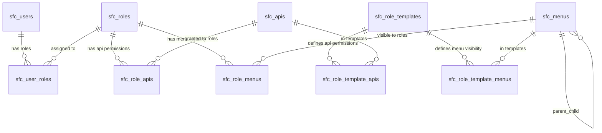

# 动态 RBAC 权限系统设计

**日期**: 2026-02-24
**状态**: 已批准
**范围**: V1.0，替换原有 ENUM 固定角色方案

---

## 1. 设计决策摘要

| 决策 | 选择 |
|------|------|
| 权限粒度 | API 路由级（method + path） |
| 角色范围 | 全局（非按站点） |
| 用户角色 | 多角色，权限取并集 |
| API 注册 | 应用启动时自动从 Gin 路由表同步 |
| 内置角色 | 4 个 `built_in=true`（super/admin/editor/viewer），不可删除 |
| super 角色 | 权限锁定，中间件直接放行，不可修改/禁用/删除 |
| 权限模板 | 独立模板表，新建角色时从模板克隆权限 |
| 后台菜单 | 独立 `sfc_menus` 表控制后台侧边栏可见性（区别于前端 `sfc_site_menus`） |

---

## 2. 表结构设计

### 2.1 需要删除的对象

| 对象 | 原因 |
|------|------|
| `CREATE TYPE user_role AS ENUM (...)` | 被 `sfc_roles` 表替代 |
| `public.sfc_site_user_roles` | 被全局 `sfc_user_roles` 替代 |

### 2.2 新增表（全部在 public schema）

#### 2.2.1 角色定义 — `sfc_roles`

```sql
CREATE TABLE public.sfc_roles (
    id          UUID PRIMARY KEY DEFAULT uuidv7(),
    name        VARCHAR(50)  NOT NULL UNIQUE,
    slug        VARCHAR(50)  NOT NULL UNIQUE,
    description TEXT,
    built_in    BOOLEAN      NOT NULL DEFAULT FALSE,
    status      BOOLEAN      NOT NULL DEFAULT TRUE,
    created_at  TIMESTAMPTZ  NOT NULL DEFAULT NOW(),
    updated_at  TIMESTAMPTZ  NOT NULL DEFAULT NOW()
);

CREATE TRIGGER trg_sfc_roles_updated_at
    BEFORE UPDATE ON public.sfc_roles FOR EACH ROW EXECUTE FUNCTION update_updated_at();
```

**内置角色 Seed:**

| slug | name | built_in | 备注 |
|------|------|----------|------|
| `super` | 超级管理员 | true | 不可删除/禁用/修改权限 |
| `admin` | 管理员 | true | 不可删除 |
| `editor` | 编辑 | true | 不可删除 |
| `viewer` | 查看者 | true | 不可删除 |

#### 2.2.2 用户-角色分配 — `sfc_user_roles`

```sql
CREATE TABLE public.sfc_user_roles (
    user_id    UUID NOT NULL REFERENCES public.sfc_users(id) ON DELETE CASCADE,
    role_id    UUID NOT NULL REFERENCES public.sfc_roles(id) ON DELETE CASCADE,
    created_at TIMESTAMPTZ NOT NULL DEFAULT NOW(),
    PRIMARY KEY (user_id, role_id)
);

CREATE INDEX idx_sfc_user_roles_role ON public.sfc_user_roles(role_id);
```

#### 2.2.3 API 端点注册 — `sfc_apis`

```sql
CREATE TABLE public.sfc_apis (
    id          UUID PRIMARY KEY DEFAULT uuidv7(),
    method      VARCHAR(10)  NOT NULL,
    path        VARCHAR(500) NOT NULL,
    name        VARCHAR(100) NOT NULL,
    description TEXT,
    "group"     VARCHAR(50)  NOT NULL,
    status      BOOLEAN      NOT NULL DEFAULT TRUE,
    created_at  TIMESTAMPTZ  NOT NULL DEFAULT NOW(),
    updated_at  TIMESTAMPTZ  NOT NULL DEFAULT NOW(),
    UNIQUE(method, path)
);

CREATE INDEX idx_sfc_apis_group ON public.sfc_apis("group");

CREATE TRIGGER trg_sfc_apis_updated_at
    BEFORE UPDATE ON public.sfc_apis FOR EACH ROW EXECUTE FUNCTION update_updated_at();
```

**自动注册**: 应用启动时通过 `gin.Engine.Routes()` 遍历所有路由，upsert 到 `sfc_apis`。当前路由表中不存在的旧记录标记 `status = false`（软禁用，保留历史映射）。

`name`、`description`、`group` 通过路由注册时的元数据注入。

#### 2.2.4 角色-API 权限映射 — `sfc_role_apis`

```sql
CREATE TABLE public.sfc_role_apis (
    role_id UUID NOT NULL REFERENCES public.sfc_roles(id) ON DELETE CASCADE,
    api_id  UUID NOT NULL REFERENCES public.sfc_apis(id) ON DELETE CASCADE,
    PRIMARY KEY (role_id, api_id)
);

CREATE INDEX idx_sfc_role_apis_api ON public.sfc_role_apis(api_id);
```

#### 2.2.5 后台管理菜单 — `sfc_menus`

```sql
CREATE TABLE public.sfc_menus (
    id         UUID PRIMARY KEY DEFAULT uuidv7(),
    parent_id  UUID REFERENCES public.sfc_menus(id) ON DELETE CASCADE,
    name       VARCHAR(100) NOT NULL,
    icon       VARCHAR(50),
    path       VARCHAR(200),
    sort_order INT     NOT NULL DEFAULT 0,
    status     BOOLEAN NOT NULL DEFAULT TRUE,
    created_at TIMESTAMPTZ NOT NULL DEFAULT NOW(),
    updated_at TIMESTAMPTZ NOT NULL DEFAULT NOW()
);

CREATE INDEX idx_sfc_menus_parent ON public.sfc_menus(parent_id);

CREATE TRIGGER trg_sfc_menus_updated_at
    BEFORE UPDATE ON public.sfc_menus FOR EACH ROW EXECUTE FUNCTION update_updated_at();
```

> 注意：此表管理**后台管理界面的侧边栏菜单**，区别于 `site_{slug}.sfc_site_menus`（前端导航菜单）。

#### 2.2.6 角色-菜单可见性映射 — `sfc_role_menus`

```sql
CREATE TABLE public.sfc_role_menus (
    role_id UUID NOT NULL REFERENCES public.sfc_roles(id) ON DELETE CASCADE,
    menu_id UUID NOT NULL REFERENCES public.sfc_menus(id) ON DELETE CASCADE,
    PRIMARY KEY (role_id, menu_id)
);

CREATE INDEX idx_sfc_role_menus_menu ON public.sfc_role_menus(menu_id);
```

#### 2.2.7 权限模板定义 — `sfc_role_templates`

```sql
CREATE TABLE public.sfc_role_templates (
    id          UUID PRIMARY KEY DEFAULT uuidv7(),
    name        VARCHAR(100) NOT NULL UNIQUE,
    description TEXT,
    built_in    BOOLEAN     NOT NULL DEFAULT FALSE,
    created_at  TIMESTAMPTZ NOT NULL DEFAULT NOW(),
    updated_at  TIMESTAMPTZ NOT NULL DEFAULT NOW()
);

CREATE TRIGGER trg_sfc_role_templates_updated_at
    BEFORE UPDATE ON public.sfc_role_templates FOR EACH ROW EXECUTE FUNCTION update_updated_at();
```

**内置模板**: 4 个与内置角色对应（super/admin/editor/viewer 模板），`built_in = true`。

#### 2.2.8 模板-API 映射 — `sfc_role_template_apis`

```sql
CREATE TABLE public.sfc_role_template_apis (
    template_id UUID NOT NULL REFERENCES public.sfc_role_templates(id) ON DELETE CASCADE,
    api_id      UUID NOT NULL REFERENCES public.sfc_apis(id) ON DELETE CASCADE,
    PRIMARY KEY (template_id, api_id)
);
```

#### 2.2.9 模板-菜单映射 — `sfc_role_template_menus`

```sql
CREATE TABLE public.sfc_role_template_menus (
    template_id UUID NOT NULL REFERENCES public.sfc_role_templates(id) ON DELETE CASCADE,
    menu_id     UUID NOT NULL REFERENCES public.sfc_menus(id) ON DELETE CASCADE,
    PRIMARY KEY (template_id, menu_id)
);
```

### 2.3 ER 关系图



---

## 3. 中间件 & 缓存设计

### 3.1 RBAC 中间件流程

```
请求进入
  │
  ▼
JWT 中间件 → 提取 user_id
  │
  ▼
RBAC 中间件
  ├── 1. 获取当前请求 method + path
  ├── 2. 查 Redis 缓存（或 DB）获取用户所有 role_ids
  ├── 3. 包含 super 角色？ ──→ YES ──→ 直接放行
  ├── 4. 对每个 role，查该 role 的 API 权限集合
  ├── 5. 取并集，匹配当前 method:path
  └── 6. 匹配成功 → 放行 / 失败 → 403
```

### 3.2 中间件链调整

```
旧: ... → SiteResolver → Schema → Auth → RBAC(RequireRole("admin")) → Handler
新: ... → Auth → RBAC(method+path 动态匹配) → SiteResolver → Schema → Handler
```

RBAC 基于全局角色，提前到 SiteResolver 之前。只有站点内容操作需要后续的 SiteResolver + Schema 中间件。

### 3.3 两级 Redis 缓存

| 层级 | Key | Value | TTL | 失效时机 |
|------|-----|-------|-----|----------|
| L1 用户角色 | `user:{user_id}:role_ids` | `["role_id_1", "role_id_2"]` | 300s | 用户角色变更时 DEL |
| L2 角色权限 | `role:{role_id}:api_set` | `["GET:/api/v1/posts", ...]` | 600s | 角色权限变更时 DEL |

**两级分离的好处**:
- 角色权限变更 → 只失效 L2 的一条 key，不用遍历该角色下所有用户
- 用户角色变更 → 只失效 L1 的一条 key，不用重建权限集

### 3.4 菜单可见性缓存

| Key | Value | TTL | 失效时机 |
|-----|-------|-----|----------|
| `user:{user_id}:menu_ids` | 合并后的菜单 ID 列表 | 300s | 角色或菜单映射变更时 DEL |

前端调用 `GET /api/v1/user/menus` → 后端取用户所有角色的菜单并集 → 返回树形结构。

### 3.5 Super 角色特殊处理

- 中间件检测到用户拥有 `super` 角色 → 跳过权限查询，直接放行
- `sfc_role_apis` 里仍维护 super 的记录（UI 展示用），但中间件不读
- super 角色约束: `built_in=true`，不可删除、不可禁用、不可修改权限

### 3.6 API 自动注册流程

应用启动时:

1. `gin.Engine.Routes()` 遍历所有注册路由
2. 对每个路由 upsert 到 `sfc_apis`（以 `method + path` 为唯一键）
3. 当前路由表中不存在的旧记录 → `status = false`（软禁用，保留历史映射）
4. `name`、`description`、`group` 通过路由注册时的元数据注入

---

## 4. 需要删除的 Redis 键

| 旧键 | 替代方案 |
|------|----------|
| `site:{slug}:role:{user_id}` | `user:{user_id}:role_ids` + `role:{role_id}:api_set` |

---

## 5. 新增 API 端点

| 方法 | 路径 | 权限 | 用途 |
|------|------|------|------|
| GET | `/api/v1/roles` | super | 角色列表 |
| POST | `/api/v1/roles` | super | 创建角色 |
| PUT | `/api/v1/roles/:id` | super | 更新角色 |
| DELETE | `/api/v1/roles/:id` | super | 删除角色（built_in 不可删） |
| GET | `/api/v1/roles/:id/apis` | super | 获取角色 API 权限 |
| PUT | `/api/v1/roles/:id/apis` | super | 设置角色 API 权限 |
| GET | `/api/v1/roles/:id/menus` | super | 获取角色菜单权限 |
| PUT | `/api/v1/roles/:id/menus` | super | 设置角色菜单权限 |
| GET | `/api/v1/role-templates` | super | 模板列表 |
| POST | `/api/v1/role-templates` | super | 创建模板 |
| PUT | `/api/v1/role-templates/:id` | super | 更新模板 |
| DELETE | `/api/v1/role-templates/:id` | super | 删除模板（built_in 不可删） |
| POST | `/api/v1/roles/:id/apply-template` | super | 从模板应用权限到角色 |
| GET | `/api/v1/users/:id/roles` | super | 获取用户角色 |
| PUT | `/api/v1/users/:id/roles` | super | 设置用户角色 |
| GET | `/api/v1/user/menus` | 已登录 | 获取当前用户可见后台菜单 |
| GET | `/api/v1/apis` | super | 查看所有已注册 API |

---

## 6. 影响范围

### 6.1 文档变更

| 文档 | 变更内容 |
|------|----------|
| `database.md` | 删除 `user_role` ENUM + `sfc_site_user_roles`，新增 9 张 RBAC 表，更新 ER 图，更新 Redis 键空间 |
| `prd.md` | 权限矩阵改为"4 个内置角色 + 自定义角色"，新增角色管理/模板管理功能描述 |
| `api.md` | 新增 RBAC 管理 API 组，中间件从 `RequireRole("admin")` 改为 method+path 动态匹配 |
| `security.md` | RBAC 架构从 ENUM 改为动态表 + 两级缓存 |
| `story.md` | 新增用户故事：角色管理、权限分配、模板应用 |
| `architecture.md` | 中间件链调整（RBAC 提前到 SiteResolver 之前） |

### 6.2 迁移文件变更

| 迁移 | 内容 |
|------|------|
| 迁移 1（已有） | 移除 `user_role` ENUM 创建 |
| 迁移 2（已有） | `sfc_site_user_roles` 替换为 `sfc_roles` + `sfc_user_roles` |
| 新增迁移 | 创建 `sfc_apis`, `sfc_role_apis`, `sfc_menus`, `sfc_role_menus` |
| 新增迁移 | 创建 `sfc_role_templates`, `sfc_role_template_apis`, `sfc_role_template_menus` |
| 新增迁移 | Seed 4 个内置角色 + 4 个内置模板 + 后台菜单初始数据 |

### 6.3 代码变更

| 模块 | 变更 |
|------|------|
| `internal/middleware/rbac.go` | 从 `RequireRole()` 改为 method+path 动态匹配 + 两级缓存 |
| `internal/model/` | 新增 Role, API, Menu, Template 等模型 |
| `internal/router/` | 路由注册附带 RBAC 元数据（name, group） |
| `migrations/` | 新增/修改迁移文件 |
