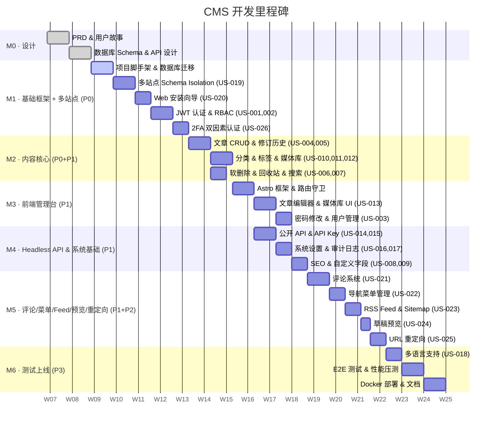

# CMS 内容管理系统 — 产品需求文档（PRD）

**版本**：v1.0
**日期**：2026-02-24
**作者**：martinadams.dev
**状态**：草稿

---

## 1. 产品概述

### 1.1 产品定位

面向中小型团队及独立开发者的现代化、高性能内容管理系统（CMS），提供文章管理、媒体资产管理、多语言支持、用户权限管控及内容分发 API，赋能各类网站、博客、电商及营销平台快速搭建内容体系。

### 1.2 核心价值主张

| 维度 | 价值 |
|------|------|
| 性能 | Gin 框架提供高吞吐 REST API（40× faster than Martini），Redis 8 多级缓存 |
| 体验 | Astro + React + shadcn/ui 构建流畅的管理后台 |
| 可靠 | PostgreSQL 18 提供 ACID 事务与 JSON 列支持 |
| 扩展 | Headless 架构，API-First 设计，支持任意前端消费 |
| 多站点 | PostgreSQL Schema Isolation 实现多站点数据隔离，每站独立内容空间 |
| 易部署 | Web 安装向导，浏览器中即可完成首次配置 |

### 1.3 技术栈

```
后端（API 服务）
├── 语言框架：Go 1.25+ + Gin v1.11+
├── 数据库：PostgreSQL 18（主库）
│   └── 多站点支持：Schema Isolation（每站独立 schema `site_{slug}`）
├── 缓存：Redis 8（会话 / 热点内容 / 限流）
├── 文件存储：RustFS（S3 兼容对象存储）
└── 认证：JWT + Refresh Token + TOTP 2FA

前端（管理后台）
├── 框架：Astro 5+ (SSR mode)
├── UI 框架：React 19（islands architecture）
├── 组件库：shadcn/ui（Radix UI + Tailwind CSS）
├── 状态管理：Zustand
└── 数据请求：TanStack Query v5

安装
└── Web 安装向导：浏览器首次运行设置（语言 / DB 测试 / 站点信息 / 管理员创建）
```

---

## 2. 目标用户

| 角色 | 描述 | 核心诉求 |
|------|------|----------|
| 内容编辑 | 负责日常内容发布与管理 | 快速发布、富文本编辑、草稿保存 |
| 内容管理员 | 负责内容规范与分类体系 | 分类/标签管理、内容审核、批量操作 |
| 超级管理员 | 系统负责人 | 用户权限、系统配置、数据监控、多站点管理 |
| 开发者（消费者） | 前端开发者通过 API 获取内容 | 稳定高效的 Headless API、文档完善 |

---

## 3. 功能范围

### 3.1 V1.0 功能

#### 3.1.1 认证与权限（Auth & RBAC）
- JWT 登录 / 登出，Refresh Token 自动续签
- 基于动态 RBAC 的权限控制：内置 4 个角色（super / admin / editor / viewer），支持自定义角色，权限通过 `sfc_role_apis` 动态配置（详细权限矩阵见 §3.1.17）
- 个人资料编辑、密码修改
- 忘记密码：邮箱验证 → 重置令牌（30 分钟有效）→ 设置新密码
- 密码策略：≥ 8 位，须包含大写字母和数字，详见 security.md
- Redis 存储 Session 黑名单（登出即失效）

#### 3.1.2 内容管理（Content Management）
- **文章（Post）**：创建 / 编辑 / 删除 / 恢复（软删除）
- **富文本编辑器**：基于 TipTap / BlockNote，支持 Markdown 与所见即所得
- **草稿 / 发布 / 计划发布** 三态工作流
  - 草稿（draft）→ 发布（published）→ 下架（archived）
  - 计划发布（scheduled）：设定未来时间点，到期后自动转为 published
    - 定时发布机制：Cron 任务每分钟执行，查询 `status=scheduled AND scheduled_at <= NOW()`，使用行级锁防止重复发布。发布失败自动重试 3 次（指数退避），超过后标记为 `publish_failed` 并记录审计日志。所有时间使用 UTC 存储，展示时按用户时区转换。
  - 下架（archived）：已发布文章被管理员主动下架，从公开 API 中移除但保留在管理后台可见，可重新发布
  - 软删除（deleted）：通过 deleted_at 字段实现，进入回收站，30 天后永久清理
- **修订历史**：版本对比与回滚
- **SEO 元数据**：Title / Description / OG Tags 独立配置
- **自定义字段（Custom Fields）**：JSON Schema 定义动态字段
  - V1.0 支持基础 `extra_fields` JSONB 字段存储自定义数据（无 Schema 校验）；V1.1 引入完整的 Post Types 管理系统（JSON Schema 校验 + 可视化字段编辑器）。
- **并发编辑策略**：采用乐观锁机制。每篇文章携带 `version` 字段，更新时需提交当前版本号，若版本不匹配返回 409 Conflict，提示用户刷新后重试。

#### 3.1.3 分类与标签（Taxonomy）
- 多级分类（无限层级，Materialized Path 实现）
- 多对多标签体系
- 分类 / 标签的内容聚合查询

#### 3.1.4 媒体资产管理（Media Library）
- 图片 / 视频 / 文件上传（Multipart，图片最大 20 MB，视频/文档最大 100 MB）
- 图片自动压缩与 WebP 转换
- 媒体库检索、批量删除、引用计数
- 图片处理管线：上传 → 格式校验 → libvips 异步压缩 → 生成 WebP 版本 + 缩略图（sm: 320px, md: 640px 宽度等比缩放）。转换失败时保留原图，记录错误日志。

#### 3.1.5 多语言支持（i18n）
- 内容多语言字段：每篇文章支持多语言变体
- 界面语言：中文 / 英文切换

#### 3.1.6 Headless API
- RESTful JSON API，遵循 OpenAPI 3.1
- API Key 管理（针对外部消费者）
- 响应缓存（Redis，TTL 可配置）
- 分页 / 过滤 / 排序 / 全文检索（Meilisearch）

#### 3.1.7 系统设置
- 站点基础配置（名称、Logo、域名）
- 邮件 SMTP 配置
- 存储配置（RustFS 对象存储）
- 操作日志审计

#### 3.1.8 多站点管理（Multi-Site）
- **Schema Isolation 架构**：每个站点拥有独立的 PostgreSQL schema（`site_{slug}`），内容表在站点 schema 中，全局表（users、sites）在 `public` schema
- **站点 CRUD**：Super 可创建、编辑、停用、删除站点
- **独立内容空间**：每个站点有独立的文章、分类、标签、媒体库、评论、菜单等
- **全局角色**：角色通过 `sfc_user_roles` 全局分配，权限通过 `sfc_role_apis` 动态控制
- **域名映射**：支持为站点绑定自定义域名
- **站点切换 UI**：管理后台顶部提供站点切换器，快速切换当前操作站点
- **中间件链路**：请求通过 SiteResolverMiddleware → SchemaMiddleware 自动设置 `SET search_path TO 'site_{slug}', 'public'`

#### 3.1.9 Web 安装向导（Installation Wizard）
- **浏览器首次运行设置**：首次访问未安装的 CMS 实例时，自动重定向至安装向导
- **安装步骤**：语言选择 → 数据库连接测试 → 站点基本信息 → 管理员账户创建 → 完成
- **原子化初始化**：在单个数据库事务中完成全部初始化（public schema 建表、首个站点 schema 创建、管理员用户写入、角色分配）
- **安装锁定**：安装完成后 `system.installed` 标志置为 true，安装接口永久禁用
- **竞态保护**：使用 PostgreSQL advisory lock 防止并发安装

#### 3.1.10 评论系统（Comments）
- **嵌套评论**：支持最多 3 级嵌套回复
- **双模式提交**：游客评论（需 author_name + author_email）和已认证用户评论
- **审核工作流**：评论状态 pending → approved / spam / trash，管理员可审批、拒绝、标为垃圾、删除
- **垃圾评论防护**：
  - Honeypot 隐藏字段：非空即判定为垃圾评论
  - IP 限流：同一 IP 每 30 秒最多 1 条评论
  - 关键词黑名单
  - 重复评论检测（SHA-256 哈希，1 小时内去重）
- **Gravatar 头像**：基于 author_email 的 MD5 哈希自动生成头像 URL
- **邮件通知**：新评论提交时异步通知站点管理员
- **置顶**：每篇文章最多 3 条置顶评论（仅顶级评论可置顶）
- **批量操作**：Admin+ 可批量修改评论状态

#### 3.1.11 导航菜单管理（Navigation Menus）
- **菜单 CRUD**：创建、编辑、删除菜单，每个菜单绑定展示位置（header / footer / sidebar / 自定义）
- **菜单项类型**：自定义 URL、文章链接、分类链接、标签链接、页面链接（`menu_item_type` 枚举）
- **层级结构**：最多 3 级嵌套菜单项
- **拖拽排序**：支持拖拽调整菜单项顺序和层级关系
- **引用解析**：菜单项关联的文章/分类/标签被删除时，标记为 `is_broken`，公开 API 中自动过滤
- **公开 API**：`GET /api/public/v1/menus?location=header` 按位置获取菜单树

#### 3.1.12 RSS Feed 与 Sitemap
- **RSS 2.0**：`/feed/rss.xml`，最新 20 篇已发布文章，支持按分类/标签过滤
- **Atom 1.0**：`/feed/atom.xml`，同 RSS 数据源的 Atom 格式
- **XML Sitemap**：
  - `/sitemap.xml`：Sitemap 索引文件
  - `/sitemap-posts.xml`：所有已发布文章
  - `/sitemap-categories.xml`：所有分类
  - `/sitemap-tags.xml`：有已发布文章的标签
- **缓存策略**：Redis 缓存 1 小时（3600s TTL），内容变更时自动失效
- **自动生成**：无需手动触发，内容变更后自动刷新

#### 3.1.13 草稿预览（Draft Preview）
- **可分享预览链接**：Editor+ 可为草稿/未发布文章生成预览链接
- **令牌规格**：`sky_preview_{base64url_random_32bytes}`，SHA-256 哈希存储
- **有效期**：24 小时过期，每篇文章最多 5 个活跃预览令牌
- **公开访问**：预览链接无需认证即可访问
- **实时内容**：预览始终返回最新草稿内容（不缓存）
- **管理功能**：查看、撤销单个或全部预览令牌

#### 3.1.14 URL 重定向管理（URL Redirects）
- **301/302 重定向**：Admin+ 管理 URL 重定向规则
- **Slug 变更自动重定向**：文章 slug 修改时自动创建 301 重定向，支持重定向链路压缩（A→B + B→C = A→C + B→C）
- **命中追踪**：Redis 缓冲计数 + 定时批量写入 PostgreSQL
- **CSV 导入/导出**：批量导入（最多 1000 条/次）、全量导出
- **中间件解析**：RedirectMiddleware 在 SchemaMiddleware 之后执行，先查 Redis 缓存再查 DB
- **Nginx Map 导出**（可选）：高性能场景下导出 Nginx redirect map 文件

#### 3.1.15 双因素认证（2FA）
- **TOTP（RFC 6238）**：支持 Google Authenticator / Authy 等标准 TOTP 应用
- **QR 码设置**：生成 `otpauth://` URI 和 SVG QR 码，用户扫码绑定
- **备用码**：10 个一次性备用码（8 位字母数字，格式 XXXX-XXXX），bcrypt 哈希存储
- **修改后的登录流程**：密码验证 → 临时令牌（5 分钟有效）→ TOTP 验证 → 签发正式 JWT
- **用户级全局生效**：2FA 配置存储在 `public.sfc_user_totp`，启用后对该用户在所有站点的登录均生效
- **管理员强制禁用**：Super 可为锁定用户强制禁用 2FA（需填写原因）
- **安全措施**：AES-256-GCM 加密 TOTP 密钥、TOTP 重放检测（Redis 90s TTL）、5 分钟内最多 5 次验证尝试

#### 3.1.16 邮件通知场景

| 触发事件 | 收件人 | 说明 |
|----------|--------|------|
| 密码重置请求 | 目标用户 | 包含重置链接，30 分钟有效 |
| 账户被禁用 | 目标用户 | 通知邮件 |
| 新用户创建 | 新用户 | 包含临时密码 |
| 新评论提交 | 站点管理员 | 有新评论待审核时通知 |
| 评论被回复 | 原评论作者 | 当评论收到回复时通知（需 author_email） |

邮件发送采用异步队列（Redis List），避免阻塞请求。

#### 3.1.17 权限矩阵（RBAC）

> 权限通过 `sfc_role_apis` 动态配置。下表为内置角色的默认权限参考。管理员可通过 RBAC 管理 API 创建自定义角色并配置权限。

| 操作 | Super | Admin | Editor | Viewer |
|------|:---:|:---:|:---:|:---:|
| 用户管理 | ✅ | ❌ | ❌ | ❌ |
| 系统配置 | ✅ | ✅ | ❌ | ❌ |
| 多站点管理（manage_sites） | ✅ | ❌ | ❌ | ❌ |
| RBAC 管理 | ✅ | ❌ | ❌ | ❌ |
| 内容 CRUD | ✅ | ✅ | ✅ | ❌ |
| 内容查看 | ✅ | ✅ | ✅ | ✅ |
| 媒体上传 | ✅ | ✅ | ✅ | ❌ |
| API Key 管理 | ✅ | ✅ | ❌ | ❌ |
| 评论审核（manage_comments） | ✅ | ✅ | ✅ | ❌ |
| 评论删除（永久） | ✅ | ✅ | ❌ | ❌ |
| 评论批量操作 | ✅ | ✅ | ❌ | ❌ |
| 菜单管理（manage_menus） | ✅ | ✅ | ❌ | ❌ |
| 重定向管理（manage_redirects） | ✅ | ✅ | ❌ | ❌ |
| 重定向导入/导出 | ✅ | ✅ | ❌ | ❌ |
| 草稿预览令牌 CRUD | ✅ | ✅ | ✅ | ❌ |
| 2FA 管理（manage_2fa，自身） | ✅ | ✅ | ✅ | ✅ |
| 2FA 强制禁用（他人） | ✅ | ❌ | ❌ | ❌ |
| 公开评论提交 | -- | -- | -- | -- (API Key) |
| 公开菜单读取 | -- | -- | -- | -- (API Key) |
| RSS/Atom/Sitemap 读取 | -- | -- | -- | -- (无需认证) |

### 3.2 V1.1 未来功能（Out of Scope for V1.0）
- 内容 AI 辅助（AI 摘要、SEO 建议）
- Webhook 通知（内容发布触发）
- GraphQL API
- 插件系统

---

## 4. 非功能需求

| 类别 | 指标 |
|------|------|
| 性能 | P99 API 响应 < 200 ms（缓存命中时 < 20 ms） |
| 并发 | 支持 1,000 并发请求（单节点） |
| 可用性 | 服务可用性 ≥ 99.5%（按月计算，排除计划维护窗口，每月不超过 2 小时）。计算公式：(总分钟数 - 故障分钟数 - 计划维护分钟数) / (总分钟数 - 计划维护分钟数) |
| 安全 | SQL 注入防御、XSS 过滤、Rate Limiting（Redis 滑动窗口）、CORS 白名单、TOTP 2FA |
| 数据 | 软删除保留 30 天，操作日志保留 90 天 |
| 浏览器 | Chrome 100+、Firefox 110+、Safari 16+ |

---

## 5. 用户体验要求

### 5.1 管理后台
- 响应式布局，支持 1280px+ 宽屏操作
- 暗色模式 / 亮色模式切换（shadcn/ui 主题系统）
- 表单操作防抖，自动保存草稿（30 秒间隔）
- 操作反馈：Sonner Toast 提示 + 乐观更新（TanStack Query）
- 空状态、加载骨架屏、错误边界全覆盖

### 5.2 性能优化
- Astro Islands 架构：仅交互组件加载 React Runtime
- API 响应数据 Redis 二级缓存，缓存击穿保护（Singleflight）
- 图片懒加载 + Next-gen format（WebP/AVIF）

---

## 6. 系统约束

- 单体部署优先（后期可拆分微服务）
- 容器化：Docker + Docker Compose
- 使用 uptrace/bun 轻量级 ORM（链式查询、自动关联、内置软删除与迁移），兼顾开发效率与性能
- 遵循 Go 标准项目布局（Standard Go Project Layout）

---

## 7. 成功指标

| 指标 | 目标 |
|------|------|
| API 平均响应时间 | < 100 ms |
| 首页 FCP（管理后台） | < 1.5 s |
| 内容发布操作步骤 | ≤ 5 步完成一篇文章发布 |
| 编辑器自动保存成功率 | ≥ 99% |
| 系统崩溃恢复时间 | < 5 分钟（Gin Recovery Middleware） |

---

## 8. 里程碑计划


