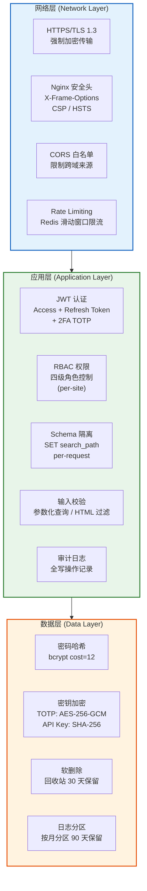

# CMS 内容管理系统 — 安全策略文档

**版本**：v2.0
**日期**：2026-02-24
**状态**：草稿

---

## 1. 安全架构概览

系统采用纵深防御（Defense in Depth）策略，在网络层、应用层、数据层分别部署安全防护措施，确保单一防线被突破时仍有其他层级保护。V2.0 新增 Schema 隔离安全、2FA 双因素认证、评论安全、预览 Token 安全和安装安全。



---

## 2. Schema 隔离安全

### 2.1 隔离机制

每个站点拥有独立的 PostgreSQL Schema（`site_{slug}`），内容表不包含 `site_id` 列 — Schema 本身即为隔离边界。错误的查询会导致 Schema 错误而非数据泄露。

| 安全关注点 | 防御措施 |
|-----------|---------|
| SQL 注入 Schema 名称 | Slug 在创建时校验格式 `^[a-z0-9_]{3,50}$`；Schema 中间件二次校验 |
| 原始用户输入注入 search_path | **永不将原始用户输入拼入 search_path** — 始终从 `public.sfc_sites` 表查询验证后的 slug |
| 跨站点数据访问 | `SET search_path` 每请求设定，不加 Schema 限定词的查询只能访问当前站点数据 |
| Schema 枚举 | `pg_catalog.pg_namespace` 访问受限；API 从不直接暴露 Schema 名称 |
| 权限提升 | 数据库用户仅拥有 `USAGE` + `CREATE` 权限在 `site_*` Schema 上；无 `SUPERUSER` |
| SuperAdmin 跨站操作 | SuperAdmin 可绕过站点范围执行管理操作（站点 CRUD、用户 2FA 管理），通过 RBAC 控制 |

### 2.2 Schema 名称校验

```go
// internal/schema/validate.go
import "regexp"

var validSchemaSlug = regexp.MustCompile(`^[a-z0-9_]{3,50}$`)

// 保留名称，禁止作为站点 slug
var reservedSlugs = map[string]bool{
    "public": true, "pg_catalog": true, "information_schema": true,
    "pg_toast": true, "pg_temp": true, "site": true, "admin": true,
    "api": true, "setup": true, "system": true, "default": true,
    "template": true, "test": true,
}

func IsValidSiteSlug(slug string) bool {
    if !validSchemaSlug.MatchString(slug) {
        return false
    }
    return !reservedSlugs[slug]
}
```

### 2.3 search_path 设定安全

```go
// internal/middleware/schema.go — 关键安全逻辑
func SchemaMiddleware(db *bun.DB) gin.HandlerFunc {
    return func(c *gin.Context) {
        slug := c.GetString("site_slug") // 由 SiteResolver 从 sites 表查询注入

        // 二次校验（防御性编程）
        if !schema.IsValidSiteSlug(slug) {
            c.AbortWithStatusJSON(400, gin.H{"error": "invalid site"})
            return
        }

        schemaName := "site_" + slug
        // 使用 fmt.Sprintf 拼接 Schema 名称是安全的，因为 slug 已经过严格校验
        // 仅允许 [a-z0-9_]，不可能包含 SQL 注入载荷
        _, err := db.ExecContext(c.Request.Context(),
            fmt.Sprintf("SET search_path TO '%s', 'public'", schemaName))
        if err != nil {
            c.AbortWithStatusJSON(500, gin.H{"error": "failed to set site context"})
            return
        }

        c.Next()
    }
}
```

---

## 3. 认证安全

### 3.1 JWT 签名算法

本系统采用 **HS256**（HMAC-SHA256）作为 JWT 签名算法：

| 决策因素 | 说明 |
|---------|------|
| 部署架构 | 单体部署，签名与验签在同一服务内完成，无需非对称加密 |
| 性能 | HS256 签名/验签速度快于 RS256 约 10 倍 |
| 密钥管理 | 仅需维护一个 `JWT_SECRET` 环境变量，运维简单 |
| 安全性 | 256 位密钥提供足够的安全强度，配合短有效期策略风险可控 |
| 迁移路径 | 若后期拆分微服务，可升级为 RS256/ES256，JWT Claims 结构无需变更 |

> **注意**：`JWT_SECRET` 至少 32 字节，使用密码学安全随机生成器生成，**禁止硬编码**在源码中。

### 3.2 Token 生命周期管理

| Token 类型 | 有效期 | 存储位置 | 说明 |
|-----------|--------|---------|------|
| Access Token | 15 分钟 | 客户端内存 / `Authorization` Header | 短有效期，泄露后影响窗口小 |
| Refresh Token | 7 天 | httpOnly Cookie + 数据库记录 | 仅用于换取新 Access Token |
| 2FA Temp Token | 5 分钟 | 客户端内存 | 密码验证通过后颁发，仅用于 2FA 验证端点 |

### 3.3 JWT Claims 结构

Access Token Claims（V2.0 — 不再包含 `role`）：

```json
{
  "sub": "550e8400-e29b-41d4-a716-446655440000",
  "jti": "a3f2e8c1-7b4d-4e9a-b5c2-1234567890ab",
  "exp": 1740200400,
  "iat": 1740199500,
  "iss": "cms-api"
}
```

| 字段 | 类型 | 说明 |
|------|------|------|
| `sub` | UUID | 用户唯一标识（替代 V1.0 的 `user_id`） |
| `jti` | UUID | Token 唯一 ID，用于黑名单机制 |
| `exp` | int64 | 过期时间戳（Unix），签发后 900 秒 |
| `iat` | int64 | 签发时间戳（Unix） |
| `iss` | string | 签发者标识 |

> **V2.0 变更**：`role` 字段已从 JWT Claims 中移除。角色是 per-site 的，存储在 `public.sfc_site_user_roles` 表中。每次请求时从 `sfc_site_user_roles` 解析角色（Redis 缓存 300s），确保角色变更在缓存 TTL 内生效，无需重新签发 Token。

2FA Temp Token Claims：

```json
{
  "sub": "550e8400-e29b-41d4-a716-446655440000",
  "purpose": "2fa_verification",
  "jti": "unique-id",
  "exp": 1740200700,
  "iat": 1740200400,
  "iss": "cms-api"
}
```

| 字段 | 类型 | 说明 |
|------|------|------|
| `purpose` | string | 固定为 `"2fa_verification"` — 中间件拒绝用于其他端点 |
| 有效期 | 5 分钟 | 比 Access Token（15 分钟）更短，减少被滥用窗口 |
| 不含 `role` | — | 不能用于授权，仅用于 2FA 验证端点 |

### 3.4 Refresh Token 轮换策略

每次使用 Refresh Token 刷新时，系统颁发**全新的 Refresh Token**，旧 Refresh Token **立即失效**。

Refresh Token 存储在 `public` Schema 中（全局表），不受站点 Schema 隔离影响。

#### Refresh Token 完整流程

**存储机制**：
- 客户端：Refresh Token 存储在 httpOnly + Secure + SameSite=Strict Cookie 中
- 服务端：数据库 `public.sfc_refresh_tokens` 表存储 Token 的 **SHA-256 哈希值**（非明文）

**刷新流程**：
1. 客户端发送 POST /api/v1/auth/refresh（Cookie 自动携带 Refresh Token）
2. 服务端提取 Cookie 中的 Refresh Token，计算 SHA-256 哈希
3. 查询 `public.sfc_refresh_tokens` 表匹配哈希值，校验 expires_at 和 revoked 状态
4. 验证通过 → 生成新 Access Token + 新 Refresh Token
5. 旧 Refresh Token 标记为 revoked（Token Rotation）
6. 新 Refresh Token 哈希写入数据库，新 Cookie 返回客户端

**安全措施**：
- Token Rotation：每次刷新都生成新 Refresh Token，旧 Token 立即失效
- Replay Detection：若已 revoked 的 Token 被再次使用，撤销该用户所有 Refresh Token（疑似泄露）
- Family Tracking：同一登录会话的所有 Refresh Token 共享 `token_family` 标识

#### 代码实现

```go
// TokenPair JWT 令牌对
type TokenPair struct {
    AccessToken  string `json:"access_token"`
    RefreshToken string `json:"refresh_token"`
    ExpiresIn    int64  `json:"expires_in"`    // Access Token 过期时间（秒）
    TokenType    string `json:"token_type"`     // 固定值 "Bearer"
}
```

```go
// service/auth_service.go — Refresh Token 轮换

// Handler 层从 httpOnly Cookie 中提取 Refresh Token 原始值，
// 传递给 Service 层进行哈希比对和轮换。
// Service 层不直接访问 HTTP Cookie，保持层间解耦。
func (s *AuthService) RefreshToken(ctx context.Context, rawToken string) (*TokenPair, error) {
    // 1. 查找并验证旧 Refresh Token（从 public.sfc_refresh_tokens）
    rt, err := s.repo.FindRefreshToken(ctx, hashSHA256(rawToken))
    if err != nil || rt.Revoked || rt.ExpiresAt.Before(time.Now()) {
        return nil, ErrInvalidRefreshToken
    }

    // 2. 立即吊销旧 Token（防止重放攻击）
    if err := s.repo.RevokeRefreshToken(ctx, rt.ID); err != nil {
        return nil, err
    }

    // 3. 颁发新的 Token 对（Access Token 不含 role，role 在 site-scoped 请求中解析）
    accessToken, err := s.generateAccessToken(rt.UserID)
    if err != nil {
        return nil, err
    }

    newRefreshToken, err := s.generateRefreshToken(ctx, rt.UserID)
    if err != nil {
        return nil, err
    }

    return &TokenPair{
        AccessToken:  accessToken,
        RefreshToken: newRefreshToken,
        ExpiresIn:    900, // 15 min
    }, nil
}
```

### 3.5 Redis 黑名单机制

用户登出时，将当前 Access Token 的 `jti`（JWT ID）加入 Redis 黑名单，TTL 设为 Token 剩余有效期：

```go
// service/auth_service.go — 登出黑名单
func (s *AuthService) Logout(ctx context.Context, claims *jwt.Claims) error {
    // 计算 Access Token 剩余有效期
    remaining := time.Until(time.Unix(claims.ExpiresAt, 0))
    if remaining <= 0 {
        return nil // Token 已过期，无需加入黑名单
    }

    // Access Token JTI 加入黑名单
    key := fmt.Sprintf("auth:blacklist:%s", claims.TokenID)
    if err := s.redis.Set(ctx, key, "1", remaining).Err(); err != nil {
        return fmt.Errorf("failed to blacklist token: %w", err)
    }

    // Token 吊销使用 Serializable 隔离级别（见 standard.md §1.3）
    tx, err := s.db.BeginTx(ctx, &sql.TxOptions{
        Isolation: sql.LevelSerializable,
    })
    if err != nil {
        return err
    }
    defer tx.Rollback()

    // 吊销关联的 Refresh Token（从 public.sfc_refresh_tokens）
    if err := s.repo.RevokeRefreshTokensByUserIDTx(tx, claims.UserID); err != nil {
        return err
    }

    return tx.Commit()
}
```

```
Redis 键空间：
auth:blacklist:{jti}    TTL=Token剩余有效期    值="1"

示例：
auth:blacklist:a3f2e8c1-...    TTL=540s    "1"
```

### 3.6 Session Fixation 防护

- 用户登录成功后，必须生成全新的 Refresh Token（不复用任何已有 Token）
- 权限提升操作（如角色变更）后，撤销所有现有 Token 并要求重新登录
- 支持"登出所有设备"功能：撤销该用户所有 Refresh Token

### 3.7 完整认证流程（含 2FA）

```mermaid
sequenceDiagram
    autonumber
    actor User as 用户
    participant Client as 前端 (Astro)
    participant Gin as Gin API Server
    participant Redis
    participant PG as PostgreSQL (public schema)

    rect rgb(240, 248, 255)
        Note over User,PG: 登录流程（含 2FA）
        User->>Client: 输入邮箱 + 密码
        Client->>Gin: POST /api/v1/auth/login {email, password}
        Gin->>Redis: GET login_fail:{email} 检查锁定
        alt 已锁定（count >= 5）
            Redis-->>Gin: count >= 5
            Gin-->>Client: 429 "账号已锁定，请 15 分钟后重试"
        else 未锁定
            Gin->>PG: SELECT * FROM public.sfc_users WHERE email = $1
            PG-->>Gin: user record
            Gin->>Gin: bcrypt.Compare(password, hash)
            alt 密码正确
                Gin->>Redis: DEL login_fail:{email}
                Gin->>PG: SELECT * FROM public.sfc_user_totp WHERE user_id = $1 AND is_enabled = true
                alt 2FA 已启用
                    PG-->>Gin: TOTP record found
                    Gin->>Gin: 生成 temp_token (5min, purpose=2fa_verification)
                    Gin-->>Client: 200 {requires_2fa: true, temp_token, expires_in: 300}
                else 2FA 未启用
                    Gin->>Gin: 生成 Access Token (JWT, 15min, 无 role claim)
                    Gin->>PG: INSERT public.sfc_refresh_tokens (token_hash, user_id, expires_at)
                    Gin->>PG: INSERT sfc_site_audits (action='login')
                    Gin-->>Client: 200 {access_token, expires_in: 900}<br/>Set-Cookie: refresh_token (httpOnly, Secure, SameSite=Lax, 7d)
                end
            else 密码错误
                Gin->>Redis: INCR login_fail:{email} EX 900
                Gin-->>Client: 401 "邮箱或密码错误"
            end
        end
    end

    rect rgb(240, 255, 240)
        Note over User,PG: 2FA TOTP 验证（仅当 2FA 启用时）
        Client->>User: 显示 TOTP 输入表单
        User->>Client: 输入 6 位验证码
        Client->>Gin: POST /api/v1/auth/2fa/validate {code}<br/>Authorization: Bearer {temp_token}
        Gin->>Gin: 验证 temp_token (purpose=2fa_verification, 未过期)
        Gin->>Redis: GET 2fa:rate:{user_id} 检查限流
        alt 超过限制 (>= 5 次/5 分钟)
            Gin-->>Client: 429 RATE_LIMITED
        else 未超限
            Gin->>PG: SELECT secret_encrypted FROM public.sfc_user_totp WHERE user_id = $1
            Gin->>Gin: AES-256-GCM 解密 → 验证 TOTP (window +-1)
            alt 验证码正确
                Gin->>Redis: EXISTS 2fa:used:{user_id}:{code} 防重放
                alt 已使用
                    Gin-->>Client: 400 "验证码已使用（重放检测）"
                else 未使用
                    Gin->>Redis: SET 2fa:used:{user_id}:{code} EX 90s
                    Gin->>Gin: 生成 Access Token + Refresh Token
                    Gin->>PG: INSERT public.sfc_refresh_tokens
                    Gin->>PG: INSERT sfc_site_audits (action='login', 2fa_verified=true)
                    Gin-->>Client: 200 {access_token, expires_in: 900}<br/>Set-Cookie: refresh_token
                end
            else 验证码错误
                Gin->>Redis: INCR 2fa:rate:{user_id} EX 300
                Gin-->>Client: 400 "验证码无效"
            end
        end
    end

    rect rgb(255, 248, 240)
        Note over User,PG: 访问受保护的 Site-Scoped 资源
        Client->>Gin: GET /api/v1/posts<br/>Authorization: Bearer {access_token}<br/>Host: blog.example.com
        Gin->>Gin: InstallationGuard → SiteResolver → SchemaMiddleware
        Note right of Gin: SET search_path TO 'site_blog', 'public'
        Gin->>Gin: 解析 JWT，验签 + 过期检查
        Gin->>Redis: EXISTS auth:blacklist:{jti}
        alt Token 在黑名单中
            Redis-->>Gin: 1
            Gin-->>Client: 401 "Token 已失效"
        else Token 有效
            Redis-->>Gin: 0
            Gin->>Redis: GET site:blog:role:{user_id}
            alt 角色缓存命中
                Redis-->>Gin: "admin"
            else 角色缓存未命中
                Gin->>PG: SELECT role FROM public.sfc_site_user_roles<br/>WHERE site_id = $1 AND user_id = $2
                PG-->>Gin: "admin"
                Gin->>Redis: SET site:blog:role:{user_id} "admin" EX 300
            end
            Gin->>Gin: RBAC 权限校验
            Gin->>PG: 查询业务数据 (site_blog schema)
            PG-->>Gin: data
            Gin-->>Client: 200 {data}
        end
    end

    rect rgb(248, 240, 255)
        Note over User,PG: 登出
        Client->>Gin: POST /api/v1/auth/logout<br/>Authorization: Bearer {access_token}
        Gin->>Redis: SET auth:blacklist:{jti} EX {remaining_ttl}
        Gin->>PG: UPDATE public.sfc_refresh_tokens SET revoked = true
        Gin->>PG: INSERT sfc_site_audits (action='logout')
        Gin-->>Client: 200 "已登出"<br/>Set-Cookie: refresh_token=; Max-Age=0
        Client->>User: 重定向到登录页
    end
```

### 3.8 前端认证实现规范

**Token 存储**：
- Access Token：存储在内存（JavaScript 变量 / Zustand store），**不存入** localStorage（防 XSS）
- Refresh Token：httpOnly Cookie，前端无法读取（由浏览器自动管理）
- 2FA Temp Token：存储在内存，**不存入** localStorage

**静默刷新策略**：
- Access Token 过期前 60 秒触发后台刷新（基于 JWT `exp` 字段计算）
- 使用 `useTokenRefresh` hook 在应用顶层初始化定时器
- 刷新失败（Refresh Token 过期）→ 清除 Zustand auth state → 跳转登录页

**请求拦截**：
- TanStack Query 全局配置 `queryClient` 的 `defaultOptions.queries.retry`
- 收到 401 → 尝试刷新 Token → 成功则重放请求 → 失败则登出
- 收到 403 → 显示权限不足提示（不重试）

**页面刷新恢复**：
- 应用启动时自动调用 POST /api/v1/auth/refresh 恢复会话
- 成功 → 获得新 Access Token，用户无感知
- 失败 → 跳转登录页

---

## 4. 2FA 双因素认证安全

### 4.1 TOTP 密钥存储

TOTP 密钥必须可恢复（用于验证 TOTP 码），因此采用 **AES-256-GCM** 对称加密（而非哈希）：

| 参数 | 值 |
|------|-----|
| 加密算法 | AES-256-GCM（认证加密，防篡改） |
| 密钥来源 | `TOTP_ENCRYPTION_KEY` 环境变量（64 个 hex 字符 = 32 字节） |
| Nonce | 12 字节随机值，每次加密独立生成，前置到密文中 |
| 存储格式 | Base64(nonce + ciphertext + GCM tag) 存入 `public.sfc_user_totp.secret_encrypted` |

```go
// pkg/crypto/totp_encryption.go — AES-256-GCM 加密 TOTP 密钥
func EncryptTOTPSecret(plaintext string) (string, error) {
    block, _ := aes.NewCipher(totpEncryptionKey) // 32 bytes from env
    aesGCM, _ := cipher.NewGCM(block)

    nonce := make([]byte, aesGCM.NonceSize()) // 12 bytes
    io.ReadFull(rand.Reader, nonce)

    ciphertext := aesGCM.Seal(nonce, nonce, []byte(plaintext), nil)
    return base64.StdEncoding.EncodeToString(ciphertext), nil
}
```

> **密钥生成**：`openssl rand -hex 32`
> **密钥轮换**：支持密钥版本化 — 密文旁存储密钥版本 ID，旧密钥保留用于解密，新加密使用最新密钥。

### 4.2 备用码安全

| 参数 | 值 |
|------|-----|
| 数量 | 10 个备用码 |
| 格式 | `XXXX-XXXX`（8 个字母数字字符，排除易混淆字符 0/O/1/I） |
| 存储 | bcrypt cost=12 哈希，存入 `public.sfc_user_totp.backup_codes_hash` 数组 |
| 使用策略 | 单次使用，验证后立即从数组中移除哈希 |
| 展示 | 仅在设置和重新生成时展示一次，不可重复查看 |

### 4.3 TOTP 防重放

使用 Redis 键防止在有效窗口内重放同一 TOTP 验证码：

```
Redis 键：2fa:used:{user_id}:{code}
TTL：90 秒（30s 周期 * 3 窗口 = 90s 有效窗口）
```

```go
// service/auth_service.go — TOTP 防重放
func (s *AuthService) ValidateTOTP(ctx context.Context, userID uuid.UUID, code string) error {
    // 1. 检查是否已使用（防重放）
    replayKey := fmt.Sprintf("2fa:used:%s:%s", userID, code)
    if exists, _ := s.redis.Exists(ctx, replayKey).Result(); exists > 0 {
        return ErrCodeAlreadyUsed
    }

    // 2. 解密 TOTP 密钥并验证码
    secret, err := s.getTOTPSecret(ctx, userID) // 从 public.sfc_user_totp 获取并解密
    if err != nil {
        return err
    }
    if !totp.Validate(code, secret) {
        return ErrInvalidTOTPCode
    }

    // 3. 标记为已使用
    s.redis.Set(ctx, replayKey, "1", 90*time.Second)
    return nil
}
```

### 4.4 2FA 验证限流

| 参数 | 值 |
|------|-----|
| 限制 | 5 次验证尝试 / 5 分钟 / 用户 |
| Redis 键 | `2fa:rate:{user_id}` TTL=300s |
| 超限响应 | 429 RATE_LIMITED |

### 4.5 2FA Temp Token 安全

| 安全关注点 | 防御措施 |
|-----------|---------|
| 滥用为 Access Token | `purpose: "2fa_verification"` claim — 中间件拒绝用于 `/auth/2fa/validate` 以外的端点 |
| 长期有效 | 5 分钟超短有效期（vs Access Token 的 15 分钟） |
| 授权能力 | 不含 `role` claim，不能用于任何授权操作 |
| 存储安全 | 仅存内存，不存 Redis 黑名单（因为自动快速过期） |

### 4.6 SuperAdmin 强制禁用

当用户丢失认证设备且备用码耗尽时，SuperAdmin 可通过 `DELETE /api/v1/users/:id/2fa` 强制禁用 2FA：
- 删除 `public.sfc_user_totp` 记录
- 吊销该用户所有 Refresh Token
- 创建包含禁用原因的审计日志条目
- 仅 SuperAdmin 角色可执行此操作

---

## 5. RBAC 权限控制

### 5.1 Per-Site 角色模型

V2.0 中角色是 **per-site** 的，存储在 `public.sfc_site_user_roles` 表中。同一用户可在不同站点拥有不同角色。

| 角色 | 站点范围 | 说明 |
|------|---------|------|
| `superadmin` | 全局 | 可管理所有站点、用户、系统设置 |
| `admin` | 当前站点 | 可管理站点内容、评论、菜单、重定向、用户角色 |
| `editor` | 当前站点 | 可创建/编辑/发布内容、管理评论、生成预览 |
| `viewer` | 当前站点 | 只读访问站点内容 |

### 5.2 角色解析策略

```
1. JWT 中不携带 role（V2.0 变更）
2. 每次 site-scoped 请求时解析角色：
   a. Redis GET site:{slug}:role:{user_id} → 缓存命中则使用
   b. 缓存未命中 → SELECT role FROM public.sfc_site_user_roles WHERE site_id = $1 AND user_id = $2
   c. 查询结果写入 Redis，TTL=300s
3. 角色变更时立即失效缓存：DEL site:{slug}:role:{user_id}
4. 用户在当前站点无角色 → 403 Forbidden
```

### 5.3 权限矩阵（含新功能）

| 操作 | SuperAdmin | Admin | Editor | Viewer |
|------|:---:|:---:|:---:|:---:|
| 站点 CRUD（manage_sites） | Y | N | N | N |
| 用户管理 | Y | Y | N | N |
| 内容 CRUD | Y | Y | Y | N |
| 评论审核（manage_comments） | Y | Y | Y | N |
| 评论删除 | Y | Y | N | N |
| 菜单 CRUD（manage_menus） | Y | Y | N | N |
| 重定向 CRUD（manage_redirects） | Y | Y | N | N |
| 预览 Token CRUD | Y | Y | Y | N |
| 2FA 设置/禁用（自身） | Y | Y | Y | Y |
| 2FA 强制禁用（他人） | Y | N | N | N |
| API Key 管理 | Y | Y | N | N |
| 审计日志查看 | Y | Y | N | N |
| 内容只读 | Y | Y | Y | Y |

### 5.4 角色缓存安全

| 安全关注点 | 防御措施 |
|-----------|---------|
| 过期角色缓存 | TTL 300s；角色变更时强制失效 |
| 无角色 = 无访问 | 用户无 `sfc_site_user_roles` 条目 → 403 |
| 角色变更 | 变更 `sfc_site_user_roles` 时立即删除 `site:{slug}:role:{user_id}` |

---

## 6. 评论安全

### 6.1 垃圾评论防护

| 机制 | 实现方式 |
|------|---------|
| Honeypot 字段 | 隐藏表单字段 `honeypot`；非空则自动标记为 `spam` |
| IP 限流 | Redis `INCR site:{slug}:ratelimit:comment:{ip}` TTL=30s；超过 1 次则拒绝 |
| 关键词黑名单 | `sfc_site_configs` 键 `comments.spam_keywords` 存储 JSON 数组 |
| 重复检测 | SHA-256(`content + author_email + post_id`)；1 小时内相同则拒绝。Redis 键 `site:{slug}:comment:dedup:{sha256}` TTL=3600s |

### 6.2 XSS 防护

评论内容采用严格的 HTML 净化策略：

```go
// 评论内容使用 bluemonday 严格白名单，仅允许基础格式化标签
var commentPolicy = bluemonday.NewPolicy()

func init() {
    // 仅允许基础内联标签
    commentPolicy.AllowElements("strong", "em", "code", "a", "br")
    commentPolicy.AllowAttrs("href").OnElements("a")
    commentPolicy.AllowAttrs("rel").Matching(regexp.MustCompile(`^noopener noreferrer$`)).OnElements("a")
    commentPolicy.AllowURLSchemes("https", "http")
}

func SanitizeCommentHTML(input string) string {
    return commentPolicy.Sanitize(input)
}
```

> **注意**：评论内容在输入时剥离所有危险 HTML，存储纯文本（或极度受限的 HTML），输出时 HTML 转义。

### 6.3 Gravatar 安全

Gravatar URL 在响应时计算（不存储在数据库）：

```go
func GravatarURL(email string, size int) string {
    email = strings.ToLower(strings.TrimSpace(email))
    hash := md5.Sum([]byte(email)) // Gravatar 要求 MD5
    return fmt.Sprintf("https://www.gravatar.com/avatar/%x?s=%d&d=mp", hash, size)
}
```

> **安全权衡**：Gravatar 官方协议要求 MD5 哈希。虽然 MD5 加密强度不如 SHA-256，但此处用途是标识符生成而非密码存储，安全风险可接受。如果不需要 Gravatar 兼容性，可改用 SHA-256（生成自定义头像服务 URL）。

### 6.4 访客评论验证

| 规则 | 说明 |
|------|------|
| `author_name` | 必填（访客模式），1-100 字符 |
| `author_email` | 必填（访客模式），校验邮箱格式 |
| 认证用户 | `user_id` 从 JWT 自动填充，`author_name` 和 `author_email` 从 `public.sfc_users` 记录获取 |

### 6.5 CSRF 防护

评论提交端点使用 API Key 认证（非 Cookie），天然免疫 CSRF。IP 限流（1 次/30s/IP）作为额外保护层。

### 6.6 隐私保护

`author_email`、`author_ip`、`user_agent` 字段**仅在管理 API 中返回**，公开 API 从不暴露这些字段。

---

## 7. 预览 Token 安全

### 7.1 Token 格式与生成

| 参数 | 值 |
|------|-----|
| 格式 | `sky_preview_{base64url_random_32bytes}` |
| 熵 | 256 bits（32 字节密码学安全随机数） |
| 存储 | SHA-256 哈希存储在 `site_{slug}.sfc_site_preview_tokens.token_hash`（原始 Token 从不存储） |

```go
// pkg/crypto/preview_token.go
func GeneratePreviewToken() (raw string, hash string, err error) {
    bytes := make([]byte, 32)
    if _, err = rand.Read(bytes); err != nil {
        return "", "", err
    }
    raw = "sky_preview_" + base64.RawURLEncoding.EncodeToString(bytes)
    h := sha256.Sum256([]byte(raw))
    hash = hex.EncodeToString(h[:])
    return raw, hash, nil
}
```

### 7.2 安全约束

| 安全关注点 | 防御措施 |
|-----------|---------|
| Token 暴力破解 | 256 bits 熵，不可能暴力破解 |
| Token 泄露 | 24 小时过期；可通过 DELETE 端点立即撤销 |
| 过期后访问 | Service 层每次检查 `expires_at > NOW()`；过期返回 410 GONE |
| 每篇文章 Token 泛滥 | 硬限制每篇文章最多 5 个活跃 Token |
| Token 生成滥用 | 限流：每用户每小时 10 次（Redis `site:{slug}:ratelimit:preview_gen:{user_id}` TTL=3600s） |
| 公开访问安全 | 预览端点无认证但需有效的未过期 Token |
| 跨站 Token 访问 | Schema 隔离确保 `site_blog` 中的 Token 无法解析 `site_docs` 中的文章；SchemaMiddleware 基于 Host header 设定 search_path |
| 枚举防护 | 公开端点不区分"Token 不存在"和"文章已删除" — 均返回 404；仅过期 Token 返回 410 |
| 存储安全 | 仅存储 SHA-256 哈希；原始 Token 在创建时返回一次，后续不可查看 |

---

## 8. 安装安全

### 8.1 安装状态守卫

安装向导端点在 `system.installed = true` 后永久禁用：

```
InstallationGuardMiddleware 检查顺序（短路返回）：
  1. 内存原子布尔值 (isInstalled) → true 则 NEXT
  2. Redis GET system:installed → "true" 则更新原子值，NEXT
  3. DB: SELECT value FROM public.sfc_configs WHERE key = 'system.installed'
     → true 则更新 Redis + 原子值，NEXT
     → false 或表不存在 → BLOCK

BLOCK 行为：
  - API 路由 (/api/*): 503 Service Unavailable + {"error": "CMS not installed"}
  - 页面路由: 重定向到 /setup
  - 例外: /api/v1/setup/* 和 /setup 路由始终允许通过
```

### 8.2 并发安装防护

使用 PostgreSQL 事务级咨询锁防止并发安装：

```sql
SELECT pg_advisory_xact_lock(1); -- 锁 ID 1，事务结束自动释放
```

### 8.3 原子事务

安装过程在单个数据库事务中执行，任何步骤失败则整个事务回滚：

```
1. 获取 pg_advisory_xact_lock（防止并发）
2. 二次确认未安装
3. 创建公共表（if not exists）
4. 创建站点记录
5. 创建站点 Schema + 所有表
6. 创建管理员用户
7. 创建 sfc_site_user_roles 条目
8. 设置 system.installed = true
9. COMMIT（任何步骤失败 → 完整回滚）
10. 更新 Redis + 内存原子值
```

### 8.4 安装限流

| 端点 | 限制 |
|------|------|
| `POST /api/v1/setup/check` | 30 req/min per IP |
| `POST /api/v1/setup/initialize` | 5 req/min per IP |

---

## 9. 密码策略

### 9.1 bcrypt 哈希参数

| 参数 | 值 | 说明 |
|------|-----|------|
| 算法 | bcrypt | 行业标准密码哈希算法，内置盐值 |
| Cost Factor | 12 | 2^12 = 4096 次迭代，单次哈希约 250ms |
| 盐值 | 自动生成 | bcrypt 内置 16 字节随机盐 |

```go
// pkg/crypto/password.go
import "golang.org/x/crypto/bcrypt"

const bcryptCost = 12

func HashPassword(password string) (string, error) {
    bytes, err := bcrypt.GenerateFromPassword([]byte(password), bcryptCost)
    return string(bytes), err
}

func CheckPassword(password, hash string) bool {
    err := bcrypt.CompareHashAndPassword([]byte(hash), []byte(password))
    return err == nil
}
```

> **Cost=12 的权衡**：在现代服务器上单次哈希约 250ms，既能有效抵御暴力破解（攻击者每秒仅能尝试约 4 个密码），又不会对正常登录体验造成明显延迟。

### 9.2 密码复杂度要求

| 规则 | 要求 |
|------|------|
| 最小长度 | 8 位字符 |
| 大写字母 | 至少包含 1 个 |
| 数字 | 至少包含 1 个 |
| 最大长度 | 72 字节（bcrypt 限制） |

```go
// pkg/crypto/password_validator.go
import (
    "regexp"
    "unicode/utf8"
)

var (
    hasUpperCase = regexp.MustCompile(`[A-Z]`)
    hasDigit     = regexp.MustCompile(`[0-9]`)
)

func ValidatePasswordStrength(password string) error {
    if utf8.RuneCountInString(password) < 8 {
        return errors.New("密码长度不能少于 8 位")
    }
    if len(password) > 72 {
        return errors.New("密码长度不能超过 72 字节")
    }
    if !hasUpperCase.MatchString(password) {
        return errors.New("密码必须包含至少一个大写字母")
    }
    if !hasDigit.MatchString(password) {
        return errors.New("密码必须包含至少一个数字")
    }
    return nil
}
```

### 9.3 密码修改流程

```mermaid
flowchart TB
    A[用户提交密码修改请求] --> B{验证当前密码}
    B -->|失败| C[返回 401 "当前密码错误"]
    B -->|成功| D{新密码复杂度校验}
    D -->|不通过| E[返回 400 "密码不满足要求"]
    D -->|通过| F[bcrypt 哈希新密码]
    F --> G[更新 public.sfc_users.password_hash]
    G --> H[吊销该用户所有 Refresh Token]
    H --> I[记录审计日志]
    I --> J[返回 200 "密码已更新，请重新登录"]

    style C fill:#ffebee,stroke:#c62828
    style E fill:#ffebee,stroke:#c62828
    style J fill:#e8f5e9,stroke:#2e7d32
```

```go
// service/auth_service.go — 密码修改
func (s *AuthService) ChangePassword(ctx context.Context, userID uuid.UUID, req ChangePasswordRequest) error {
    user, err := s.userRepo.FindByID(ctx, userID)
    if err != nil {
        return ErrUserNotFound
    }

    // 1. 验证旧密码
    if !crypto.CheckPassword(req.CurrentPassword, user.PasswordHash) {
        return ErrInvalidPassword
    }

    // 2. 校验新密码复杂度
    if err := crypto.ValidatePasswordStrength(req.NewPassword); err != nil {
        return err
    }

    // 3. 哈希新密码
    newHash, err := crypto.HashPassword(req.NewPassword)
    if err != nil {
        return err
    }

    // 4. 密码修改使用 Serializable 隔离级别（见 standard.md §1.3）
    tx, err := s.db.BeginTx(ctx, &sql.TxOptions{
        Isolation: sql.LevelSerializable,
    })
    if err != nil {
        return err
    }
    defer tx.Rollback()

    // 5. 更新密码（public.sfc_users）
    if err := s.userRepo.UpdatePasswordTx(tx, userID, newHash); err != nil {
        return err
    }

    // 6. 吊销所有 Refresh Token，强制重新登录（public.sfc_refresh_tokens）
    if err := s.repo.RevokeRefreshTokensByUserIDTx(tx, userID); err != nil {
        return err
    }

    return tx.Commit()
}
```

### 9.4 密码重置安全流程

1. 用户提交 POST /api/v1/auth/forgot-password { email }
2. 服务端生成 32 字节随机 Token，存储 SHA-256 哈希到 `password_reset_tokens` 表
3. 发送邮件包含重置链接（含明文 Token），有效期 30 分钟
4. 用户点击链接提交 POST /api/v1/auth/reset-password { token, new_password }
5. 服务端验证 Token 哈希、有效期、使用状态
6. 验证通过 → 更新密码哈希，撤销所有该用户的 Refresh Token，标记 Token 已使用

**防护措施**：
- 无论邮箱是否存在均返回相同响应（防枚举攻击）
- Token 单次使用后立即失效
- 同一邮箱 5 分钟内最多请求 1 次（Rate Limit）
- 重置成功后强制登出所有设备

### 9.5 密码存储原则

| 原则 | 实施措施 |
|------|---------|
| 永不存储明文密码 | 仅存储 bcrypt 哈希值 |
| 永不在日志中输出密码 | 审计日志记录 action="update"、resource_type="password"，不记录密码值 |
| 永不在 API 响应中返回密码哈希 | DTO 层排除 `password_hash` 字段 |
| 禁止密码明文传输 | 强制 HTTPS，Cookie 设置 `Secure` 标志 |

---

## 10. 登录安全

### 10.1 登录失败锁定

使用 Redis 计数器实现登录失败锁定，防御暴力破解攻击：

```
Redis 键：login_fail:{email}
TTL：900 秒（15 分钟）
阈值：5 次失败后锁定
```

```go
// service/auth_service.go — 登录失败锁定
const (
    maxLoginAttempts = 5
    lockoutDuration  = 15 * time.Minute // 900s
)

func (s *AuthService) checkLoginLockout(ctx context.Context, email string) error {
    key := fmt.Sprintf("login_fail:%s", email)
    count, err := s.redis.Get(ctx, key).Int()
    if err != nil && err != redis.Nil {
        return err
    }
    if count >= maxLoginAttempts {
        return ErrAccountLocked // 返回 429
    }
    return nil
}

func (s *AuthService) recordLoginFailure(ctx context.Context, email string) (int64, error) {
    key := fmt.Sprintf("login_fail:%s", email)
    pipe := s.redis.Pipeline()
    incr := pipe.Incr(ctx, key)
    pipe.Expire(ctx, key, lockoutDuration)
    if _, err := pipe.Exec(ctx); err != nil {
        return 0, err
    }
    return incr.Val(), nil
}

func (s *AuthService) resetLoginFailures(ctx context.Context, email string) {
    key := fmt.Sprintf("login_fail:%s", email)
    s.redis.Del(ctx, key)
}
```

### 10.2 锁定期间行为

| 场景 | 行为 |
|------|------|
| 锁定期间提交正确密码 | 返回 429 "账号已锁定，请 15 分钟后重试" |
| 锁定期间提交错误密码 | 返回 429（不重置计数器） |
| 锁定超时后 | Redis 键自动过期，用户可正常登录 |
| 登录成功 | 立即清除失败计数 `DEL login_fail:{email}` |

### 10.3 安全响应策略

为防止用户名枚举攻击，登录失败时**统一返回相同错误信息**：

```go
// handler/auth.go — 安全的登录错误响应
func (h *AuthHandler) Login(c *gin.Context) {
    // ... 省略参数绑定

    err := h.authService.Login(ctx, req)
    switch {
    case errors.Is(err, service.ErrAccountLocked):
        c.JSON(429, ErrorResponse("RATE_LIMITED", "账号已锁定，请 15 分钟后重试"))
    case errors.Is(err, service.ErrInvalidCredentials),
         errors.Is(err, service.ErrUserNotFound): // 邮箱不存在也返回相同消息
        c.JSON(401, ErrorResponse("UNAUTHORIZED", "邮箱或密码错误"))
    default:
        c.JSON(500, ErrorResponse("INTERNAL_ERROR", "登录失败"))
    }
}
```

> **关键点**：`ErrUserNotFound`（邮箱不存在）和 `ErrInvalidCredentials`（密码错误）返回相同的错误信息 "邮箱或密码错误"，不暴露邮箱是否注册。

### 10.4 登录日志记录

每次登录（成功或失败）都记录到审计日志：

```go
// 审计日志记录内容
sfc_site_audits {
    actor_email:   "user@example.com",
    action:        "login",              // login / logout
    resource_type: "session",
    ip_address:    "203.0.113.1",        // 从 X-Forwarded-For 或 RemoteAddr 获取
    user_agent:    "Mozilla/5.0 ...",    // 请求 User-Agent
    created_at:    "2026-02-21T10:00:00Z"
}
```

> V2.0 新增：2FA 验证成功的登录，审计日志 `resource_snapshot` 中包含 `"2fa_verified": true`。

---

## 11. API 安全

### 11.1 Rate Limiting 策略

使用 Redis **滑动窗口算法**配合 **Lua Script** 实现原子性限流：

```go
// middleware/ratelimit.go — Redis 滑动窗口限流

// Lua Script：原子操作，保证并发安全
var slidingWindowScript = redis.NewScript(`
    local key = KEYS[1]
    local now = tonumber(ARGV[1])
    local window = tonumber(ARGV[2])
    local limit = tonumber(ARGV[3])

    -- 移除窗口外的过期记录
    redis.call('ZREMRANGEBYSCORE', key, 0, now - window)

    -- 获取当前窗口内请求数
    local count = redis.call('ZCARD', key)

    if count < limit then
        -- 未超限，添加当前请求
        redis.call('ZADD', key, now, now .. '-' .. math.random(1000000))
        redis.call('EXPIRE', key, window / 1000)
        return 0  -- 允许
    else
        return 1  -- 拒绝
    end
`)

func RateLimitMiddleware(limit int, window time.Duration) gin.HandlerFunc {
    return func(c *gin.Context) {
        // 根据请求类型确定限流键
        var key string
        if apiKey := c.GetString("api_key_hash"); apiKey != "" {
            key = fmt.Sprintf("ratelimit:api:%s", apiKey)       // 公开 API: 按 API Key
        } else if userID := c.GetString("user_id"); userID != "" {
            key = fmt.Sprintf("ratelimit:user:%s", userID)      // 管理 API: 按用户
        } else {
            key = fmt.Sprintf("ratelimit:ip:%s", c.ClientIP())  // 未认证: 按 IP
        }

        now := time.Now().UnixMilli()
        result, err := slidingWindowScript.Run(c, redisClient,
            []string{key},
            now,
            window.Milliseconds(),
            limit,
        ).Int()

        if err != nil {
            c.Next() // Redis 故障时放行，避免影响可用性
            return
        }

        if result == 1 {
            c.Header("Retry-After", strconv.Itoa(int(window.Seconds())))
            c.AbortWithStatusJSON(429, ErrorResponse("RATE_LIMITED", "请求频率超限"))
            return
        }
        c.Next()
    }
}
```

### 11.2 限流配置

| API 类型 | 限流维度 | 默认限额 | 窗口 |
|---------|---------|---------|------|
| 管理 API (`/api/v1`) | 每用户 | 60 req/min | 60s |
| 公开 API (`/api/public/v1`) | 每 API Key | 按 `api_keys.rate_limit` 配置（默认 100 req/min） | 60s |
| 登录接口 | 每 IP | 20 req/min | 60s |
| 安装接口 (`/api/v1/setup/initialize`) | 每 IP | 5 req/min | 60s |
| 安装检查 (`/api/v1/setup/check`) | 每 IP | 30 req/min | 60s |
| 评论提交 | 每 IP | 1 req/30s | 30s |
| 预览 Token 生成 | 每用户 | 10 req/hour | 3600s |
| 2FA 验证 | 每用户 | 5 req/5min | 300s |

### 11.3 API Key 管理

#### 生成算法

```go
// pkg/crypto/apikey.go
import (
    "crypto/rand"
    "crypto/sha256"
    "encoding/hex"
    "fmt"
)

const apiKeyPrefix = "cms_live_"

func GenerateAPIKey() (raw string, hash string, prefix string, err error) {
    // 生成 32 字节随机数
    bytes := make([]byte, 32)
    if _, err = rand.Read(bytes); err != nil {
        return
    }

    // 原始 Key：前缀 + hex 编码
    raw = apiKeyPrefix + hex.EncodeToString(bytes)

    // SHA-256 哈希存储
    h := sha256.Sum256([]byte(raw))
    hash = hex.EncodeToString(h[:])

    // 展示前缀（用于用户识别）
    prefix = raw[:len(apiKeyPrefix)+4] // cms_live_xxxx

    return
}
```

#### 存储与展示策略

| 操作 | 处理方式 |
|------|---------|
| 创建时 | 返回明文 Key（**仅此一次**），同时存储 SHA-256 哈希到 `api_keys.key_hash` |
| 列表展示 | 仅显示前缀 `cms_live_a1b2`，不可逆推出完整 Key |
| 验证时 | 对请求中的 Key 计算 SHA-256，与数据库中 `key_hash` 比对 |
| 吊销时 | 设置 `revoked_at` 时间戳，`is_active = false` |

> **V2.0 变更**：API Key 表现在位于每个 `site_{slug}` Schema 中（per-site），而非全局公共表。

#### API Key 轮换策略

- 默认有效期：90 天（可在创建时自定义）
- 到期前 14 天系统发送提醒邮件
- 支持同时持有最多 2 个有效 Key（平滑过渡期）
- 旧 Key 在新 Key 生成后仍可使用 7 天（Grace Period）
- 过期后的 Key 返回 401，响应头包含 `X-API-Key-Expired: true`

### 11.4 CORS 白名单配置

```go
// middleware/cors.go
import "github.com/gin-contrib/cors"

func CORSMiddleware(allowedOrigins []string) gin.HandlerFunc {
    return cors.New(cors.Config{
        AllowOrigins:     allowedOrigins,     // 从配置文件读取白名单
        AllowMethods:     []string{"GET", "POST", "PUT", "DELETE", "OPTIONS"},
        AllowHeaders:     []string{"Authorization", "Content-Type", "X-API-Key", "X-Site-Slug"},
        ExposeHeaders:    []string{"X-Request-ID", "Retry-After"},
        AllowCredentials: true,               // 允许 Cookie（Refresh Token）
        MaxAge:           12 * time.Hour,     // 预检请求缓存 12 小时
    })
}
```

```yaml
# config.yaml
cors:
  allowed_origins:
    - "https://cms.example.com"      # 管理后台
    - "https://www.example.com"      # 前端站点
    # 开发环境
    - "http://localhost:3000"
    - "http://localhost:4321"
```

> **部署注意**：Nginx 层的 CORS/CSP 配置应与此处保持一致，详见 deployment.md

---

## 12. 数据安全

### 12.1 SQL 注入防护

使用 uptrace/bun 参数化查询（`?` 占位符，自动转换为 `$1`），**禁止字符串拼接 SQL**：

```go
// 正确：参数化查询
func (r *PostRepo) FindByID(ctx context.Context, id uuid.UUID) (*model.Post, error) {
    var post model.Post
    err := r.db.NewSelect().
        Model(&post).
        Where("id = ?", id).
        Where("deleted_at IS NULL").
        Scan(ctx)
    return &post, err
}

// 搜索通过 Meilisearch 实现，不在 SQL 层执行
func (s *PostService) Search(ctx context.Context, siteSlug, keyword string) ([]*model.Post, error) {
    resp, err := s.meili.Index("posts-" + siteSlug).Search(keyword, &meilisearch.SearchRequest{Limit: 20})
    if err != nil { return nil, fmt.Errorf("meilisearch search: %w", err) }
    // 从搜索结果提取 ID，再批量从 DB 加载完整实体
    ids := extractIDs(resp.Hits)
    var posts []*model.Post
    err = s.db.NewSelect().Model(&posts).Where("id IN (?)", bun.In(ids)).Scan(ctx)
    return posts, err
}
```

```go
// 错误：字符串拼接 SQL（严禁使用）
func (r *PostRepo) FindByStatus_UNSAFE(ctx context.Context, status string) ([]*model.Post, error) {
    query := fmt.Sprintf("SELECT * FROM sfc_site_posts WHERE status = '%s'", status)
    // 攻击者传入 status = "'; DROP TABLE sfc_site_posts; --" 即可注入
    return r.db.QueryContext(ctx, query)
}
```

> **特殊情况**：`SET search_path` 中的 Schema 名称使用 `fmt.Sprintf` 拼接是安全的，因为 slug 已经过严格正则校验（`^[a-z0-9_]{3,50}$`），仅包含安全字符。

### 12.2 XSS 防护

使用 **bluemonday** 对富文本 HTML 内容进行白名单过滤：

```go
// pkg/sanitizer/html.go
import "github.com/microcosm-cc/bluemonday"

var contentPolicy *bluemonday.Policy

func init() {
    contentPolicy = bluemonday.NewPolicy()

    // 允许的块级标签
    contentPolicy.AllowElements("p", "h1", "h2", "h3", "h4", "h5", "h6")
    contentPolicy.AllowElements("blockquote", "pre", "code")
    contentPolicy.AllowElements("ul", "ol", "li")
    contentPolicy.AllowElements("table", "thead", "tbody", "tr", "th", "td")
    contentPolicy.AllowElements("hr", "br")
    contentPolicy.AllowElements("figure", "figcaption")

    // 允许的行内标签
    contentPolicy.AllowElements("strong", "em", "del", "mark", "sub", "sup")
    contentPolicy.AllowElements("a", "span")

    // 允许的媒体标签
    contentPolicy.AllowElements("img", "video", "source")

    // 允许的属性
    contentPolicy.AllowAttrs("href").OnElements("a")
    contentPolicy.AllowAttrs("target").Matching(regexp.MustCompile(`^_blank$`)).OnElements("a")
    contentPolicy.AllowAttrs("rel").Matching(regexp.MustCompile(`^noopener noreferrer$`)).OnElements("a")
    contentPolicy.AllowAttrs("src", "alt", "width", "height").OnElements("img")
    contentPolicy.AllowAttrs("src", "controls", "width", "height").OnElements("video")
    contentPolicy.AllowAttrs("src", "type").OnElements("source")
    contentPolicy.AllowAttrs("class").Globally()
    contentPolicy.AllowAttrs("id").Globally()

    // 链接协议白名单
    contentPolicy.AllowURLSchemes("https", "http", "mailto")

    // 禁止所有 JavaScript 事件属性（onclick, onerror 等）
    // bluemonday 默认不允许事件属性，无需额外配置
}

func SanitizeHTML(input string) string {
    return contentPolicy.Sanitize(input)
}
```

### 12.3 CSRF 防护

采用 **SameSite Cookie + Origin Header 校验** 双重防护：

| 防护措施 | 配置 |
|---------|------|
| Refresh Token Cookie | `SameSite=Lax; Secure; HttpOnly; Path=/api/v1/auth` |
| Origin 校验 | 中间件检查 `Origin` / `Referer` Header 是否在白名单中 |
| Access Token | 通过 `Authorization` Header 传递（非 Cookie），天然免疫 CSRF |

```go
// Refresh Token Cookie 设置
http.SetCookie(w, &http.Cookie{
    Name:     "refresh_token",
    Value:    refreshToken,
    Path:     "/api/v1/auth",    // 仅在 auth 路径下发送
    MaxAge:   7 * 24 * 3600,     // 7 天
    HttpOnly: true,              // JavaScript 不可访问
    Secure:   true,              // 仅 HTTPS
    SameSite: http.SameSiteLaxMode,
})
```

> **非 XHR 表单提交**：本系统所有数据修改操作均通过 XHR/Fetch（携带 Authorization header），不使用传统 HTML form POST。如未来需要支持 form POST，需额外实现 CSRF Token 机制（Double Submit Cookie 模式）。

### 12.4 敏感数据加密

| 数据类型 | 加密方式 | 说明 |
|---------|---------|------|
| 用户密码 | bcrypt (cost=12) | 不可逆哈希，内置盐值 |
| API Key | SHA-256 | 单向哈希，用于快速比对 |
| Refresh Token | SHA-256 | 数据库存储哈希值，Cookie 存储原始值 |
| Preview Token | SHA-256 | 数据库存储哈希值，原始 Token 仅创建时返回 |
| TOTP 密钥 | AES-256-GCM | 对称加密（需可恢复），密钥从环境变量加载 |
| 2FA 备用码 | bcrypt (cost=12) | 不可逆哈希，单次使用后删除 |
| JWT Secret | 环境变量 | 不入库，不入代码仓库 |
| TOTP 加密密钥 | 环境变量 | `TOTP_ENCRYPTION_KEY`，不入库，不入代码仓库 |

### 12.5 请求体大小限制

```go
// router/router.go — 请求体大小限制
func SetupRouter() *gin.Engine {
    r := gin.New()

    // 全局默认：10MB
    r.MaxMultipartMemory = 10 << 20 // 10 MB

    // 文件上传接口：100MB
    media := r.Group("/api/v1/media")
    media.Use(func(c *gin.Context) {
        c.Request.Body = http.MaxBytesReader(c.Writer, c.Request.Body, 100<<20)
        c.Next()
    })

    return r
}
```

| 接口类型 | 限制 |
|---------|------|
| 通用 API 请求 | 10 MB |
| 文件上传 `/api/v1/media` | 100 MB |
| 重定向 CSV 导入 | 1 MB |

---

## 13. 文件上传安全

### 13.1 MIME 类型白名单

| 文件类别 | 允许的 MIME 类型 | 允许的扩展名 | 大小限制 |
|---------|-----------------|-------------|---------|
| 图片 | image/jpeg, image/png, image/gif, image/webp, image/svg+xml | .jpg, .jpeg, .png, .gif, .webp, .svg | 20 MB |
| 视频 | video/mp4, video/webm | .mp4, .webm | 100 MB |
| 文档 | application/pdf, application/msword, application/vnd.openxmlformats-officedocument.wordprocessingml.document | .pdf, .doc, .docx | 100 MB |

### 13.2 文件名处理

**原始文件名永不用于存储路径**，使用随机 UUID 重命名：

```go
// service/media_service.go — 安全文件名生成
func (s *MediaService) generateStoragePath(mimeType string) string {
    now := time.Now()
    ext := getExtensionFromMIME(mimeType) // 根据 MIME 类型确定扩展名，不信任原始扩展名

    // 路径格式（RustFS 对象 key）：media/{year}/{month}/{uuid}.{ext}
    return fmt.Sprintf("media/%d/%02d/%s%s",
        now.Year(), now.Month(),
        uuid.Must(uuid.NewV7()).String(),
        ext,
    )
    // 示例：media/2026/02/a1b2c3d4-e5f6-7890-abcd-ef1234567890.webp
}
```

### 13.3 MIME 类型检测

**不信任文件扩展名**，使用 `http.DetectContentType` 检测文件真实类型：

```go
// service/media_service.go — 真实 MIME 检测
func (s *MediaService) validateFile(file multipart.File, header *multipart.FileHeader) error {
    // 1. 读取文件头部 512 字节（http.DetectContentType 需要的最大字节数）
    buf := make([]byte, 512)
    n, err := file.Read(buf)
    if err != nil && err != io.EOF {
        return fmt.Errorf("failed to read file: %w", err)
    }
    buf = buf[:n]

    // 重置读取位置
    if seeker, ok := file.(io.Seeker); ok {
        seeker.Seek(0, io.SeekStart)
    }

    // 2. 检测真实 MIME 类型
    detectedMIME := http.DetectContentType(buf)

    // 3. 校验是否在白名单中
    if !isAllowedMIME(detectedMIME) {
        return fmt.Errorf("不支持的文件类型: %s", detectedMIME)
    }

    // 4. 校验文件大小
    if err := checkFileSize(detectedMIME, header.Size); err != nil {
        return err
    }

    return nil
}
```

### 13.4 存储路径隔离

```
RustFS 对象 key 结构（bucket: cms-media）：
media/
├── 2026/
│   ├── 01/
│   │   ├── a1b2c3d4-...-ef12.webp
│   │   └── b2c3d4e5-...-f123.pdf
│   └── 02/
│       ├── c3d4e5f6-...-0234.webp
│       └── d4e5f6a7-...-1345.mp4
```

- 按 **年/月** 组织目录，避免单目录文件过多
- 文件名使用 **UUID v4**，无法猜测或遍历
- 原始文件名仅记录在 `sfc_site_media_files.original_name` 字段中

### 13.5 SVG 安全处理

SVG 文件可包含内嵌 JavaScript，需特殊处理：

```go
// 提供 SVG 文件时，强制设置 Content-Type，禁止浏览器执行脚本
func serveSVG(c *gin.Context, filePath string) {
    c.Header("Content-Type", "image/svg+xml")
    c.Header("Content-Security-Policy", "script-src 'none'")
    c.Header("X-Content-Type-Options", "nosniff")
    c.File(filePath)
}
```

| 防护措施 | 说明 |
|---------|------|
| Content-Type 固定 | 设置为 `image/svg+xml`，浏览器以图片模式解析 |
| CSP 禁止脚本 | `script-src 'none'` 阻止内嵌脚本执行 |
| nosniff | 阻止浏览器 MIME 嗅探 |

---

## 14. 审计与合规

### 14.1 操作日志策略

记录所有**写操作**到审计日志（V2.0 中审计日志位于每个 `site_{slug}` Schema 内）：

| 操作类型 | 记录的动作 |
|---------|-----------|
| 内容操作 | create / update / delete / restore / publish / unpublish / archive |
| 认证操作 | login / logout |
| 管理操作 | 用户创建/修改/停用、角色变更、API Key 管理 |
| 站点操作 | 站点创建/修改/删除 |
| 评论操作 | 评论审核/删除 |
| 菜单操作 | 菜单/菜单项 CRUD |
| 重定向操作 | 重定向 CRUD / 导入 |
| 预览操作 | Token 生成/撤销 |
| 2FA 操作 | enable_2fa / disable_2fa |
| 设置操作 | settings_change / password_change |

### 14.2 日志包含信息

```go
// model/audit.go — 审计日志结构
type AuditLog struct {
    ID               uuid.UUID       `db:"id"`
    ActorID          *uuid.UUID      `db:"actor_id"`          // 操作者 ID（可为空，如系统操作）
    ActorEmail       string          `db:"actor_email"`       // 冗余邮箱，防用户删除后丢失
    Action           string          `db:"action"`            // create/update/delete/restore/login/logout/...
    ResourceType     string          `db:"resource_type"`     // post/user/media/category/tag/session/apikey/comment/menu/redirect/preview_token/totp
    ResourceID       string          `db:"resource_id"`       // 资源 UUID
    ResourceSnapshot json.RawMessage `db:"resource_snapshot"` // 操作时的资源快照
    IPAddress        string          `db:"ip_address"`        // 客户端 IP
    UserAgent        string          `db:"user_agent"`        // 请求 User-Agent
    CreatedAt        time.Time       `db:"created_at"`
}
```

### 14.3 按月分区

审计日志表使用 PostgreSQL **Range 分区**，按月划分（每个 `site_{slug}` Schema 独立分区）：

```sql
-- 主表（定义在每个 site_{slug} Schema 中）
CREATE TABLE {schema}.sfc_site_audits (
    ...
) PARTITION BY RANGE (created_at);

-- 分区示例（按月创建）
CREATE TABLE {schema}.sfc_site_audits_2026_02 PARTITION OF {schema}.sfc_site_audits
    FOR VALUES FROM ('2026-02-01') TO ('2026-03-01');

CREATE TABLE {schema}.sfc_site_audits_2026_03 PARTITION OF {schema}.sfc_site_audits
    FOR VALUES FROM ('2026-03-01') TO ('2026-04-01');
```

> **运维建议**：定时任务自动创建未来分区（每月运行，创建 2 个月后的分区，遍历所有站点 Schema），避免插入失败。

### 14.4 数据保留策略

| 数据类型 | 保留期限 | 清理方式 |
|---------|---------|---------|
| 审计日志 | 90 天 | DROP 过期分区表（高效，无需逐行删除），每站点 Schema 独立 |
| 回收站（软删除） | 30 天 | 定时任务物理删除 `deleted_at < NOW() - 30 days` 的记录 |
| 过期 Refresh Token | 自动 | `expires_at` 过期后由定时任务清理（public Schema） |
| 过期 Preview Token | 自动 | 定时任务每小时清理（遍历所有站点 Schema） |

```sql
-- 清理 90 天前的审计日志分区（每站点 Schema）
SET search_path TO 'site_{slug}', 'public';
DROP TABLE IF EXISTS sfc_site_audits_2025_11;

-- 清理回收站中超过 30 天的记录（每站点 Schema）
DELETE FROM sfc_site_posts WHERE deleted_at IS NOT NULL AND deleted_at < NOW() - INTERVAL '30 days';

-- 清理过期预览 Token（每站点 Schema）
DELETE FROM sfc_site_preview_tokens WHERE expires_at < NOW() - INTERVAL '1 hour';
```

### 14.5 敏感数据处理

| 原则 | 实施措施 |
|------|---------|
| 不记录密码 | 审计日志中不含 `password` / `password_hash` 字段 |
| 不记录 Token 明文 | 仅记录操作行为（login/logout），不记录 JWT 或 Refresh Token 值 |
| 不记录 TOTP 密钥 | 2FA 审计日志不含 secret 或备用码 |
| 不记录预览 Token 原始值 | 仅记录 `post_id` 和 `expires_at` |
| 资源快照脱敏 | `resource_snapshot` 中排除敏感字段（密码哈希、API Key 哈希、TOTP 密钥） |
| 邮箱冗余存储 | `actor_email` 冗余记录，防止用户被删除后日志中操作者信息丢失 |

---

## 15. 安全头配置

### 15.1 Nginx 安全头

| Header | 值 | 说明 |
|--------|-----|------|
| `X-Content-Type-Options` | `nosniff` | 阻止浏览器 MIME 嗅探 |
| `X-Frame-Options` | `DENY` | 禁止页面被嵌入 iframe（防止点击劫持） |
| `X-XSS-Protection` | `0` | 已弃用，依赖 CSP 替代（Chrome 已移除此功能） |
| `Content-Security-Policy` | 见下方 | 限制资源加载来源。**配置归属**：CSP Header 统一由 Nginx 层配置（见 deployment.md §5.2），后端不重复设置，避免双重定义导致的冲突。后端仅在开发环境（无 Nginx）时设置 CSP。 |
| `Strict-Transport-Security` | `max-age=31536000; includeSubDomains` | 强制 HTTPS，有效期 1 年 |
| `Referrer-Policy` | `strict-origin-when-cross-origin` | 跨域请求仅发送 Origin |
| `Permissions-Policy` | `camera=(), microphone=(), geolocation=()` | 禁用非必要浏览器 API |

### 15.2 Nginx 配置示例

```nginx
server {
    listen 443 ssl http2;
    server_name cms.example.com;

    # TLS 配置
    ssl_certificate     /etc/nginx/certs/fullchain.pem;
    ssl_certificate_key /etc/nginx/certs/privkey.pem;
    ssl_protocols       TLSv1.2 TLSv1.3;
    ssl_ciphers         HIGH:!aNULL:!MD5;

    # ── 安全头 ──────────────────────────────────
    add_header X-Content-Type-Options    "nosniff" always;
    add_header X-Frame-Options           "DENY" always;
    add_header X-XSS-Protection          "0" always;
    add_header Referrer-Policy           "strict-origin-when-cross-origin" always;
    add_header Permissions-Policy        "camera=(), microphone=(), geolocation=()" always;

    # HSTS：强制 HTTPS，1 年有效期
    add_header Strict-Transport-Security "max-age=31536000; includeSubDomains" always;

    # CSP：限制资源加载来源
    add_header Content-Security-Policy   "default-src 'self'; script-src 'self'; style-src 'self' 'unsafe-inline'; img-src 'self' data: blob: https://cdn.example.com https://www.gravatar.com; font-src 'self'; connect-src 'self' https://api.example.com; frame-ancestors 'none'; base-uri 'self'; form-action 'self';" always;

    # ── 代理配置 ──────────────────────────────────
    location /api/ {
        proxy_pass http://backend:8080;
        proxy_set_header Host $host;
        proxy_set_header X-Real-IP $remote_addr;
        proxy_set_header X-Forwarded-For $proxy_add_x_forwarded_for;
        proxy_set_header X-Forwarded-Proto $scheme;

        # 请求体大小限制
        client_max_body_size 100m;
    }

    location / {
        proxy_pass http://frontend:3000;
        proxy_set_header Host $host;
        proxy_set_header X-Real-IP $remote_addr;
    }

    # 禁止访问隐藏文件
    location ~ /\. {
        deny all;
        return 404;
    }
}

# HTTP → HTTPS 重定向
server {
    listen 80;
    server_name cms.example.com;
    return 301 https://$host$request_uri;
}
```

> **V2.0 CSP 变更**：`img-src` 中新增 `https://www.gravatar.com` 以支持评论头像。

---

## 16. 安全检查清单

上线前安全自检表，确保所有安全措施已正确部署：

### Schema 隔离安全

| 检查项 | 状态 |
|--------|------|
| 站点 slug 校验正则 `^[a-z0-9_]{3,50}$` 已启用 | ☐ |
| 保留 Schema 名称黑名单已配置 | ☐ |
| SchemaMiddleware 不使用原始用户输入拼接 search_path | ☐ |
| 数据库用户无 SUPERUSER 权限 | ☐ |

### 认证安全

| 检查项 | 状态 |
|--------|------|
| JWT Secret 使用环境变量，长度 >= 32 字节 | ☐ |
| Access Token 有效期设为 15 分钟 | ☐ |
| JWT Claims 不包含 role（role per-request 解析） | ☐ |
| Refresh Token 有效期设为 7 天，httpOnly + Secure + SameSite=Lax | ☐ |
| Refresh Token 每次刷新后轮换，旧 Token 立即失效 | ☐ |
| Refresh Token 存储在 public schema（全局） | ☐ |
| 登出时 Access Token JTI 加入 Redis 黑名单 | ☐ |
| 密码使用 bcrypt (cost=12) 哈希存储 | ☐ |
| 密码复杂度校验已启用（>= 8 位，含大写字母和数字） | ☐ |
| 登录失败 5 次后锁定 15 分钟 | ☐ |
| 登录错误信息不暴露邮箱是否存在 | ☐ |

### 2FA 安全

| 检查项 | 状态 |
|--------|------|
| TOTP_ENCRYPTION_KEY 环境变量已设置（64 hex chars = 32 bytes） | ☐ |
| TOTP 密钥使用 AES-256-GCM 加密存储 | ☐ |
| 备用码使用 bcrypt cost=12 哈希存储 | ☐ |
| 备用码单次使用后立即删除 | ☐ |
| TOTP 防重放 Redis 键已启用（TTL=90s） | ☐ |
| 2FA 验证限流：5 次/5 分钟/用户 | ☐ |
| Temp Token 有效期 5 分钟，purpose=2fa_verification | ☐ |
| SuperAdmin 可强制禁用他人 2FA | ☐ |

### 评论安全

| 检查项 | 状态 |
|--------|------|
| Honeypot 字段检测已启用 | ☐ |
| IP 限流：1 评论/30s/IP | ☐ |
| 评论内容 HTML 净化（bluemonday 严格白名单） | ☐ |
| 公开 API 不暴露 author_email / author_ip / user_agent | ☐ |
| 关键词黑名单配置可用 | ☐ |

### 预览 Token 安全

| 检查项 | 状态 |
|--------|------|
| Preview Token 使用 32 字节密码学安全随机数 | ☐ |
| 仅存储 SHA-256 哈希，原始 Token 仅创建时返回 | ☐ |
| 24 小时过期，每篇最多 5 个活跃 Token | ☐ |
| Token 生成限流：10 次/小时/用户 | ☐ |

### 安装安全

| 检查项 | 状态 |
|--------|------|
| InstallationGuardMiddleware 在 system.installed=true 后禁用 setup 端点 | ☐ |
| 安装使用 pg_advisory_xact_lock 防并发 | ☐ |
| 安装在单个事务中原子执行 | ☐ |
| Setup 端点限流：5 req/min/IP | ☐ |

### API 安全

| 检查项 | 状态 |
|--------|------|
| 管理 API 限流：60 req/min/user | ☐ |
| 公开 API 限流：按 API Key 配置 rate_limit | ☐ |
| API Key 使用 SHA-256 哈希存储 | ☐ |
| API Key 明文仅在创建时返回一次 | ☐ |
| CORS 白名单已配置，仅允许信任的域名 | ☐ |
| CORS AllowHeaders 包含 X-Site-Slug | ☐ |
| 请求体大小限制已设置（API 10MB，上传 100MB） | ☐ |

### 数据安全

| 检查项 | 状态 |
|--------|------|
| 所有 SQL 查询使用参数化（uptrace/bun `?` 占位符） | ☐ |
| 富文本内容经过 bluemonday 白名单过滤 | ☐ |
| CSRF 防护已启用（SameSite Cookie + Origin 校验） | ☐ |
| 敏感数据（密码、Token、TOTP 密钥）不出现在日志中 | ☐ |
| API 响应不返回 password_hash 字段 | ☐ |

### 文件上传安全

| 检查项 | 状态 |
|--------|------|
| MIME 类型白名单已配置 | ☐ |
| 使用 http.DetectContentType 检测真实 MIME 类型 | ☐ |
| 文件名使用 UUID 重命名，不使用原始文件名 | ☐ |
| 文件大小限制已设置（图片 20MB，其他 100MB） | ☐ |
| SVG 文件响应设置 Content-Security-Policy: script-src 'none' | ☐ |

### 基础设施

| 检查项 | 状态 |
|--------|------|
| Nginx 安全头全部配置 | ☐ |
| CSP img-src 包含 gravatar.com（评论头像） | ☐ |
| HTTPS 已启用，HTTP 自动重定向 | ☐ |
| HSTS 已启用（max-age=31536000） | ☐ |
| TLS 版本 >= 1.2 | ☐ |
| 数据库连接使用环境变量配置 | ☐ |
| Redis 已设置密码（requirepass） | ☐ |
| 隐藏文件访问已禁止（location ~ /\.） | ☐ |
| TOTP_ENCRYPTION_KEY 环境变量已配置 | ☐ |

### 监控与审计

| 检查项 | 状态 |
|--------|------|
| 所有写操作记录审计日志（每站点 Schema 独立） | ☐ |
| 审计日志包含 actor_id、IP、User-Agent | ☐ |
| 审计日志按月分区（每站点 Schema 独立） | ☐ |
| 审计日志 90 天自动清理 | ☐ |
| 回收站 30 天自动清理 | ☐ |
| 过期预览 Token 定时清理 | ☐ |
| 登录行为（成功/失败/2FA）记录日志 | ☐ |
