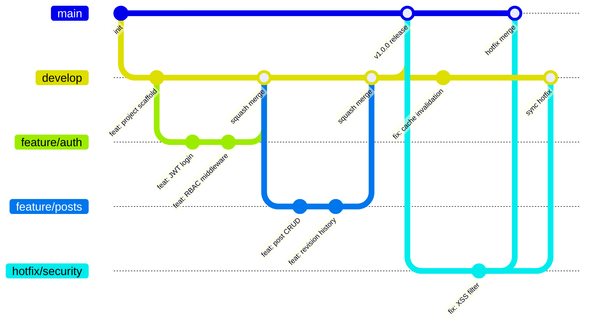

# CMS 内容管理系统 — 编码规范

**版本**：v2.0
**日期**：2026-02-24
**状态**：草稿

---

## 1. Go 编码规范

### 1.1 命名约定

| 类型 | 规则 | 示例 |
|------|------|------|
| 包名 | 小写单词，不使用下划线或驼峰 | `handler`、`repository`、`middleware` |
| 变量名 | camelCase | `postCount`、`userID`、`pageSize` |
| 导出函数/类型 | PascalCase | `CreatePost`、`PostService`、`ListResponse` |
| 接口命名 | -er 后缀（描述行为） | `PostRepository`、`CacheWriter`、`TokenValidator` |
| 常量 | PascalCase | `MaxPageSize`、`DefaultCacheTTL`、`RoleAdmin` |
| 缩写词 | 全大写保持一致 | `userID`（非 `userId`）、`httpURL`（非 `httpUrl`） |

```go
// 正确
package repository

const MaxPageSize = 100

type PostRepository interface {
    FindByID(ctx context.Context, id uuid.UUID) (*model.Post, error)
}

// 错误
package post_repository  // 包名不使用下划线

const MAX_PAGE_SIZE = 100  // 常量不使用 SCREAMING_SNAKE_CASE

type IPostRepository interface { ... }  // 接口不使用 I 前缀
```

### 1.2 错误处理模式

#### fmt.Errorf + %w 包装

为错误添加描述性上下文信息时，使用 `fmt.Errorf` + `%w`：

```go
func (r *postRepo) FindByID(ctx context.Context, id uuid.UUID) (*model.Post, error) {
    var post model.Post
    err := r.db.NewSelect().Model(&post).Where("id = ?", id).Scan(ctx)
    if err != nil {
        if errors.Is(err, sql.ErrNoRows) {
            return nil, fmt.Errorf("post %s: %w", id, ErrNotFound)
        }
        return nil, fmt.Errorf("query post by id: %w", err)
    }
    return &post, nil
}
```

#### errors.Join 组合哨兵错误

将哨兵错误与底层错误组合时，使用 `errors.Join`，使上层可通过 `errors.Is()` 同时匹配两个错误：

```go
// 在 AppError 构造函数中，将哨兵错误与原始错误组合
func NotFound(msg string, err error) *AppError {
    return &AppError{Code: http.StatusNotFound, Message: msg, Err: errors.Join(ErrNotFound, err)}
}

// 调用方可同时检查哨兵错误和底层错误
errors.Is(appErr, apperror.ErrNotFound) // true
errors.Is(appErr, sql.ErrNoRows)        // true (如果原始 err 是 sql.ErrNoRows)
```

**选择原则**：`fmt.Errorf("context: %w", err)` 用于添加描述性上下文；`errors.Join(sentinelErr, err)` 用于将哨兵错误与底层错误绑定，保留双重 `errors.Is()` 可达性。

#### Sentinel Errors

在 `internal/pkg/apperror/` 中定义全局哨兵错误，供各层复用：

```go
package apperror

import "errors"

var (
    ErrNotFound      = errors.New("resource not found")
    ErrUnauthorized  = errors.New("unauthorized")
    ErrForbidden     = errors.New("forbidden")
    ErrConflict      = errors.New("resource conflict")
    ErrValidation    = errors.New("validation failed")
    ErrUnprocessable = errors.New("unprocessable entity")  // 业务逻辑错误（如非法状态转换）
    ErrRateLimited   = errors.New("rate limited")          // 请求频率超限
)
```

#### 自定义错误类型

业务错误携带额外上下文信息时，使用自定义错误类型：

```go
type ValidationError struct {
    Field   string
    Message string
}

func (e *ValidationError) Error() string {
    return fmt.Sprintf("validation: %s - %s", e.Field, e.Message)
}
```

#### 不允许忽略 error

```go
// 正确：显式处理或赋值给 _
result, err := service.CreatePost(ctx, req)
if err != nil {
    return err
}

// 如果确实不需要 error，必须显式忽略并注释原因
_ = conn.Close() // 连接关闭错误无需处理

// 错误：直接忽略
service.CreatePost(ctx, req)  // lint 报错：error return value is not checked
```

### 1.3 项目分层规则

```
请求流向：HTTP Request → Handler → Service → Repository → Database
```

#### Handler 层（HTTP 请求解析、响应格式化）

- 负责：解析请求参数、调用 Service、格式化 HTTP 响应
- 禁止：包含业务逻辑、直接访问数据库、直接操作缓存

```go
// internal/handler/post.go
type PostHandler struct {
    postService service.PostService
}

func NewPostHandler(ps service.PostService) *PostHandler {
    return &PostHandler{postService: ps}
}

func (h *PostHandler) Create(c *gin.Context) {
    var req dto.CreatePostRequest
    if err := c.ShouldBindJSON(&req); err != nil {
        c.JSON(http.StatusBadRequest, dto.ErrorResponse("VALIDATION_ERROR", err.Error()))
        return
    }

    userID := c.GetString("user_id")
    post, err := h.postService.Create(c.Request.Context(), userID, &req)
    if err != nil {
        handleError(c, err)
        return
    }

    c.JSON(http.StatusCreated, dto.SuccessResponse(post))
}
```

#### Service 层（业务逻辑、事务管理）

- 负责：业务规则校验、事务编排、缓存策略、跨 Repository 协调
- 禁止：解析 HTTP 请求、返回 HTTP 状态码、直接写 SQL

```go
// internal/service/post_service.go
type PostService interface {
    Create(ctx context.Context, userID string, req *dto.CreatePostRequest) (*dto.PostResponse, error)
    Update(ctx context.Context, userID string, id uuid.UUID, req *dto.UpdatePostRequest) (*dto.PostResponse, error)
    Delete(ctx context.Context, id uuid.UUID) error
}

type postService struct {
    postRepo     repository.PostRepository
    categoryRepo repository.CategoryRepository
    cacheService CacheService
    db           *bun.DB // 用于事务管理
}

func (s *postService) Create(ctx context.Context, userID string, req *dto.CreatePostRequest) (*dto.PostResponse, error) {
    // 业务校验
    if req.Slug != "" {
        exists, err := s.postRepo.SlugExists(ctx, req.Slug)
        if err != nil {
            return nil, fmt.Errorf("check slug: %w", err)
        }
        if exists {
            return nil, fmt.Errorf("slug %q: %w", req.Slug, apperror.ErrConflict)
        }
    }

    // 事务
    tx, err := s.db.BeginTx(ctx, nil)
    if err != nil {
        return nil, fmt.Errorf("begin tx: %w", err)
    }
    defer tx.Rollback()

    post := req.ToModel(userID)
    if err := s.postRepo.WithTx(tx).Create(ctx, post); err != nil {
        return nil, fmt.Errorf("create post: %w", err)
    }

    if err := tx.Commit(); err != nil {
        return nil, fmt.Errorf("commit tx: %w", err)
    }

    // 清除缓存
    s.cacheService.InvalidatePostList(ctx)

    return dto.NewPostResponse(post), nil
}
```

#### 事务隔离级别指南

```go
// ========== 事务隔离级别指南 ==========

// 默认：ReadCommitted（PostgreSQL 默认值，适用大多数场景）
// bun 事务
tx, err := db.BeginTx(ctx, &sql.TxOptions{
    Isolation: sql.LevelReadCommitted,
})
defer tx.Rollback()

// 敏感操作使用 Serializable：密码修改、Token 撤销、余额变更
// Serializable 事务
tx, err := db.BeginTx(ctx, &sql.TxOptions{
    Isolation: sql.LevelSerializable,
})
// Serializable 事务可能因序列化冲突失败，需实现重试逻辑（最多 3 次）
```

#### Repository 层（数据访问、SQL 查询）

- 负责：SQL 查询、数据映射
- 禁止：包含业务逻辑、操作缓存

```go
// internal/repository/post_repo.go
type PostRepository interface {
    FindByID(ctx context.Context, id uuid.UUID) (*model.Post, error)
    FindAll(ctx context.Context, filter PostFilter) ([]*model.Post, int, error)
    Create(ctx context.Context, post *model.Post) error
    Update(ctx context.Context, post *model.Post) error
    SoftDelete(ctx context.Context, id uuid.UUID) error
    SlugExists(ctx context.Context, slug string) (bool, error)
    WithTx(tx bun.Tx) PostRepository
}
```

#### 各层接口定义规范

- 接口定义在**调用方所在包**（依赖倒置原则）
- Service 层接口定义在 `service` 包，供 Handler 引用
- Repository 层接口定义在 `repository` 包，供 Service 引用

### 1.4 Schema 隔离模式

#### 站点上下文获取

所有站点作用域的 Handler 从 Gin Context 获取站点信息，**不允许**从请求参数中传入 `site_id`：

```go
// 正确：从中间件注入的 Gin Context 获取站点上下文
func (h *PostHandler) Create(c *gin.Context) {
    siteSlug := c.GetString("site_slug")   // SchemaMiddleware 注入
    siteID := c.GetString("site_id")       // SiteResolverMiddleware 注入
    userID := c.GetString("user_id")       // AuthMiddleware 注入
    role := c.GetString("role")            // RBAC 中间件注入（全局角色）

    // search_path 已由 SchemaMiddleware 设置为 'site_{slug}', 'public'
    // 所有后续查询自动作用于正确的站点模式
    // ...
}

// 错误：从请求参数获取站点 ID
func (h *PostHandler) Create(c *gin.Context) {
    siteID := c.Query("site_id")  // 禁止！站点上下文由中间件管理
}
```

#### bun QueryHook 设置 search_path

使用 bun QueryHook 在每次查询前自动设置 `search_path`，确保所有 SQL 执行在正确的站点模式下：

```go
// internal/middleware/schema_hook.go
type SchemaQueryHook struct{}

func (h *SchemaQueryHook) BeforeQuery(ctx context.Context, event *bun.QueryEvent) context.Context {
    if slug, ok := ctx.Value("site_slug").(string); ok && slug != "" {
        schema := "site_" + slug
        // 在查询前设置 search_path
        event.DB.ExecContext(ctx,
            fmt.Sprintf("SET LOCAL search_path TO '%s', 'public'", schema))
    }
    return ctx
}

func (h *SchemaQueryHook) AfterQuery(ctx context.Context, event *bun.QueryEvent) {
    // no-op
}
```

#### Repository 层 Schema 感知模式

Repository 不需要显式指定模式名 —— `search_path` 已由中间件设置。所有查询使用无限定表名：

```go
// internal/repository/post_repo.go
// 正确：使用无限定表名，依赖 search_path 解析到正确模式
func (r *postRepo) FindByID(ctx context.Context, id uuid.UUID) (*model.Post, error) {
    var post model.Post
    err := r.db.NewSelect().
        Model(&post).
        Where("id = ?", id).
        Where("deleted_at IS NULL").
        Scan(ctx)
    if err != nil {
        if err == sql.ErrNoRows {
            return nil, fmt.Errorf("post %s: %w", id, apperror.ErrNotFound)
        }
        return nil, fmt.Errorf("query post: %w", err)
    }
    return &post, nil
}

// 错误：硬编码模式名
func (r *postRepo) FindByID(ctx context.Context, id uuid.UUID) (*model.Post, error) {
    err := r.db.NewSelect().
        TableExpr("site_blog.sfc_site_posts").  // 禁止！不要硬编码模式名
        // ...
}

// 如需显式引用 public 模式的表，使用完整限定名
func (r *postRepo) FindWithAuthor(ctx context.Context, id uuid.UUID) (*model.PostWithAuthor, error) {
    var result model.PostWithAuthor
    err := r.db.NewRaw(`
        SELECT p.*, u.display_name AS author_name
        FROM sfc_site_posts p
        JOIN public.sfc_users u ON u.id = p.author_id
        WHERE p.id = ? AND p.deleted_at IS NULL`, id).Scan(ctx, &result)
    // ...
}
```

### 1.5 Schema 管理模式

#### 站点模式创建

使用模板函数创建新站点模式，确保所有站点具有一致的表结构：

```go
// internal/schema/create_site.go
func CreateSiteSchema(ctx context.Context, tx bun.Tx, slug string) error {
    // 1. 验证 slug 格式
    if !isValidSlug(slug) {
        return fmt.Errorf("invalid site slug %q: %w", slug, apperror.ErrValidation)
    }

    schema := "site_" + slug

    // 2. 创建模式
    _, err := tx.ExecContext(ctx, fmt.Sprintf("CREATE SCHEMA IF NOT EXISTS %s", schema))
    if err != nil {
        return fmt.Errorf("create schema %s: %w", schema, err)
    }

    // 3. 设置 search_path
    _, err = tx.ExecContext(ctx,
        fmt.Sprintf("SET LOCAL search_path TO '%s', 'public'", schema))
    if err != nil {
        return err
    }

    // 4. 执行所有 per-site DDL（sfc_site_posts, sfc_site_categories, sfc_site_tags, sfc_site_comments, sfc_site_menus, etc.）
    if err := createSiteTables(ctx, tx, schema); err != nil {
        return err
    }

    // 5. Seed 内置数据（sfc_site_post_types, sfc_site_configs）
    if err := seedSiteDefaults(ctx, tx, schema); err != nil {
        return err
    }

    return nil
}
```

#### 站点模式删除

```go
// internal/schema/delete_site.go
func DeleteSiteSchema(ctx context.Context, tx bun.Tx, slug string) error {
    schema := "site_" + slug

    // DROP SCHEMA CASCADE 将删除模式内所有表、索引、触发器和数据
    // 此操作不可逆！
    _, err := tx.ExecContext(ctx,
        fmt.Sprintf("DROP SCHEMA IF EXISTS %s CASCADE", schema))
    if err != nil {
        return fmt.Errorf("drop schema %s: %w", schema, err)
    }

    return nil
}
```

#### Slug 验证

```go
// internal/schema/validation.go
import "regexp"

var slugRegex = regexp.MustCompile(`^[a-z0-9_]{3,50}$`)

var reservedSlugs = map[string]bool{
    "public": true, "pg_catalog": true, "information_schema": true,
    "pg_toast": true, "pg_temp": true, "site": true, "admin": true,
    "api": true, "setup": true, "system": true, "default": true,
    "template": true, "test": true,
}

func isValidSlug(slug string) bool {
    if !slugRegex.MatchString(slug) {
        return false
    }
    return !reservedSlugs[slug]
}
```

### 1.6 中间件模式

#### SchemaMiddleware

设置 PostgreSQL `search_path` 以确保所有查询解析到正确的站点模式：

```go
// internal/middleware/schema.go
func SchemaMiddleware(siteRepo repository.SiteRepository, db *bun.DB) gin.HandlerFunc {
    return func(c *gin.Context) {
        slug := c.GetString("site_slug") // 由 SiteResolverMiddleware 预先注入
        if slug == "" {
            c.AbortWithStatusJSON(400, gin.H{"error": "missing site context"})
            return
        }

        schema := "site_" + slug

        // 验证模式名以防止 SQL 注入
        if !isValidSlug(slug) {
            c.AbortWithStatusJSON(400, gin.H{"error": "invalid site"})
            return
        }

        // 设置 search_path
        _, err := db.ExecContext(c.Request.Context(),
            fmt.Sprintf("SET search_path TO '%s', 'public'", schema))
        if err != nil {
            c.AbortWithStatusJSON(500, gin.H{"error": "无法设置站点上下文"})
            return
        }

        c.Next()
    }
}
```

#### 角色解析

JWT 不携带 `role` 声明，角色从 `public.sfc_user_roles` 按请求解析，RBAC 中间件通过 `sfc_role_apis` 动态匹配 API 权限（两级 Redis 缓存）：

```go
// internal/middleware/auth.go（角色解析部分）
func resolveRole(ctx context.Context, rdb *redis.Client, db *bun.DB,
    siteID uuid.UUID, userID uuid.UUID, siteSlug string) (string, error) {

    // 1. 检查 Redis 缓存
    cacheKey := fmt.Sprintf("site:%s:role:%s", siteSlug, userID)
    cached, err := rdb.Get(ctx, cacheKey).Result()
    if err == nil {
        return cached, nil
    }

    // 2. 缓存未命中，查询数据库
    var role string
    err = db.NewSelect().
        TableExpr("public.sfc_user_roles").
        Column("role_id").
        Where("user_id = ?", userID).
        Scan(ctx, &role)
    if err != nil {
        if err == sql.ErrNoRows {
            return "", fmt.Errorf("user %s has no role on site %s: %w",
                userID, siteSlug, apperror.ErrForbidden)
        }
        return "", fmt.Errorf("query role: %w", err)
    }

    // 3. 写入缓存（TTL 300s）
    rdb.Set(ctx, cacheKey, role, 300*time.Second)

    return role, nil
}
```

#### 中间件链注册

```go
// internal/router/router.go
func SetupRouter(r *gin.Engine, deps *Dependencies) {
    // 全局中间件
    r.Use(gin.Recovery())
    r.Use(middleware.CORSMiddleware(deps.Config))
    r.Use(middleware.RateLimitMiddleware(deps.Redis))

    // ========== 安装向导（无认证，无站点上下文） ==========
    setup := r.Group("/api/v1/setup")
    setup.Use(middleware.SetupRateLimitMiddleware(deps.Redis))
    {
        setup.POST("/check",      handler.SetupCheck)
        setup.POST("/initialize", handler.SetupInitialize)
    }

    // ========== 全局认证路由（无 SchemaMiddleware） ==========
    r.POST("/api/v1/auth/login",         handler.Login)
    r.POST("/api/v1/auth/2fa/validate",  handler.Validate2FA)

    auth := r.Group("/api/v1/auth")
    auth.Use(middleware.JWTMiddleware(deps.Config))
    {
        auth.POST("/refresh",           handler.RefreshToken)
        auth.POST("/logout",            handler.Logout)
        auth.GET("/2fa/status",         handler.Get2FAStatus)
        auth.POST("/2fa/setup",         handler.Setup2FA)
        auth.POST("/2fa/verify",        handler.Verify2FASetup)
        auth.POST("/2fa/disable",       handler.Disable2FA)
        auth.POST("/2fa/backup-codes",  handler.RegenerateBackupCodes)
    }

    // ========== 公开 Feed/Sitemap（无认证，站点从 Host 解析） ==========
    feeds := r.Group("")
    feeds.Use(middleware.InstallationGuardMiddleware(deps.DB, deps.Redis))
    feeds.Use(middleware.SiteResolverMiddleware(deps.SiteRepo, deps.Redis))
    feeds.Use(middleware.SchemaMiddleware(deps.SiteRepo, deps.DB))
    {
        feeds.GET("/feed/rss.xml",           handler.RSSFeed)
        feeds.GET("/feed/atom.xml",          handler.AtomFeed)
        feeds.GET("/sitemap.xml",            handler.SitemapIndex)
        feeds.GET("/sitemap-posts.xml",      handler.SitemapPosts)
        feeds.GET("/sitemap-categories.xml", handler.SitemapCategories)
        feeds.GET("/sitemap-tags.xml",       handler.SitemapTags)
    }

    // ========== 公开 API（API Key 认证，站点从 Host 解析） ==========
    public := r.Group("/api/public/v1")
    public.Use(middleware.InstallationGuardMiddleware(deps.DB, deps.Redis))
    public.Use(middleware.APIKeyMiddleware())
    public.Use(middleware.SiteResolverMiddleware(deps.SiteRepo, deps.Redis))
    public.Use(middleware.SchemaMiddleware(deps.SiteRepo, deps.DB))
    public.Use(middleware.RedirectMiddleware(deps.RedirectService))
    {
        public.GET("/posts/:slug/comments",  handler.PublicListComments)
        public.POST("/posts/:slug/comments", handler.PublicCreateComment)
        public.GET("/menus",                 handler.PublicGetMenu)
        public.GET("/preview/:token",        handler.PublicPreview)
    }

    // ========== 管理 API（JWT 认证，站点从 JWT claims 解析） ==========
    api := r.Group("/api/v1")
    api.Use(middleware.InstallationGuardMiddleware(deps.DB, deps.Redis))
    api.Use(middleware.JWTMiddleware(deps.Config))
    api.Use(middleware.SiteResolverMiddleware(deps.SiteRepo, deps.Redis))
    api.Use(middleware.SchemaMiddleware(deps.SiteRepo, deps.DB))
    {
        // Posts, Categories, Tags, Media ... (existing routes)

        // Comments moderation
        comments := api.Group("/comments")
        // RBAC 中间件根据 sfc_role_apis 动态匹配，无需硬编码角色
        // comments, menus, redirects 等路由的权限由 sfc_role_apis 表配置
        comments := api.Group("/comments")
        { /* RBAC 中间件自动匹配 */ }

        // Menus
        menus := api.Group("/menus")
        { /* RBAC 中间件自动匹配 */ }

        // Redirects
        redirects := api.Group("/redirects")
        { /* RBAC 中间件自动匹配 */ }

        // Preview tokens
        // (nested under posts routes, Editor+)
    }
}
```

### 1.7 SQL 书写规范

#### bun 查询规范

```go
// ========== bun 查询规范 ==========

// 链式查询（推荐）
var posts []Post
err := db.NewSelect().
    Model(&posts).
    Where("status = ?", "published").
    Where("deleted_at IS NULL").
    OrderExpr("created_at DESC").
    Limit(20).
    Scan(ctx)

// 关联查询
var post Post
err := db.NewSelect().
    Model(&post).
    Relation("Author").
    Relation("Categories").
    Relation("Tags").
    Where("post.id = ?", postID).
    Scan(ctx)

// Raw SQL（复杂查询时使用）
var results []PostWithCount
err := db.NewRaw(`
    SELECT p.*, count(pcm.category_id) as category_count
    FROM sfc_site_posts p
    LEFT JOIN sfc_site_post_category_map pcm ON pcm.post_id = p.id
    WHERE p.status = ?
    GROUP BY p.id`, "published").Scan(ctx, &results)

// 参数化查询：bun 使用 ? 占位符，自动防止 SQL 注入
// 禁止: fmt.Sprintf("WHERE id = '%s'", id)
// 正确: .Where("id = ?", id)
```

#### SQL 格式化规则

- 关键字大写（`SELECT`、`FROM`、`WHERE`、`JOIN`）
- 每个子句独占一行，缩进对齐
- 逗号放在字段前面（便于 Git diff）

```go
const findPostsWithFilters = `
    SELECT p.id
         , p.title
         , p.slug
         , p.status
         , p.published_at
         , u.display_name AS author_name
      FROM sfc_site_posts p
      JOIN public.sfc_users u ON u.id = p.author_id
     WHERE p.deleted_at IS NULL
       AND ($1::text IS NULL OR p.status = $1)
       AND ($2::text IS NULL OR p.title ILIKE '%' || $2 || '%')
     ORDER BY p.created_at DESC
     LIMIT $3 OFFSET $4`
```

### 1.8 Context 传递

所有公共方法的第一个参数必须为 `context.Context`，用于传递超时、取消信号和请求元数据：

```go
// 正确
func (s *postService) Create(ctx context.Context, req *dto.CreatePostRequest) error
func (r *postRepo) FindByID(ctx context.Context, id uuid.UUID) (*model.Post, error)

// 错误：缺少 context
func (r *postRepo) FindByID(id uuid.UUID) (*model.Post, error)

// 错误：context 不是第一个参数
func (s *postService) Create(req *dto.CreatePostRequest, ctx context.Context) error
```

### 1.9 日志规范

使用 Go 标准库 `log/slog` 结构化日志：

```go
// 日志初始化（main.go）
logger := slog.New(slog.NewJSONHandler(os.Stdout, &slog.HandlerOptions{
    Level: slog.LevelInfo,
}))
slog.SetDefault(logger)
```

| 级别 | 用途 | 示例 |
|------|------|------|
| `slog.Debug` | 开发调试信息 | SQL 查询详情、缓存命中情况 |
| `slog.Info` | 正常业务事件 | 用户登录、文章发布 |
| `slog.Warn` | 异常但可恢复 | 缓存连接失败降级、请求超时重试 |
| `slog.Error` | 需要关注的错误 | 数据库连接失败、支付回调异常 |

```go
// 使用结构化字段，避免字符串拼接
slog.Info("post published",
    slog.String("post_id", post.ID.String()),
    slog.String("author_id", userID),
    slog.String("slug", post.Slug),
    slog.String("site_slug", siteSlug),
)

slog.Error("failed to create post",
    slog.String("error", err.Error()),
    slog.String("user_id", userID),
    slog.String("site_slug", siteSlug),
)
```

### 1.10 Model 约定

#### Comment 模型

支持访客评论和登录用户评论。访客评论 `user_id` 为空，需提供 `author_name` + `author_email`：

```go
// internal/model/comment.go
type Comment struct {
    bun.BaseModel `bun:"table:sfc_site_comments,alias:c"`

    ID          uuid.UUID      `bun:"id,pk,type:uuid,default:uuidv7()" json:"id"`
    PostID      uuid.UUID      `bun:"post_id,type:uuid,notnull" json:"post_id"`
    ParentID    *uuid.UUID     `bun:"parent_id,type:uuid" json:"parent_id"`
    UserID      *uuid.UUID     `bun:"user_id,type:uuid" json:"user_id"`             // nullable: 登录用户评论时设置
    AuthorName  string         `bun:"author_name,notnull" json:"author_name"`
    AuthorEmail string         `bun:"author_email,notnull" json:"author_email"`
    AuthorURL   *string        `bun:"author_url" json:"author_url,omitempty"`
    AuthorIP    string         `bun:"author_ip,type:inet,notnull" json:"-"`          // 不暴露给公开 API
    UserAgent   *string        `bun:"user_agent" json:"-"`                           // 不暴露给公开 API
    Content     string         `bun:"content,notnull" json:"content"`
    Status      string         `bun:"status,notnull,default:'pending'" json:"status"` // pending/approved/spam/trash
    IsPinned    bool           `bun:"is_pinned,notnull,default:false" json:"is_pinned"`
    CreatedAt   time.Time      `bun:"created_at,notnull,default:current_timestamp" json:"created_at"`
    UpdatedAt   time.Time      `bun:"updated_at,notnull,default:current_timestamp" json:"updated_at"`
    DeletedAt   *time.Time     `bun:"deleted_at,soft_delete" json:"-"`

    // 关联
    Post    *Post     `bun:"rel:belongs-to,join:post_id=id" json:"post,omitempty"`
    Parent  *Comment  `bun:"rel:belongs-to,join:parent_id=id" json:"-"`
    Replies []Comment `bun:"rel:has-many,join:id=parent_id" json:"replies,omitempty"`
}
```

#### MenuItem 模型（多态引用）

菜单项使用 `type` + `reference_id` 实现多态引用（指向 post/category/tag/page）：

```go
// internal/model/menu_item.go
type MenuItem struct {
    bun.BaseModel `bun:"table:sfc_site_menu_items,alias:mi"`

    ID          uuid.UUID  `bun:"id,pk,type:uuid,default:uuidv7()" json:"id"`
    MenuID      uuid.UUID  `bun:"menu_id,type:uuid,notnull" json:"menu_id"`
    ParentID    *uuid.UUID `bun:"parent_id,type:uuid" json:"parent_id"`
    Label       string     `bun:"label,notnull" json:"label"`
    URL         *string    `bun:"url" json:"url"`                                    // 自定义链接的 URL
    Target      string     `bun:"target,notnull,default:'_self'" json:"target"`      // _self / _blank
    Icon        *string    `bun:"icon" json:"icon,omitempty"`
    CSSClass    *string    `bun:"css_class" json:"css_class,omitempty"`
    Type        string     `bun:"type,notnull,default:'custom'" json:"type"`         // custom/post/category/tag/page
    ReferenceID *uuid.UUID `bun:"reference_id,type:uuid" json:"reference_id"`        // 多态引用目标
    SortOrder   int        `bun:"sort_order,notnull,default:0" json:"sort_order"`
    IsActive    bool       `bun:"is_active,notnull,default:true" json:"is_active"`
    CreatedAt   time.Time  `bun:"created_at,notnull,default:current_timestamp" json:"created_at"`
    UpdatedAt   time.Time  `bun:"updated_at,notnull,default:current_timestamp" json:"updated_at"`

    // 响应字段（非数据库列）
    IsBroken bool       `bun:"-" json:"is_broken,omitempty"`    // 引用目标已删除或取消发布
    Children []MenuItem `bun:"-" json:"children,omitempty"`     // 子菜单项（树形构建）
}

// ResolveURL 根据 type 和 reference_id 解析实际 URL
// 由 Service 层在构建响应时调用
func (mi *MenuItem) ResolveURL(posts map[uuid.UUID]string, categories map[uuid.UUID]string, tags map[uuid.UUID]string) {
    switch mi.Type {
    case "custom":
        // URL 已直接存储，无需解析
    case "post", "page":
        if mi.ReferenceID != nil {
            if slug, ok := posts[*mi.ReferenceID]; ok {
                url := "/" + slug
                mi.URL = &url
            } else {
                mi.IsBroken = true
            }
        }
    case "category":
        if mi.ReferenceID != nil {
            if path, ok := categories[*mi.ReferenceID]; ok {
                url := "/categories" + path
                mi.URL = &url
            } else {
                mi.IsBroken = true
            }
        }
    case "tag":
        if mi.ReferenceID != nil {
            if slug, ok := tags[*mi.ReferenceID]; ok {
                url := "/tags/" + slug
                mi.URL = &url
            } else {
                mi.IsBroken = true
            }
        }
    }
}
```

#### Redirect 模型（Redis 缓冲命中计数）

重定向的命中计数通过 Redis `INCR` 缓冲，由定时任务批量刷新到 PostgreSQL：

```go
// internal/model/redirect.go
type Redirect struct {
    bun.BaseModel `bun:"table:sfc_site_redirects,alias:r"`

    ID         uuid.UUID  `bun:"id,pk,type:uuid,default:uuidv7()" json:"id"`
    SourcePath string     `bun:"source_path,notnull" json:"source_path"`       // 唯一（模式内）
    TargetURL  string     `bun:"target_url,notnull" json:"target_url"`
    StatusCode int        `bun:"status_code,notnull,default:301" json:"status_code"` // 301 or 302
    IsActive   bool       `bun:"is_active,notnull,default:true" json:"is_active"`
    HitCount   int64      `bun:"hit_count,notnull,default:0" json:"hit_count"`
    LastHitAt  *time.Time `bun:"last_hit_at" json:"last_hit_at"`
    CreatedBy  uuid.UUID  `bun:"created_by,type:uuid,notnull" json:"-"`
    CreatedAt  time.Time  `bun:"created_at,notnull,default:current_timestamp" json:"created_at"`
    UpdatedAt  time.Time  `bun:"updated_at,notnull,default:current_timestamp" json:"updated_at"`

    // 关联
    Creator *User `bun:"rel:belongs-to,join:created_by=id" json:"created_by,omitempty"`
}
```

命中计数更新模式：

```go
// 实时：Redis INCR（异步，不阻塞请求）
func (s *RedirectService) IncrementHitCount(ctx context.Context, siteSlug string, redirectID uuid.UUID) {
    key := fmt.Sprintf("site:%s:redirect:hits:%s", siteSlug, redirectID)
    s.redis.Incr(ctx, key)
}

// 定时：从 Redis 刷新到 PostgreSQL（每 5 分钟）
func (s *RedirectService) FlushHitCounts(ctx context.Context) error {
    // 遍历所有站点，SCAN Redis 键，GETDEL 读取计数后写入 DB
    // 详见 deployment.md §8.2
}
```

### 1.11 完整调用链示例

以下展示一个从 Handler 到 Repository 的完整调用链：

```go
// ============================================================
// Handler 层：internal/handler/post.go
// ============================================================

func (h *PostHandler) GetByID(c *gin.Context) {
    id, err := uuid.Parse(c.Param("id"))
    if err != nil {
        c.JSON(http.StatusBadRequest, dto.ErrorResponse("VALIDATION_ERROR", "无效的文章 ID"))
        return
    }

    post, err := h.postService.GetByID(c.Request.Context(), id)
    if err != nil {
        handleError(c, err) // 根据错误类型映射 HTTP 状态码
        return
    }

    c.JSON(http.StatusOK, dto.SuccessResponse(post))
}

// ============================================================
// Service 层：internal/service/post_service.go
// ============================================================

func (s *postService) GetByID(ctx context.Context, id uuid.UUID) (*dto.PostResponse, error) {
    // 先查缓存
    cached, err := s.cacheService.GetPost(ctx, id)
    if err == nil && cached != nil {
        return cached, nil
    }

    // 缓存未命中，查数据库
    post, err := s.postRepo.FindByID(ctx, id)
    if err != nil {
        return nil, fmt.Errorf("get post %s: %w", id, err)
    }

    resp := dto.NewPostResponse(post)

    // 写入缓存
    _ = s.cacheService.SetPost(ctx, id, resp, 5*time.Minute)

    return resp, nil
}

// ============================================================
// Repository 层：internal/repository/post_repo.go
// ============================================================

func (r *postRepo) FindByID(ctx context.Context, id uuid.UUID) (*model.Post, error) {
    var post model.Post
    // search_path 已由 SchemaMiddleware 设置，无需指定模式名
    err := r.db.NewSelect().
        Model(&post).
        Where("id = ?", id).
        Where("deleted_at IS NULL").
        Scan(ctx)
    if err != nil {
        if err == sql.ErrNoRows {
            return nil, fmt.Errorf("post %s: %w", id, apperror.ErrNotFound)
        }
        return nil, fmt.Errorf("query post: %w", err)
    }
    return &post, nil
}
```

---

## 2. TypeScript / React 编码规范

### 2.1 命名约定

| 类型 | 规则 | 示例 |
|------|------|------|
| 组件文件 | PascalCase | `PostEditor.tsx`、`MediaLibrary.tsx` |
| 工具/库文件 | camelCase | `api.ts`、`utils.ts`、`authStore.ts` |
| Hook 文件 | camelCase，`use` 前缀 | `usePosts.ts`、`useAuth.ts` |
| 组件命名 | PascalCase（与文件名一致） | `export default function PostEditor()` |
| Props 类型 | `interface XxxProps` | `interface PostEditorProps` |
| 常量 | SCREAMING_SNAKE_CASE | `MAX_FILE_SIZE`、`API_BASE_URL` |
| 类型/接口 | PascalCase | `Post`、`PaginatedResponse<T>` |

### 2.2 React 组件规范

#### 函数组件 + Props 类型声明

```tsx
// 正确：函数组件 + 明确的 Props interface
interface PostCardProps {
  post: Post;
  onEdit: (id: string) => void;
  showAuthor?: boolean;
}

export default function PostCard({ post, onEdit, showAuthor = true }: PostCardProps) {
  return (
    <Card>
      <CardHeader>
        <CardTitle>{post.title}</CardTitle>
        {showAuthor && <p>{post.author.displayName}</p>}
      </CardHeader>
      <CardFooter>
        <Button onClick={() => onEdit(post.id)}>编辑</Button>
      </CardFooter>
    </Card>
  );
}
```

#### 避免 any

```tsx
// 正确：使用泛型或具体类型
function parseResponse<T>(data: unknown): T {
  return data as T;
}

// 错误：使用 any
function parseResponse(data: any): any { ... }
```

#### Hook 使用规则

```tsx
// 自定义 Hook：以 use 开头，封装可复用逻辑
function usePostList(filters: PostFilters) {
  return useQuery({
    queryKey: ['posts', 'list', filters],
    queryFn: () => fetchPosts(filters),
    staleTime: 30_000,
  });
}

// 正确：条件逻辑放在 Hook 内部，Hook 本身无条件调用
function PostDetail({ id }: { id: string }) {
  const { data } = useQuery({
    queryKey: ['posts', 'detail', id],
    queryFn: () => fetchPost(id),
    enabled: !!id,  // 条件放在 enabled 中
  });
  return <div>{data?.title}</div>;
}

// 错误：条件调用 Hook
function PostDetail({ id }: { id?: string }) {
  if (id) {
    const { data } = useQuery({ ... });  // 违反 Hook 规则
  }
}
```

#### 认证 Hook 规范

```typescript
// ========== 认证 Hook ==========

// useAuth — 全局认证状态管理
// 存储在 Zustand store，Access Token 仅保存在内存中（不存 localStorage）
interface AuthState {
  user: User | null;
  accessToken: string | null;
  isAuthenticated: boolean;
  requires2FA: boolean;        // 登录后是否需要 2FA 验证
  tempToken: string | null;    // 2FA 验证用的临时 token
  login: (credentials: LoginRequest) => Promise<void>;
  logout: () => Promise<void>;
  validate2FA: (code: string, isBackupCode?: boolean) => Promise<void>;
}

export const useAuthStore = create<AuthState>((set) => ({
  user: null,
  accessToken: null,
  isAuthenticated: false,
  requires2FA: false,
  tempToken: null,
  login: async (credentials) => {
    const res = await api.post('/auth/login', credentials);
    if (res.data.requires_2fa) {
      set({ requires2FA: true, tempToken: res.data.temp_token });
    } else {
      set({ accessToken: res.data.access_token, user: res.data.user, isAuthenticated: true });
    }
  },
  validate2FA: async (code, isBackupCode) => {
    // POST /auth/2fa/validate with temp_token
    // On success: set accessToken + user + isAuthenticated, clear requires2FA + tempToken
  },
  logout: async () => { /* POST /auth/logout -> clear state */ },
}));

// useTokenRefresh — 静默刷新 Hook（在 App 顶层调用）
// Access Token 过期前 60 秒自动刷新
// 刷新失败自动登出
export function useTokenRefresh() {
  // 1. 解析 JWT exp 字段计算剩余时间
  // 2. setTimeout 在过期前 60s 调用 POST /auth/refresh
  // 3. 成功 -> 更新 accessToken；失败 -> logout()
}
```

### 2.3 Astro 页面规范

#### Islands 架构最佳实践

根据组件交互需求选择合适的水合指令：

| 指令 | 用途 | 示例 |
|------|------|------|
| `client:load` | 首屏立即需要交互 | 导航菜单、登录表单 |
| `client:visible` | 滚动到可见区域后加载 | 评论区、底部图表 |
| `client:idle` | 浏览器空闲时加载 | 侧边栏工具、非关键功能 |
| 无指令 | 纯展示，无需交互 | 静态内容卡片 |

```astro
---
// src/pages/posts/index.astro
import MainLayout from '@/components/layout/MainLayout.astro';
import PostList from '@/components/posts/PostList.tsx';
import StatsCard from '@/components/dashboard/StatsCard.tsx';
---

<MainLayout title="文章管理">
  <!-- 首屏核心交互组件：立即加载 -->
  <PostList client:load />

  <!-- 非首屏统计组件：可见时加载 -->
  <StatsCard client:visible />
</MainLayout>
```

### 2.4 TanStack Query 使用约定

#### queryKey 命名规范

采用层级数组结构：`[资源, 操作, 参数]`

```tsx
// 列表
queryKey: ['posts', 'list', { page, status, categoryId }]

// 详情
queryKey: ['posts', 'detail', postId]

// 关联资源
queryKey: ['posts', postId, 'revisions']

// 分类树
queryKey: ['categories', 'tree']
```

#### staleTime / gcTime 配置

```tsx
// 全局默认配置（QueryClient）
const queryClient = new QueryClient({
  defaultOptions: {
    queries: {
      staleTime: 30_000,       // 30 秒内不重新请求
      gcTime: 5 * 60 * 1000,  // 5 分钟后垃圾回收
      retry: 1,
      refetchOnWindowFocus: false,
    },
  },
});

// 特定场景覆盖
// 分类树：变更不频繁
queryKey: ['categories', 'tree'],
staleTime: 5 * 60 * 1000,  // 5 分钟

// 仪表盘统计：实时性要求高
queryKey: ['dashboard', 'stats'],
staleTime: 10_000,  // 10 秒
```

#### Mutation + 乐观更新

```tsx
function useDeletePost() {
  const queryClient = useQueryClient();

  return useMutation({
    mutationFn: (id: string) => deletePost(id),
    onMutate: async (id) => {
      // 取消正在进行的查询
      await queryClient.cancelQueries({ queryKey: ['posts', 'list'] });

      // 保存旧数据用于回滚
      const previous = queryClient.getQueryData(['posts', 'list']);

      // 乐观更新：立即从列表中移除
      queryClient.setQueryData(['posts', 'list'], (old: PostListResponse) => ({
        ...old,
        data: old.data.filter((p: Post) => p.id !== id),
      }));

      return { previous };
    },
    onError: (_err, _id, context) => {
      // 回滚
      queryClient.setQueryData(['posts', 'list'], context?.previous);
    },
    onSettled: () => {
      // 无论成败，重新获取最新数据
      queryClient.invalidateQueries({ queryKey: ['posts', 'list'] });
    },
  });
}
```

### 2.5 Zustand Store 规范

#### Store 拆分原则

按业务域拆分，避免单一巨型 Store：

```
stores/
├── authStore.ts    # 认证状态（token、用户信息、2FA 状态）
├── uiStore.ts      # UI 状态（侧边栏、主题、通知）
└── editorStore.ts  # 编辑器状态（自动保存、草稿）
```

#### Store 命名与 Selector

```tsx
// stores/uiStore.ts
interface UIState {
  sidebarCollapsed: boolean;
  theme: 'light' | 'dark';
  toggleSidebar: () => void;
  setTheme: (theme: 'light' | 'dark') => void;
}

export const useUIStore = create<UIState>((set) => ({
  sidebarCollapsed: false,
  theme: 'light',
  toggleSidebar: () => set((state) => ({ sidebarCollapsed: !state.sidebarCollapsed })),
  setTheme: (theme) => set({ theme }),
}));

// 使用 selector 避免不必要的重渲染
function Sidebar() {
  const collapsed = useUIStore((state) => state.sidebarCollapsed);
  const toggle = useUIStore((state) => state.toggleSidebar);
  // ...
}

// 错误：解构整个 store 会导致任意状态变更时重渲染
function Sidebar() {
  const { sidebarCollapsed, toggleSidebar } = useUIStore();  // 避免
}
```

### 2.6 导入排序

按照以下顺序组织导入，各组之间空一行：

```tsx
// 1. 外部库
import { useState } from 'react';
import { useQuery, useMutation } from '@tanstack/react-query';
import { toast } from 'sonner';

// 2. 内部模块
import { fetchPosts, deletePost } from '@/lib/api';
import { useAuth } from '@/hooks/useAuth';
import PostCard from '@/components/posts/PostCard';
import { Button } from '@/components/ui/button';

// 3. 类型导入
import type { Post, PostFilters } from '@/types';

// 4. 样式（如有）
import './PostList.css';
```

### 2.7 代码质量工具 (Biome)

项目使用 [Biome](https://biomejs.dev/) 统一 lint + format（替代 ESLint + Prettier）。

#### 配置

- 配置文件: `web/biome.json`
- Scope: `src/**/*.{ts,tsx,astro}`
- 规则集: recommended（内置最佳实践）

#### 常用命令

```bash
bun run lint        # 检查 lint + format 问题
bun run lint:fix    # 自动修复
bun run format      # 仅格式化
bun run typecheck   # TypeScript 类型检查 (astro check)
```

#### 规则说明

| 规则 | 说明 |
|------|------|
| 缩进 | 2 spaces |
| 行宽 | 100 字符 |
| 引号 | 单引号 (`'`) |
| 分号 | 始终添加 |
| 导入排序 | Biome 内置 `organizeImports`（遵循 §2.6 排序约定） |

### 2.8 前端测试规范

#### 测试文件组织

测试文件统一放在组件同级的 `__tests__` 目录中，命名与组件一致：

```
components/
├── posts/
│   ├── PostCard.tsx
│   ├── PostList.tsx
│   └── __tests__/
│       ├── PostCard.test.tsx
│       └── PostList.test.tsx
```

#### 测试结构

使用 `describe` / `it` 组织用例，描述使用中文：

```tsx
describe('PostCard', () => {
  it('应显示文章标题和作者', () => {
    render(<PostCard post={mockPost} onEdit={vi.fn()} />);
    expect(screen.getByRole('heading', { name: '测试文章' })).toBeInTheDocument();
  });

  it('点击编辑按钮时应调用 onEdit', async () => {
    const onEdit = vi.fn();
    render(<PostCard post={mockPost} onEdit={onEdit} />);
    await userEvent.click(screen.getByRole('button', { name: '编辑' }));
    expect(onEdit).toHaveBeenCalledWith(mockPost.id);
  });
});
```

#### 核心规则

| 规则 | 说明 |
|------|------|
| 优先使用 `screen.getByRole` | 基于无障碍角色查询，避免依赖 `getByTestId` |
| 异步断言使用 `waitFor` | `await waitFor(() => expect(...))` 确保异步 UI 更新完成 |
| API Mock 使用 MSW | 通过 `msw` 拦截网络请求，禁止手动 mock `fetch` 或 `axios` |
| 测试运行器 | Vitest + React Testing Library（`@testing-library/react`） |
| 覆盖率要求 | 组件分支覆盖率 >= 70%，工具函数覆盖率 >= 90% |

#### MSW 示例

```tsx
// __tests__/setup.ts
import { setupServer } from 'msw/node';
import { http, HttpResponse } from 'msw';

export const server = setupServer(
  http.get('/api/v1/posts', () => {
    return HttpResponse.json({ success: true, data: [mockPost] });
  }),
);
```

### 2.9 集成测试：testcontainers-go

```go
// ========== 集成测试：testcontainers-go ==========

func SetupTestDB(t *testing.T) *bun.DB {
    ctx := context.Background()
    container, err := postgres.Run(ctx,
        "postgres:18-alpine",
        postgres.WithDatabase("test_db"),
        postgres.WithUsername("test"),
        postgres.WithPassword("test"),
    )
    require.NoError(t, err)
    t.Cleanup(func() { container.Terminate(ctx) })

    connStr, _ := container.ConnectionString(ctx, "sslmode=disable")
    sqldb, err := sql.Open("postgres", connStr)
    require.NoError(t, err)

    db := bun.NewDB(sqldb, pgdialect.NewDialect())

    // 执行迁移（创建 public 模式 + 测试站点模式）
    runMigrations(db)
    return db
}

// CreateTestSite 创建测试用站点模式
func CreateTestSite(t *testing.T, db *bun.DB, slug string) {
    ctx := context.Background()

    // 1. 在 public.sfc_sites 中创建站点记录
    _, err := db.ExecContext(ctx, `
        INSERT INTO public.sfc_sites (name, slug, is_active)
        VALUES (?, ?, true)
        ON CONFLICT (slug) DO NOTHING`, "Test Site "+slug, slug)
    require.NoError(t, err)

    // 2. 创建站点模式（使用模板函数）
    tx, err := db.BeginTx(ctx, nil)
    require.NoError(t, err)
    defer tx.Rollback()

    err = schema.CreateSiteSchema(ctx, tx, slug)
    require.NoError(t, err)

    err = tx.Commit()
    require.NoError(t, err)
}

// DropTestSite 清理测试用站点模式
func DropTestSite(t *testing.T, db *bun.DB, slug string) {
    ctx := context.Background()
    schemaName := "site_" + slug

    _, err := db.ExecContext(ctx,
        fmt.Sprintf("DROP SCHEMA IF EXISTS %s CASCADE", schemaName))
    require.NoError(t, err)

    _, err = db.ExecContext(ctx,
        "DELETE FROM public.sfc_sites WHERE slug = ?", slug)
    require.NoError(t, err)
}

// SetTestSearchPath 设置测试请求的 search_path
func SetTestSearchPath(t *testing.T, db *bun.DB, slug string) {
    ctx := context.Background()
    schemaName := "site_" + slug
    _, err := db.ExecContext(ctx,
        fmt.Sprintf("SET search_path TO '%s', 'public'", schemaName))
    require.NoError(t, err)
}
```

测试用例示例（multi-site 隔离验证）：

```go
func TestPostService_CrossSiteIsolation(t *testing.T) {
    db := SetupTestDB(t)
    CreateTestSite(t, db, "site_a")
    CreateTestSite(t, db, "site_b")
    defer DropTestSite(t, db, "site_a")
    defer DropTestSite(t, db, "site_b")

    // 在 site_a 创建文章
    SetTestSearchPath(t, db, "site_a")
    postA := createTestPost(t, db, "Site A Post")

    // 在 site_b 查询不应找到 site_a 的文章
    SetTestSearchPath(t, db, "site_b")
    _, err := findPostByID(t, db, postA.ID)
    assert.ErrorIs(t, err, apperror.ErrNotFound)
}
```

---

## 3. API 设计规范

### 3.1 RESTful URL 命名规则

- 使用**复数名词**表示资源集合
- 嵌套资源使用路径表达归属关系
- URL 全小写，单词间使用连字符 `-`

```
# 正确
GET    /api/v1/posts
GET    /api/v1/posts/:id
GET    /api/v1/posts/:id/revisions
POST   /api/v1/posts/:id/revisions/:rev_id/rollback
GET    /api/v1/categories/:id/posts
GET    /api/v1/posts/:id/preview          # 预览令牌管理
POST   /api/v1/redirects/import           # 重定向导入
GET    /api/v1/menus/:id                  # 菜单详情

# 错误
GET    /api/v1/getPost/:id          # 动词不应出现在 URL
GET    /api/v1/post/:id             # 应使用复数
GET    /api/v1/post_categories      # 使用连字符而非下划线
```

### 3.2 HTTP 方法语义

| 方法 | 语义 | 幂等 | 示例 |
|------|------|------|------|
| GET | 查询资源 | 是 | `GET /api/v1/posts` |
| POST | 创建资源 / 执行操作 | 否 | `POST /api/v1/posts` |
| PUT | 全量更新资源 | 是 | `PUT /api/v1/posts/:id` |
| PATCH | 部分更新资源 | 是 | `PATCH /api/v1/posts/:id` |
| DELETE | 删除资源（本项目为软删除） | 是 | `DELETE /api/v1/posts/:id` |

### 3.3 统一响应格式

所有 API 必须遵循统一响应结构（参见 api.md）：

```go
// internal/dto/response.go

// 成功响应
type Response struct {
    Success bool        `json:"success"`
    Data    interface{} `json:"data,omitempty"`
    Message string      `json:"message,omitempty"`
}

// 列表响应
type ListResponse struct {
    Success    bool        `json:"success"`
    Data       interface{} `json:"data"`
    Pagination *Pagination `json:"pagination"`
}

// 分页信息
type Pagination struct {
    Page       int `json:"page"`
    PerPage    int `json:"per_page"`
    Total      int `json:"total"`
    TotalPages int `json:"total_pages"`
}

// 错误响应
type ErrorBody struct {
    Success bool         `json:"success"`
    Error   *ErrorDetail `json:"error"`
}

type ErrorDetail struct {
    Code    string        `json:"code"`
    Message string        `json:"message"`
    Details []FieldError  `json:"details,omitempty"`
}
```

### 3.4 分页参数约定

| 参数 | 类型 | 默认值 | 说明 |
|------|------|--------|------|
| `page` | int | 1 | 页码，从 1 开始 |
| `per_page` | int | 20 | 每页数量，最大 100 |
| `sort` | string | `created_at:desc` | 排序字段与方向，格式 `field:asc\|desc` |

```
GET /api/v1/posts?page=2&per_page=10&sort=published_at:desc
```

### 3.5 错误码使用规则

Handler 层根据错误类型映射 HTTP 状态码：

```go
func handleError(c *gin.Context, err error) {
    switch {
    case errors.Is(err, apperror.ErrNotFound):
        c.JSON(http.StatusNotFound, dto.ErrorResponse("NOT_FOUND", err.Error()))
    case errors.Is(err, apperror.ErrConflict):
        c.JSON(http.StatusConflict, dto.ErrorResponse("CONFLICT", err.Error()))
    case errors.Is(err, apperror.ErrValidation):
        c.JSON(http.StatusBadRequest, dto.ErrorResponse("VALIDATION_ERROR", err.Error()))
    case errors.Is(err, apperror.ErrUnauthorized):
        c.JSON(http.StatusUnauthorized, dto.ErrorResponse("UNAUTHORIZED", err.Error()))
    case errors.Is(err, apperror.ErrForbidden):
        c.JSON(http.StatusForbidden, dto.ErrorResponse("FORBIDDEN", err.Error()))
    case errors.Is(err, apperror.ErrUnprocessable):
        c.JSON(http.StatusUnprocessableEntity, dto.ErrorResponse("UNPROCESSABLE", err.Error()))
    case errors.Is(err, apperror.ErrRateLimited):
        c.JSON(http.StatusTooManyRequests, dto.ErrorResponse("RATE_LIMITED", err.Error()))
    default:
        slog.Error("unhandled error", slog.String("error", err.Error()))
        c.JSON(http.StatusInternalServerError, dto.ErrorResponse("INTERNAL_ERROR", "服务器内部错误"))
    }
}
```

### 3.6 统一错误响应

```go
// ========== 统一错误响应 ==========

type ErrorResponse struct {
    Code    string `json:"code"`
    Message string `json:"message"`
}

func RespondError(c *gin.Context, httpStatus int, code string, message string) {
    c.JSON(httpStatus, gin.H{
        "code":    code,
        "message": message,
    })
}

// 使用示例
// RespondError(c, 404, "NOT_FOUND", "文章不存在")
// RespondError(c, 409, "VERSION_CONFLICT", "内容已被其他用户修改，请刷新后重试")
```

### 3.7 API 版本管理

- 管理 API 路径前缀：`/api/v1`
- 公开 API 路径前缀：`/api/public/v1`
- 版本升级时保留旧版本路由，设置废弃响应头 `Deprecation: true`
- 破坏性变更（字段删除、类型变更）必须发布新版本

---

## 4. Git 工作流

### 4.1 分支策略



| 分支 | 用途 | 创建自 | 合并至 |
|------|------|--------|--------|
| `main` | 生产环境代码 | — | — |
| `develop` | 开发集成分支 | `main` | `main` |
| `feature/*` | 功能开发 | `develop` | `develop` |
| `hotfix/*` | 生产紧急修复 | `main` | `main` + `develop` |

### 4.2 Commit Message 格式

遵循 [Conventional Commits](https://www.conventionalcommits.org/) 规范：

```
<type>(<scope>): <description>

[可选 body]

[可选 footer]
```

| Type | 说明 |
|------|------|
| `feat` | 新功能 |
| `fix` | Bug 修复 |
| `docs` | 文档变更 |
| `refactor` | 重构（不影响功能） |
| `test` | 测试相关 |
| `chore` | 构建/工具/依赖变更 |
| `perf` | 性能优化 |
| `style` | 代码格式（不影响逻辑） |

#### 示例

```
feat(post): add revision history and rollback

- Store content snapshots on each update
- Support rollback to any previous version
- Add GET /api/v1/posts/:id/revisions endpoint

Closes #42

---

fix(auth): prevent token reuse after logout

Add JTI to Redis blacklist on logout to prevent
access token reuse within its remaining TTL.

---

chore(deps): upgrade Go to 1.24.1

---

docs(api): add media upload API specification
```

### 4.3 PR 规范

#### 标题格式

与 Commit Message 一致：`<type>(<scope>): <description>`

#### 描述模板

```markdown
## 变更说明
<!-- 简要描述本次变更内容和目的 -->

## 变更类型
- [ ] 新功能 (feat)
- [ ] Bug 修复 (fix)
- [ ] 重构 (refactor)
- [ ] 文档 (docs)
- [ ] 其他

## 测试
<!-- 描述测试情况 -->
- [ ] 单元测试通过
- [ ] 手动测试通过
- [ ] API 兼容性已验证

## 截图（如有 UI 变更）
```

#### Review 要求

- 至少 **1 人 Approve** 方可合并
- CI 全部通过（lint、test、build）
- 无未解决的 Review 评论

### 4.4 代码合并策略

| 合并方向 | 策略 | 原因 |
|----------|------|------|
| `feature/*` -> `develop` | **Squash Merge** | 保持 develop 历史整洁 |
| `develop` -> `main` | **Merge Commit** | 保留完整发布记录 |
| `hotfix/*` -> `main` | **Merge Commit** | 保留修复追踪记录 |

---

## 5. 代码审查清单

| 检查项 | 关注点 | 通过标准 |
|--------|--------|----------|
| **功能正确性** | 代码是否实现了需求描述的功能 | 逻辑正确，边界条件已处理 |
| **错误处理** | 是否所有 error 都被处理，是否使用 `%w` 包装 | 无忽略的 error，错误信息有上下文 |
| **安全性** | SQL 注入（参数化查询）、XSS（HTML 过滤）、权限校验 | 无字符串拼接 SQL，富文本经过 bluemonday 过滤 |
| **Schema 隔离** | 是否正确依赖 `search_path` 而非硬编码模式名 | 无硬编码模式名，public 表使用完整限定名 |
| **性能** | N+1 查询、缓存使用、大量数据分页 | 关联数据使用 JOIN 预加载，列表接口有分页限制 |
| **测试覆盖** | 核心业务逻辑是否有单元测试 | Service 层关键路径有测试用例 |
| **命名和可读性** | 命名是否符合规范，代码是否易于理解 | 遵循本文档命名约定，复杂逻辑有注释 |
| **API 兼容性** | 是否破坏了已有 API 契约 | 无删除已有字段，无类型变更，新增字段有默认值 |
| **日志规范** | 是否使用结构化日志，级别是否恰当 | 使用 slog，无 fmt.Println，错误日志包含上下文和 site_slug |
| **Context 传递** | 公共方法是否接收 context.Context | 所有跨层调用传递 context |
| **依赖方向** | 是否违反分层规则（Handler->Service->Repository） | 无跨层调用，无反向依赖 |
| **多站点安全** | 站点上下文是否来自中间件，是否存在跨站数据泄漏风险 | 站点信息从 Gin Context 获取，无 site_id 查询参数 |
