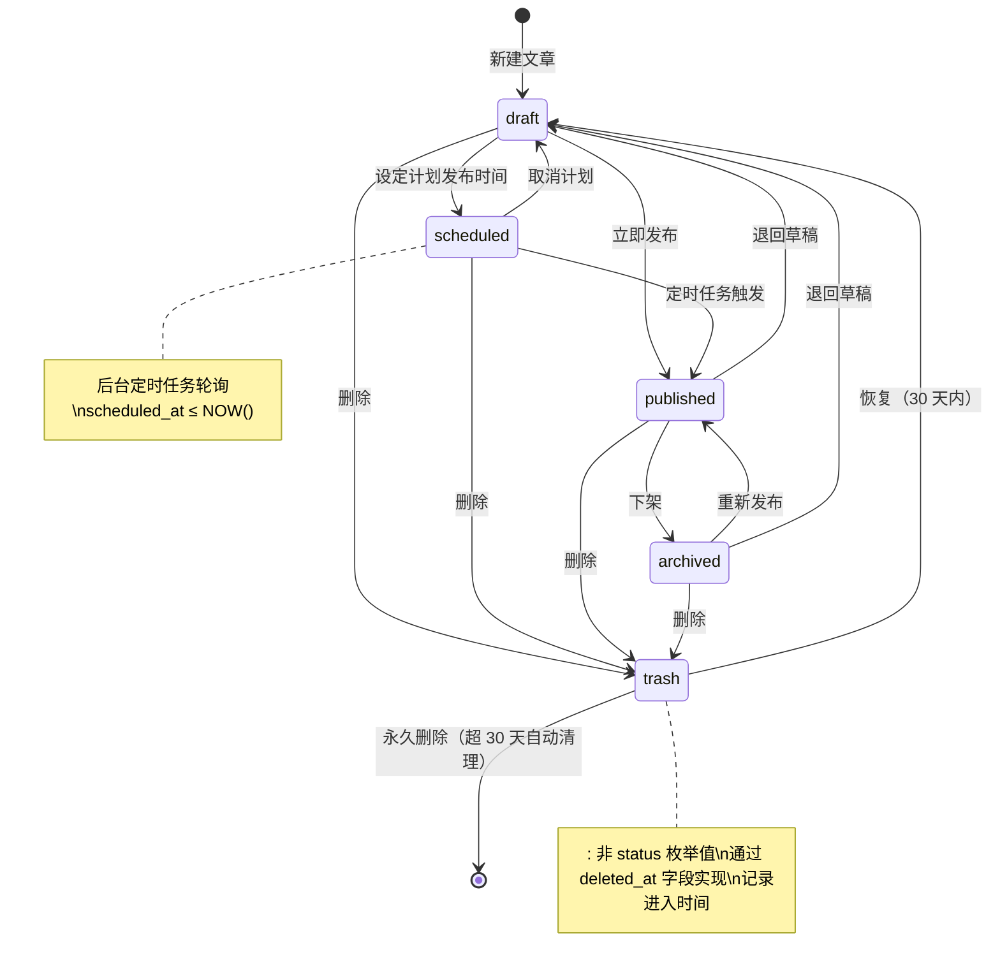

# CMS 内容管理系统 — 用户故事（User Stories）

**版本**：v1.0
**日期**：2026-02-24
**格式**：As a [role], I want to [action], so that [benefit]

---

## 模块一：认证与权限管理

### US-001 用户登录

**As a** 系统用户
**I want to** 使用邮箱和密码登录系统
**So that** 我可以访问与我角色匹配的功能模块

**验收标准（Acceptance Criteria）**

```gherkin
Given 用户在登录页面
When  输入正确的邮箱和密码并点击登录
Then  系统颁发 JWT Access Token（有效期 15 min）和 Refresh Token（有效期 7 天）
And   跳转至 Dashboard 首页

When  输入错误密码连续 5 次
Then  账号被锁定 15 分钟，返回 429 Too Many Requests

When  Access Token 过期时发起请求
Then  系统自动使用 Refresh Token 续签，用户无感知
```

**技术实现要点**
- Gin 路由：`POST /api/v1/auth/login`
- Redis 存储登录失败计数（Key: `login_fail:{email}`，TTL: 900s）
- 登出时将 Access Token 的 jti 加入 Redis 黑名单，同时吊销 Refresh Token（数据库 revoked=true）

---

### US-002 角色权限控制

**As a** 超级管理员
**I want to** 为不同用户分配角色（SuperAdmin / Admin / Editor / Viewer）
**So that** 不同人员只能访问和操作其职责范围内的功能

**验收标准**

```gherkin
Given 超级管理员进入用户管理页面
When  选择一个用户并修改其角色为 Editor
Then  该用户下次请求时权限立即生效（无需重新登录）

Given Editor 角色用户
When  尝试访问用户管理、系统设置等仅 Admin 可见页面
Then  前端不显示对应菜单项
And   API 层返回 403 Forbidden

Given Viewer 角色用户
When  尝试创建或编辑文章
Then  API 返回 403 Forbidden，前端展示无权限提示

Scenario: Admin 访问 SuperAdmin 专属功能
Given Admin 已登录
When  尝试访问用户管理或系统全局设置
Then  返回 403 Forbidden 并显示"权限不足"提示

Scenario: Viewer 的内容可见范围
Given Viewer 已登录
When  浏览文章列表
Then  仅可见 status=published 的文章，不可见 draft/scheduled/archived 内容，不可见回收站
```

**权限矩阵**

| 操作 | SuperAdmin | Admin | Editor | Viewer |
|------|:---:|:---:|:---:|:---:|
| 用户管理 | ✅ | ❌ | ❌ | ❌ |
| 系统配置 | ✅ | ✅ | ❌ | ❌ |
| 多站点管理（manage_sites） | ✅ | ❌ | ❌ | ❌ |
| 内容 CRUD | ✅ | ✅ | ✅ | ❌ |
| 内容查看 | ✅ | ✅ | ✅ | ✅ |
| 媒体上传 | ✅ | ✅ | ✅ | ❌ |
| API Key 管理 | ✅ | ✅ | ❌ | ❌ |
| 评论审核（manage_comments） | ✅ | ✅ | ✅ | ❌ |
| 评论删除（永久） | ✅ | ✅ | ❌ | ❌ |
| 菜单管理（manage_menus） | ✅ | ✅ | ❌ | ❌ |
| 重定向管理（manage_redirects） | ✅ | ✅ | ❌ | ❌ |
| 草稿预览令牌 CRUD | ✅ | ✅ | ✅ | ❌ |
| 2FA 管理（manage_2fa，自身） | ✅ | ✅ | ✅ | ✅ |
| 2FA 强制禁用（他人） | ✅ | ❌ | ❌ | ❌ |

---

### US-003 修改个人密码

**As a** 已登录用户
**I want to** 修改我的账号密码
**So that** 保障账号安全

**验收标准**

```gherkin
When  输入正确的当前密码和新密码（≥ 8 位，含大写 + 数字）
Then  密码更新成功，当前 Refresh Token 全部作废（强制重新登录）

When  输入错误的当前密码
Then  返回错误提示，密码不变
```

> 完整的密码策略详见 security.md

---

## 模块二：文章内容管理

### US-004 创建新文章

**As a** Editor
**I want to** 创建一篇新文章
**So that** 内容可以发布到站点或通过 API 供前端消费

**验收标准**

```gherkin
Given 编辑点击「新建文章」
When  填写标题、正文（富文本编辑器）、分类、标签、封面图
And   点击「保存草稿」
Then  文章以 draft 状态保存
And   系统自动生成 URL Slug（基于标题，规则见下方说明）
And   30 秒内无操作系统自动保存

When  点击「立即发布」
Then  文章状态变为 published
And   published_at 记录当前时间戳

When  设置「计划发布时间」为未来时间点
Then  文章状态为 scheduled
And   后台定时任务到点后自动发布

Scenario: 并发编辑冲突
Given Editor A 和 Editor B 同时编辑同一文章
When  Editor B 先保存（version 从 3 变为 4）
And   Editor A 随后保存（提交 version=3）
Then  返回 409 Conflict
And   提示 Editor A 刷新页面获取最新内容后重新编辑
```

**Slug 生成规则**
- 英文标题：转小写，空格替换为连字符 `-`，移除特殊字符（例：`My First Post` → `my-first-post`）
- 中文标题：使用拼音转写或基于短哈希生成 Slug（例：`我的文章` → `wo-de-wen-zhang` 或 `a1b2c3`）
- 具体实现细节参见 standard.md 或 architecture.md

**富文本编辑器功能**
- 标题（H1-H6）、加粗、斜体、删除线
- 有序 / 无序列表、引用块、代码块（语法高亮）
- 图片插入（从媒体库选择或粘贴上传）
- 内嵌视频（YouTube / 本地视频）
- 表格插入与编辑

---

### US-005 编辑已有文章

**As a** Editor
**I want to** 编辑已发布或草稿状态的文章
**So that** 内容可以持续更新

**验收标准**

```gherkin
When  编辑对已发布文章进行修改并保存
Then  系统创建新的修订版本（Revision）
And   原已发布内容保持不变，直到手动点击「更新发布」

When  编辑查看修订历史
Then  可看到每个版本的修改时间、修改人、内容差异（Diff 视图）

When  点击「回滚到此版本」
Then  文章内容恢复到选定版本
And   新增一条修订记录注明回滚操作
```

---

### US-006 文章软删除与恢复

**As a** Admin
**I want to** 删除文章并在必要时恢复
**So that** 防止误删导致内容丢失

**验收标准**

```gherkin
When  点击「删除」文章
Then  文章进入「回收站」（soft delete，deleted_at 字段置时间戳）
And   文章从前台 API 响应中消失

When  在回收站找到文章并点击「恢复」
Then  文章恢复为删除前的状态

When  文章在回收站停留超过 30 天
Then  后台定时任务永久删除该文章及其修订历史
```

---

### US-007 文章全文检索

**As a** Editor
**I want to** 在文章列表中按关键字搜索
**So that** 快速找到需要编辑的文章

**验收标准**

```gherkin
When  在搜索框输入关键字「性能优化」
Then  返回标题或正文中包含该词的文章列表（Meilisearch 全文搜索）
And   关键字高亮显示
And   结果按相关性排序

When  同时筛选分类 + 状态 + 时间范围
Then  返回满足所有条件的文章列表
```

**搜索排名规则**
- 标题匹配权重 > 正文匹配权重；Meilisearch 原生支持搜索排名
- 中文使用 Meilisearch 内置 CJK 分词（零配置）

---

### US-008 SEO 元数据配置

**As a** Editor
**I want to** 为每篇文章单独配置 SEO 信息
**So that** 提升文章在搜索引擎中的排名

**验收标准**

```gherkin
When  在文章编辑页侧栏填写 Meta Title、Meta Description、OG Image
Then  这些字段独立存储，不影响正文内容

When  通过公开 API 获取文章
Then  响应中包含 seo 字段对象，包含上述所有 SEO 信息
```

---

### US-009 自定义字段（Custom Fields）

**As a** Admin
**I want to** 为不同文章类型定义额外的结构化字段
**So that** 满足不同业务场景的内容结构需求（如产品页需要价格字段）

**验收标准**

```gherkin
Given Admin 创建文章类型「产品」并添加字段：price（number）、sku（string）
When  Editor 创建「产品」类型文章
Then  编辑页自动出现 price、sku 输入项

When  通过 API 获取该文章
Then  extra_fields 中包含 price 和 sku 的值
```

---

## 模块三：分类与标签

### US-010 分类树管理

**As a** Admin
**I want to** 创建、编辑和组织多级内容分类
**So that** 内容有清晰的归类体系

**验收标准**

```gherkin
When  创建一个顶级分类「技术」
And   在「技术」下创建子分类「后端」
Then  分类树中显示正确的层级关系
And   URL Slug 自动生成为 /tech/backend

When  拖拽调整分类顺序
Then  列表顺序按新的 sort_order 更新

When  删除有子分类的分类
Then  系统提示「请先删除或移动子分类」，拒绝删除
```

---

### US-011 标签管理

**As a** Editor
**I want to** 为文章添加多个标签
**So that** 读者可以发现相关主题的内容

**验收标准**

```gherkin
When  在文章编辑页的标签输入框键入标签名
Then  自动提示已有标签（fuzzy match）
And   可创建新标签（按 Enter 确认）

When  移除文章的某个标签
Then  标签与文章的关联关系解除（不删除标签本身）
```

---

## 模块四：媒体资产管理

### US-012 上传媒体文件

**As a** Editor
**I want to** 上传图片、视频等媒体文件
**So that** 在文章中引用这些素材

**验收标准**

```gherkin
When  拖拽图片文件到上传区（支持 jpg/png/gif/webp/svg，最大 20 MB）
Then  图片上传成功
And   系统生成缩略图（sm: 320px、md: 640px 宽度等比缩放）
And   自动转换为 WebP 格式（降低存储体积）
And   返回图片 CDN URL

When  上传大于 100 MB 的文件
Then  返回文件大小超限错误提示

When  上传类型不在白名单的文件（如 .exe）
Then  返回文件类型不允许错误
```

---

### US-013 媒体库管理

**As a** Editor
**I want to** 浏览、搜索和管理已上传的媒体文件
**So that** 复用已有素材，避免重复上传

**验收标准**

```gherkin
When  打开媒体库
Then  以网格视图展示所有文件（缩略图），支持切换为列表视图
And   显示文件名、大小、上传时间、引用计数

When  搜索「banner」
Then  返回文件名包含 banner 的媒体文件

When  尝试删除一个被 3 篇文章引用的图片
Then  系统返回错误提示「该文件被 3 篇文章引用」并列出引用文章
And   提供「强制删除」选项（需 Admin+ 权限）
And   用户确认强制删除后，文件被移除，引用链接失效
```

---

## 模块五：Headless API（面向开发者）

### US-014 API Key 管理

**As a** Admin
**I want to** 生成和管理 API Key
**So that** 外部应用可以安全访问内容 API

**验收标准**

```gherkin
When  点击「生成 API Key」并填写备注
Then  系统生成格式为 cms_live_xxxx 的 API Key（只显示一次，不可再查看）
And   Key 的哈希值存入数据库

When  外部应用携带 API Key 调用 /api/public/v1/posts
Then  认证通过，返回已发布文章列表

When  吊销（Revoke）某个 API Key
Then  该 Key 立即失效，Redis 缓存同步清除
```

---

### US-015 公开内容 API

**As a** 前端开发者
**I want to** 通过 API 获取已发布的内容
**So that** 在自己的网站 / App 中展示内容

**验收标准**

```gherkin
GET /api/public/v1/posts?page=1&per_page=20&category=tech&tag=go&sort=published_at:desc

Response:
{
  "data": [...],
  "pagination": {
    "page": 1,
    "per_page": 20,
    "total": 156,
    "total_pages": 8
  }
}

When  请求不存在的文章 ID
Then  返回 404 Not Found

When  每分钟超过 100 次请求（同一 API Key）
Then  返回 429 Too Many Requests，附带 Retry-After Header
```

**缓存策略**
- 列表接口：Redis 缓存 60 秒（写入时自动失效）
- 详情接口：Redis 缓存 300 秒（文章更新时主动失效）
- Cache-Control Header：public, max-age=60

---

## 模块六：系统设置与监控

### US-016 站点基础配置

**As a** SuperAdmin
**I want to** 配置站点的基础信息
**So that** 系统能以正确的名称、Logo 和域名运行

**验收标准**

```gherkin
When  修改站点名称为「我的博客」并保存
Then  配置写入数据库，同时更新 Redis 缓存中的全局配置
And   管理后台顶部 Logo 区域实时更新站点名称
```

---

### US-017 操作日志审计

**As a** SuperAdmin
**I want to** 查看所有用户的操作记录
**So that** 追溯问题和异常行为

**验收标准**

```gherkin
When  任何用户执行创建、更新、删除操作
Then  系统记录：操作人、操作类型、目标资源、IP 地址、时间戳

When  SuperAdmin 查看审计日志
Then  可按用户、操作类型、时间范围筛选
And   日志只读，不可删除（90 天后自动归档）
```

---

## 模块七：多语言

### US-018 内容多语言管理

**As a** Editor
**I want to** 为同一篇文章维护不同语言版本
**So that** 内容可以服务多语言用户群体

**验收标准**

```gherkin
Given 文章默认为中文（zh-CN）
When  切换到英文（en）标签并填写英文标题和正文
Then  英文版本独立存储（sfc_site_post_translations 表）
And   通过 API 请求时携带 locale=en 查询参数
Then  返回英文版本内容
```

---

## 模块八：多站点管理

### US-019 多站点管理

**优先级**：P1

**As a** SuperAdmin
**I want to** 创建和管理多个独立站点
**So that** 一个 CMS 实例可以服务多个网站，每个站点拥有独立的内容空间

**验收标准**

1. SuperAdmin 可通过 `POST /api/v1/admin/sites` 创建新站点，需提供名称、slug（`^[a-z0-9_]{3,50}$`）、可选域名
2. 创建站点时系统在单个事务中完成：插入 `public.sfc_sites` 记录、创建 `site_{slug}` schema、执行全部 per-site DDL、种子 built-in sfc_site_post_types、插入默认 sfc_site_configs
3. SuperAdmin 可通过 `PATCH /api/v1/admin/sites/{site_id}` 编辑站点（名称、域名、描述、Logo、时区、启停状态）。slug 创建后不可修改
4. SuperAdmin 可通过 `DELETE /api/v1/admin/sites/{site_id}` 删除站点，需提交 `confirm_slug` 确认且不能删除最后一个站点。删除执行 `DROP SCHEMA site_{slug} CASCADE`
5. 每个站点拥有独立的文章、分类、标签、媒体库、评论、菜单、重定向、预览令牌、API Key、审计日志
6. 用户角色为 per-site 分配：通过 `public.sfc_site_user_roles` 表，同一用户可在站点 A 为 Admin、站点 B 为 Editor
7. 支持域名映射：`public.sfc_sites.domain` 字段，SiteResolverMiddleware 通过 Host header 解析当前站点
8. 管理后台顶部提供站点切换 UI，通过 `X-Site-Slug` header 指定当前操作站点
9. JWT claims 中包含 `site` 字段，AuthMiddleware 根据 `sfc_site_user_roles` 解析当前站点角色（Redis 缓存 300s）
10. 保留 slug 名称不可使用：`public`、`pg_catalog`、`information_schema`、`pg_toast`、`pg_temp`、`site`、`admin`、`api`、`setup`、`system`、`default`、`template`、`test`

**相关 API 端点**
- `POST /api/v1/admin/sites` — 创建站点
- `GET /api/v1/admin/sites` — 列出所有站点
- `GET /api/v1/admin/sites/{site_id}` — 获取站点详情
- `PATCH /api/v1/admin/sites/{site_id}` — 更新站点
- `DELETE /api/v1/admin/sites/{site_id}` — 删除站点
- `POST /api/v1/admin/sites/{site_id}/roles` — 为用户分配站点角色
- `DELETE /api/v1/admin/sites/{site_id}/roles/{user_id}` — 移除用户站点角色

---

### US-020 Web 安装向导

**优先级**：P1

**As a** 首次部署 CMS 的用户
**I want to** 通过浏览器完成首次系统初始化
**So that** 无需手动执行 SQL 或命令行操作即可启动 CMS

**验收标准**

1. 首次访问未安装的 CMS 实例时，所有页面（`/setup` 和 `/api/v1/setup/*` 除外）返回 503 或重定向至 `/setup`
2. 安装向导页面提供单步表单：站点名称、站点 slug、站点 URL、管理员邮箱、管理员密码（含强度指示器）、管理员显示名称、语言（默认 zh-CN）
3. 提交后调用 `POST /api/v1/setup/initialize`，在单个数据库事务中原子执行：创建 public schema 表（含 enum 类型）、创建首个站点（`public.sfc_sites` + `site_{slug}` schema）、创建管理员用户、分配 superadmin 角色、设置 `system.installed = true`
4. 事务中任一步骤失败则全部回滚，返回 `SETUP_FAILED` 错误
5. 使用 PostgreSQL advisory lock（`pg_advisory_xact_lock`）防止并发安装竞态
6. 安装完成后，`POST /api/v1/setup/initialize` 永久返回 409 `ALREADY_INSTALLED`
7. 安装成功后返回 access_token，前端自动跳转至 `/admin`
8. `POST /api/v1/setup/check` 用于检测安装状态（三级缓存：内存原子变量 → Redis → DB）

**相关 API 端点**
- `POST /api/v1/setup/check` — 检查安装状态（无需认证，30 req/min）
- `POST /api/v1/setup/initialize` — 执行安装（无需认证，5 req/min）

---

## 模块九：评论系统

### US-021 评论系统

**优先级**：P1

**As a** 站点访客或已登录用户
**I want to** 在已发布的文章下发表评论和回复
**So that** 我可以与作者和其他读者互动讨论

**验收标准**

1. 游客提交评论需提供 author_name（1-100 字符）和 author_email（合法邮箱），已认证用户自动填充 user_id 及用户信息
2. 评论支持最多 3 级嵌套回复（level 0 = 顶级评论，level 2 = 最大回复深度），超出返回 422 `MAX_NESTING_DEPTH`
3. 新评论默认状态为 `pending`，需管理员审核后才在公开 API 显示
4. Editor+ 可在管理后台查看评论列表，按状态（pending/approved/spam/trash）、文章、关键词筛选
5. Editor+ 可单条或批量（最多 100 条）修改评论状态（approve / reject / spam / trash）
6. Admin+ 可永久删除评论（级联删除子回复）
7. 每篇文章最多 3 条置顶评论（仅顶级评论可置顶）
8. Admin+ 可回复评论，回复自动设为 approved 状态
9. 垃圾防护：honeypot 隐藏字段（非空 = spam）、IP 限流（同一 IP 每 30 秒最多 1 条评论）、关键词黑名单、重复评论检测（SHA-256，1 小时去重）
10. Gravatar 头像基于 author_email 的 MD5 哈希在响应时计算，默认 80px `d=mp`
11. 新评论提交时异步发送邮件通知站点管理员
12. 公开 API 返回嵌套评论树（分页仅针对顶级评论），置顶评论优先排列，不暴露 author_email / author_ip / user_agent

**相关 API 端点**
- `GET /api/v1/comments` — 管理端评论列表（Editor+）
- `GET /api/v1/comments/:id` — 管理端评论详情（Editor+）
- `PUT /api/v1/comments/:id/status` — 修改评论状态（Editor+）
- `PUT /api/v1/comments/:id/pin` — 切换置顶（Editor+）
- `POST /api/v1/comments/:id/reply` — 管理员回复（Editor+）
- `PUT /api/v1/comments/batch-status` — 批量修改状态（Admin+）
- `DELETE /api/v1/comments/:id` — 永久删除（Admin+）
- `GET /api/public/v1/posts/:slug/comments` — 公开评论列表
- `POST /api/public/v1/posts/:slug/comments` — 公开提交评论

---

## 模块十：导航菜单管理

### US-022 导航菜单管理

**优先级**：P1

**As a** Admin
**I want to** 创建和管理导航菜单
**So that** 站点的各个展示位置（header / footer / sidebar）有结构化的导航链接

**验收标准**

1. Admin+ 可创建菜单，指定名称、slug（站内唯一，`^[a-z0-9]([a-z0-9-]*[a-z0-9])?$`）、展示位置（header/footer/sidebar/自定义）
2. Admin+ 可为菜单添加菜单项，类型包括：custom（自定义 URL）、post（文章链接）、category（分类链接）、tag（标签链接）、page（页面链接）
3. 菜单项支持最多 3 级嵌套层级（level 0 = 顶级，level 2 = 最大深度）
4. Admin+ 可通过 `PUT /api/v1/menus/:id/items/reorder` 批量调整菜单项排序和层级关系（拖拽排序），需提交全部菜单项
5. 引用类型菜单项（post/category/tag/page）的 URL 在响应时由服务端解析：如 `posts.slug` → `/{slug}`，`categories.path` → `/categories/{path}`
6. 引用的文章/分类/标签被删除时，菜单项标记 `is_broken = true`，公开 API 自动过滤
7. 公开 API `GET /api/public/v1/menus?location=header` 按位置返回完整菜单树（仅 `is_active = true` 且非 broken 的项），Redis 缓存 300s
8. Admin+ 可编辑菜单元数据（名称、slug、位置、描述）和菜单项属性（label、url、target、icon、css_class、type、reference_id、is_active）
9. 删除菜单时级联删除所有菜单项

**相关 API 端点**
- `GET /api/v1/menus` — 列出所有菜单（Admin+）
- `POST /api/v1/menus` — 创建菜单（Admin+）
- `GET /api/v1/menus/:id` — 获取菜单详情含菜单项树（Admin+）
- `PUT /api/v1/menus/:id` — 更新菜单元数据（Admin+）
- `DELETE /api/v1/menus/:id` — 删除菜单（Admin+）
- `POST /api/v1/menus/:id/items` — 添加菜单项（Admin+）
- `PUT /api/v1/menus/:id/items/:item_id` — 更新菜单项（Admin+）
- `DELETE /api/v1/menus/:id/items/:item_id` — 删除菜单项（Admin+）
- `PUT /api/v1/menus/:id/items/reorder` — 批量重排菜单项（Admin+）
- `GET /api/public/v1/menus` — 按位置获取公开菜单

---

## 模块十一：RSS Feed 与 Sitemap

### US-023 RSS Feed 与 Sitemap

**优先级**：P2

**As a** 站点访客或搜索引擎
**I want to** 通过 RSS/Atom feed 订阅站点最新文章，并通过 XML Sitemap 发现所有公开内容
**So that** 我可以及时获取更新，搜索引擎可以高效抓取

**验收标准**

1. `GET /feed/rss.xml` 返回 RSS 2.0 格式的最新 20 篇已发布文章（Content-Type: `application/rss+xml`），支持按 category/tag/limit 参数过滤
2. `GET /feed/atom.xml` 返回 Atom 1.0 格式的相同数据源（Content-Type: `application/atom+xml`）
3. `GET /sitemap.xml` 返回 Sitemap 索引文件，引用 `/sitemap-posts.xml`、`/sitemap-categories.xml`、`/sitemap-tags.xml`
4. `GET /sitemap-posts.xml` 包含所有已发布文章 URL，根据发布时间设置 priority（7 天内 0.9，30 天内 0.8，90 天内 0.7，更早 0.5；page 类型 0.6）
5. `GET /sitemap-categories.xml` 包含所有分类 URL（root 0.6，child 0.5），`lastmod` 取该分类下最新已发布文章的时间
6. `GET /sitemap-tags.xml` 仅包含有已发布文章的标签（priority 0.4），`lastmod` 取该标签下最新已发布文章的时间
7. 所有 feed 和 sitemap 端点 Redis 缓存 1 小时（3600s TTL），内容变更时自动失效（`site:{slug}:cache:feed:*` 和 `site:{slug}:cache:sitemap:*`）
8. 超过 50,000 URL 时 sitemap 自动分页（`sitemap-posts-1.xml`、`sitemap-posts-2.xml`）
9. 响应包含 `Cache-Control: public, max-age=3600`、`ETag`、`Last-Modified` 头
10. 站点通过 Host header 解析（SchemaMiddleware），feed 和 sitemap 均为站点维度

**相关 API 端点**
- `GET /feed/rss.xml` — RSS 2.0 feed
- `GET /feed/atom.xml` — Atom 1.0 feed
- `GET /sitemap.xml` — Sitemap 索引
- `GET /sitemap-posts.xml` — 文章 Sitemap
- `GET /sitemap-categories.xml` — 分类 Sitemap
- `GET /sitemap-tags.xml` — 标签 Sitemap

---

## 模块十二：草稿预览

### US-024 草稿预览

**优先级**：P2

**As a** Editor
**I want to** 为草稿或未发布文章生成可分享的预览链接
**So that** 我可以将未发布内容分享给审阅者，无需给对方分配系统账号

**验收标准**

1. Editor+ 可通过 `POST /api/v1/posts/:id/preview` 为任意状态的文章生成预览令牌
2. 令牌格式为 `sky_preview_{base64url_random_32bytes}`，仅 SHA-256 哈希存储于 `sfc_site_preview_tokens` 表，原始令牌仅在创建时返回一次
3. 令牌有效期 24 小时，每篇文章最多 5 个活跃（未过期）令牌，超出返回 422
4. 令牌生成限流：每用户每小时最多 10 个令牌
5. `GET /api/public/v1/preview/:token` 为公开端点，无需认证，通过 Host header 解析站点，验证令牌哈希和有效期后返回完整文章内容
6. 预览响应始终返回最新草稿内容（不缓存），包含 `is_preview: true` 和 `preview_expires_at` 标识
7. 过期令牌返回 410 GONE，不存在或已删除文章返回 404
8. Editor+ 可通过 `GET /api/v1/posts/:id/preview` 查看文章的所有活跃令牌（不含原始令牌值）
9. Editor+ 可通过 `DELETE /api/v1/posts/:id/preview` 撤销全部令牌，或 `DELETE /api/v1/posts/:id/preview/:token_id` 撤销单个令牌
10. 过期令牌由后台 Cron 每小时清理

**相关 API 端点**
- `POST /api/v1/posts/:id/preview` — 生成预览令牌（Editor+）
- `GET /api/v1/posts/:id/preview` — 列出活跃预览令牌（Editor+）
- `DELETE /api/v1/posts/:id/preview` — 撤销全部预览令牌（Editor+）
- `DELETE /api/v1/posts/:id/preview/:token_id` — 撤销单个预览令牌（Editor+）
- `GET /api/public/v1/preview/:token` — 公开预览访问

---

## 模块十三：URL 重定向管理

### US-025 URL 重定向管理

**优先级**：P2

**As a** Admin
**I want to** 管理站点的 URL 重定向规则
**So that** 站点 URL 变更后旧链接不会失效，SEO 权重得以传递

**验收标准**

1. Admin+ 可通过 `POST /api/v1/redirects` 创建重定向规则，指定 source_path（必须以 `/` 开头，站内唯一）、target_url、status_code（301 或 302，默认 301）
2. Admin+ 可编辑重定向规则的 source_path、target_url、status_code、is_active
3. Admin+ 可单条删除或批量删除（最多 100 条/次）重定向
4. 文章 slug 变更时，系统自动创建 301 重定向（`/{old_slug}` → `/{new_slug}`），并压缩重定向链（若 A→B 已存在且 B→C 创建，则 A 直接更新为 A→C）
5. 重定向命中次数通过 Redis INCR 缓冲，后台 Cron 每 5 分钟批量刷入 PostgreSQL
6. Admin+ 可通过 `POST /api/v1/redirects/import` 导入 CSV（格式：source_path,target_url,status_code；最大 1MB，最多 1000 行），重复 source_path 跳过并在响应中报告
7. Admin+ 可通过 `GET /api/v1/redirects/export` 导出全部重定向为 CSV
8. RedirectMiddleware 在 SchemaMiddleware 之后执行，先查 Redis 缓存（`site:{slug}:redirects:map`，TTL 600s）再查 DB，命中后异步递增计数并发出 HTTP 重定向
9. 重定向列表支持分页、搜索（source_path/target_url）、按 status_code/is_active 筛选、按 hit_count/created_at/last_hit_at 排序

**相关 API 端点**
- `GET /api/v1/redirects` — 列出重定向（Admin+）
- `POST /api/v1/redirects` — 创建重定向（Admin+）
- `PUT /api/v1/redirects/:id` — 更新重定向（Admin+）
- `DELETE /api/v1/redirects/:id` — 删除重定向（Admin+）
- `POST /api/v1/redirects/bulk-delete` — 批量删除（Admin+）
- `POST /api/v1/redirects/import` — CSV 导入（Admin+）
- `GET /api/v1/redirects/export` — CSV 导出（Admin+）

---

## 模块十四：双因素认证

### US-026 双因素认证（2FA）

**优先级**：P1

**As a** 系统用户
**I want to** 为我的账户启用 TOTP 双因素认证
**So that** 即使密码泄露，攻击者也无法登录我的账户

**验收标准**

1. 任何已登录用户可通过 `POST /api/v1/auth/2fa/setup` 初始化 2FA 设置，系统返回 TOTP 密钥（Base32）、`otpauth://` URI、SVG QR 码、10 个备用码（格式 XXXX-XXXX）
2. 备用码仅在 setup 和 regenerate 时显示一次，存储为 bcrypt 哈希（cost=12），使用后从数组中移除（一次性）
3. 用户使用 authenticator app 扫码后，需提交第一个 TOTP 码至 `POST /api/v1/auth/2fa/verify` 完成验证，验证通过后 `is_enabled = true`、`verified_at = NOW()`
4. 已启用 2FA 的用户登录时：密码验证通过后不直接签发 access_token，而是返回 `requires_2fa: true` 和 `temp_token`（5 分钟有效，`purpose: 2fa_verification`）
5. 用户提交 TOTP 码至 `POST /api/v1/auth/2fa/validate`（携带 temp_token），验证通过后签发正式 access_token 和 refresh_token
6. TOTP 验证支持 +/-1 步容差（有效窗口 90s），使用 Redis 防重放（`2fa:used:{user_id}:{code}`，TTL 90s）
7. TOTP 验证限流：每用户 5 分钟内最多 5 次尝试
8. 用户可通过 `POST /api/v1/auth/2fa/disable`（需当前密码 + TOTP 码/备用码）禁用 2FA，禁用后删除 `user_totp` 记录并吊销所有 refresh_token
9. 用户可通过 `POST /api/v1/auth/2fa/backup-codes`（需当前密码）重新生成备用码，旧备用码全部失效
10. `GET /api/v1/auth/2fa/status` 返回 2FA 启用状态、验证时间、剩余备用码数量
11. SuperAdmin 可通过 `DELETE /api/v1/users/:id/2fa` 强制禁用其他用户的 2FA（需填写原因），同时吊销目标用户所有 refresh_token
12. TOTP 密钥使用 AES-256-GCM 加密存储（密钥来自环境变量 `TOTP_ENCRYPTION_KEY`），2FA 配置位于 `public.sfc_user_totp` 表，用户级全局生效（不分站点）

**相关 API 端点**
- `POST /api/v1/auth/2fa/setup` — 初始化 2FA 设置
- `POST /api/v1/auth/2fa/verify` — 验证首个 TOTP 码激活 2FA
- `POST /api/v1/auth/2fa/disable` — 禁用 2FA
- `POST /api/v1/auth/2fa/backup-codes` — 重新生成备用码
- `GET /api/v1/auth/2fa/status` — 查询 2FA 状态
- `POST /api/v1/auth/2fa/validate` — 登录流程中的 TOTP 验证
- `DELETE /api/v1/users/:id/2fa` — SuperAdmin 强制禁用用户 2FA

---

## 附录 A：文章生命周期状态机

> **注意**：trash 不是 status 枚举值。文章的实际状态枚举为 draft / published / scheduled / archived，"回收站"通过 `deleted_at IS NOT NULL` 来表示。



---

## 附录 B：故事优先级排序

| 优先级 | 用户故事 |
|--------|----------|
| P0（必须） | US-001, US-002, US-004, US-005, US-006, US-012 |
| P1（重要） | US-003, US-007, US-010, US-011, US-013, US-014, US-015, US-016, US-017, US-019, US-020, US-021, US-022, US-026 |
| P2（计划） | US-008, US-009, US-023, US-024, US-025 |
| P3（未来） | US-018 |
